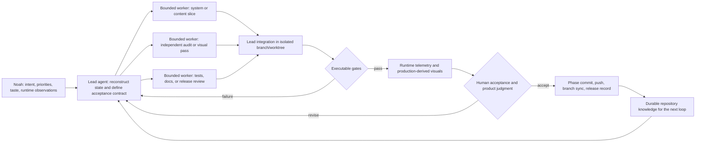

# Building Blockwild with Agentic Autoresearch

## A case study in human-directed, multi-agent product development, evaluation, and operationalization

| Record | Scope |
| --- | --- |
| Evidence snapshot | `design-1` through implementation commit `39aef5e`, 2026-07-20. This document is the next tracked commit. |
| Product | [Blockwild](README.md), an operational browser voxel-survival game. |
| Current release in this snapshot | v1.8.5, *Trailcraft Currents*. |
| Hosted game | [blockwild.noahhicks.chatgpt.site](https://blockwild.noahhicks.chatgpt.site) |
| Purpose | A reusable technical and management record from which a portfolio case study, talk, article, architecture deck, demo script, or agent-operations report can be made. |

---

## Living operational continuation

This case study preserves its original evidence snapshot, while the engineering loop continues on `main`. The tracked [`performance comparison log`](docs/PERFORMANCE_COMPARISON_LOG.md) is the current measurement ledger: it records comparable and non-comparable captures, exact before/after commit probes, player-action presentation latency, negative results, and the next acceptance run. Keeping the historical narrative separate from the append-only ledger prevents a new optimization from silently rewriting the evidence used by older portfolio artifacts.

The July 21 player-first pass demonstrates that continuation. A user report that broken blocks and standing trees remained visible after the falling proxy began was translated into an explicit ordering contract, production telemetry, a deterministic interaction benchmark, and a terrain-consolidation redesign. On the exact pre-change versus post-change Node streaming probe, terrain merge submissions fell from 962 to 147, stale merges from 39 to 2, warm installation work from 0.0595 ms to 0.0178 ms, and final weighted debt from 63.98 to 13.60. The same record also retains the transient submitted-mesh increase and small readiness-delay regressions for the next hardware-browser run rather than presenting a one-sided score.

---

## Executive abstract

Blockwild is useful as an AI-development case study because it is not a bounded coding exercise. It is a persistent, stateful game with an unusually wide integration surface: deterministic procedural terrain, streamed voxel geometry, colored lighting, fluids, weather, survival simulation, real-time creature combat, capture and husbandry, settlements, quests, guild campaigns, multiplayer authority, browser persistence, generated art, spatial audio, compatibility migrations, performance telemetry, and a production deployment path. A change to one subsystem can damage several others. A new creature is not complete when its definition compiles; it needs ecology, a model, animation, dimensions, sound, drops, capture behavior, Bestiary data, persistence, multiplayer representation, visual review, and regression coverage.

The project was developed through a human-directed agent organization. Noah set product direction, supplied subjective and runtime observations, decided aesthetic preferences, defined completion contracts, controlled branch integration, and repeatedly refused to treat “the tests pass” as equivalent to “the game feels right.” A lead Codex agent reconstructed the relevant system, divided work into bounded investigations or implementation slices, integrated the results, ran executable gates, generated inspection artifacts, and committed accepted phases. Specialized subagents were used where parallelism could increase breadth or reduce context pressure. The long Blockwild task history records more than one hundred distinct delegated task names spanning world generation, models, UI, multiplayer, audio, audits, documentation, and release verification.

This resembles Andrej Karpathy's [`autoresearch`](https://github.com/karpathy/autoresearch) in one important way: the agent repeatedly changes a system, measures the result, keeps useful changes, and lets Git preserve the experimental lineage. It differs in equally important ways. Blockwild does not train or update model weights. It does not optimize one scalar metric. It operates across a non-stationary, multi-objective product where correctness, performance, visual taste, compatibility, and playability can conflict. Its “learning” occurs at the system and organizational level: observations become code, tests, metrics, renderers, design rules, release notes, or durable repository knowledge. The agent does not become a newly trained model; the development system becomes better able to produce and verify the next change.

That distinction makes the case stronger, not weaker. It demonstrates how an autoresearch-style loop can move from a deliberately tiny research harness to a deployed creative system without pretending that product development is reducible to validation loss.

## Claim boundary: what “self-learning” means here

The phrase *self-learning AI system* is overloaded. Four different processes are often collapsed into it:

| Layer | What changes | Present in Blockwild? |
| --- | --- | --- |
| Model learning | Neural-network weights change through training or fine-tuning | No |
| In-run adaptation | An agent changes its plan after tool results, tests, or user feedback | Yes |
| Organizational learning | Durable instructions, tests, tools, documents, and workflows improve future agent runs | Yes |
| Product learning | Telemetry and observed failure change the shipped system | Yes |

Blockwild should therefore be described as **agentic autoresearch for software and game development**, or as a **repository-mediated self-improving engineering system**. It should not be described as an autonomously retrained model.

This wording protects the credibility of every artifact derived from this document. The interesting claim is not that Codex secretly changed its weights. The interesting claim is that a human and a large agent organization built a feedback environment in which evidence could reliably alter a complex product, and in which each expensive lesson could be made cheaper to apply the next time.

## Evidence policy

The figures in this document are intentionally tied to a source class:

- **Live audit** means the command was run against the snapshot while this case study was prepared.
- **Tracked record** means the result appears in versioned code, [`progress.md`](progress.md), the [`CHANGELOG`](CHANGELOG.md), or a release guide.
- **Git measurement** means it was computed from the repository history through `39aef5e`.
- **Task-log measurement** means it was computed from the archived Codex task JSONL. It measures orchestration calls, not simultaneous workers or human-equivalent headcount.
- **Interpretation** means a design or management conclusion derived from those records.

This distinction matters. Lines of code are not a quality metric. A spawn-agent call is not proof that useful work happened. A passing unit test is not proof that a creature looks good. The strongest claims combine several evidence types.

## Snapshot of scope

The following is the pre-document implementation snapshot, not a lifetime estimate and not a claim about manual-equivalent labor.

| Surface | Verified snapshot |
| --- | ---: |
| Git history represented | 106 commits from 2026-07-10 through 2026-07-20 |
| Tracked files | 671 |
| Tracked TypeScript and TSX | approximately 119,209 lines |
| Application area | approximately 100,884 tracked text lines across 121 files |
| Tests | 110 test files; the last full gameplay/content gate recorded 780/780 plus 10/10 rendered/audio checks |
| Named changelog entries | 28 |
| Creature catalog | 231 entries; all 231 have discovery hints |
| Flora catalog | 52 entries; all 52 have native-range assignments |
| Natural creature species | 113 across active spawn pools |
| World ecology | 24 surface biomes and seven underground habitats |
| Visual-theme audit | 231 creatures, 309 blocks, 17 block families, zero strict violations |
| Audio library | 54 shipped WAV effects and 23 music MP3s under `public/music/` |
| Long-task agent orchestration | 114 spawn calls across 110 distinct task names, 65 follow-up calls, and 326 inter-agent message calls |
| Current repository audits | 10,000 deterministic container simulations; 50 regional-road seeds; 50 Dwarven-infrastructure seeds |

Noah identifies the long effort as involving 109 subagents. The archived log contains 114 spawn calls across 110 task names. Those numbers are compatible with retries or failed/duplicated dispatches, but they are not identical, so this document uses the safer phrase **more than one hundred delegated work units**. They were not all active at once.

### Reproducing the repository evidence

The main catalog and world claims can be regenerated from the repository root:

```bash
npm run audit:ecology
npm run audit:world-overhaul
npm run audit:living-bestiary
npm run audit:visual-theme
npm test
```

The first four commands produced the live-audit figures in this document. `npm test` is the broader production build and regression gate; its latest tracked result through the evidence snapshot is recorded in [`progress.md`](progress.md). Git counts can be checked with `git rev-list --count HEAD` and `git ls-files`. The archived task log is not part of the product repository, so its orchestration counts are reported with their source class and limitations rather than presented as a reproducible product metric.

## What Blockwild became

Blockwild began as a playable voxel sandbox and rapidly became a layered game. Its world is deterministic from a seed and streams 16 by 16 chunks across a vertical range from Y -64 to Y 127. The current ecology audit finds every one of the 24 surface biomes within 4,096 blocks for each audited world seed. Below them sit seven authored underground habitats: ordinary tunnels that preserve darkness and contrast, Rootweave Grotto, Starbloom Hollows, Glasswater Deeps, Pillarstone Reaches, Crystaldeep Gallery, and Emberdeep Fumaroles.

The player can mine, build, craft, smelt, farm, fight, travel, trade, manage worlds, import and export saves, collect and research creatures, raise companions, ride suitable creatures, use magic, pursue guild campaigns, and host direct multiplayer sessions. The world contains surface, aquatic, and subterranean settlements; sparse regional roads; temples, lairs, staged encounters, and dungeons; time, weather, water, lava, crops, orchards, machines, storage, and contextual loot. Browser-local persistence is deliberate: generated terrain is reproducible from the seed, while player edits and authored state are normalized into versioned saves.

The creature system illustrates the integration burden. The current audit counts 231 Bestiary entries and 113 naturally spawning species. Their runtime concerns include:

- deterministic ecology and time/depth conditions;
- real-time stats, moves, type resolution, hostility, capture, care, and drops;
- connected, animated production geometry shared by gameplay and portraits;
- sound events and distance-aware playback;
- individual names, bonds, history, forms, rarity, research, and custody;
- persistence and host-authoritative multiplayer snapshots;
- mounts, swimmers, flyers, constructs, summons, bosses, and dragon life cycles.

The wider progression layer includes a universal 21-type resolver, fixed readable species stats rather than hidden individual-value rolls, level-and-bond move unlocks, 20 spells, seven faction-linked guilds, 21 principal guild characters, seven recruits, and 56 campaign chapters. Four summons originate in named otherworldly realms and can be grounded through explicit rules rather than silently converted into ordinary pets. These systems share combat, Bestiary, quest, and persistence contracts instead of existing as disconnected menus.

This breadth is why Blockwild is a better test of agent management than a clean-room application with one API and a small test suite. Every expansion changes the number of invariants that future work must preserve.

## From `autoresearch` to product autoresearch

Karpathy's `autoresearch` deliberately reduces research to a compact loop. The agent may edit one training file. A fixed five-minute run produces a comparable `val_bpb` score. The agent records the experiment, keeps a better commit, discards a worse one, and continues. The human edits the Markdown program that defines the research organization. This separation is the key idea: the researcher programs the process that programs the model experiment.

Blockwild preserves that loop's discipline while changing almost every constraint around it.

| Dimension | `autoresearch` | Blockwild |
| --- | --- | --- |
| Search surface | One editable training file | A large game, its content, tools, tests, assets, documentation, and deployment path |
| Objective | Lower one validation metric | Preserve correctness while improving playability, performance, art direction, content depth, compatibility, and usability |
| Experiment budget | Fixed five-minute training run | Task-appropriate bounded tests, audits, renders, browser traversals, soak runs, and human review |
| Evaluator ownership | Fixed evaluation code is read-only | Many executable evaluators plus human judgment; critical evaluators are kept independent of the feature they check |
| Keep/discard mechanism | Advance or reset the experiment branch | Phase commits, isolated design work, regression repair, main/design branch synchronization, and explicit approval |
| Memory | Git and a result table | Git, tests, typed contracts, metrics, audits, design standards, release notes, generated comparisons, and task history |
| Autonomy | Agent continues until interrupted | Agents work autonomously inside bounded scope; Noah retains priority, taste, and release authority |
| Primary failure risk | Metric regression, crash, or complexity without score gain | Cross-system regression, save corruption, visual drift, simulation cost, misleading aggregate metrics, and integration conflict |

Anthropic's [orchestrator-worker pattern](https://www.anthropic.com/engineering/building-effective-agents) describes the multi-agent part more closely: a lead agent dynamically determines subtasks, gives workers bounded objectives, and synthesizes their outputs. Its evaluator-optimizer pattern describes the repeated visual and performance passes. Anthropic's [multi-agent research-system report](https://www.anthropic.com/engineering/multi-agent-research-system) is also relevant because it treats subagents as separate context windows and warns that coordination cost, token use, and poor delegation can erase the benefits of parallelism.

OpenAI's [harness-engineering account](https://openai.com/index/harness-engineering/) supplies the closest software-engineering parallel. It argues that repository-local knowledge, agent-legible tools, isolated worktrees, browser control, logs, metrics, and recurring cleanup are what allow agent output to compound. Blockwild independently exhibits the same core mechanism: the human contribution moves upward from writing individual lines toward specifying intent, building evaluators, allocating attention, and deciding when evidence is sufficient.

The result is not a copy of any one framework. It is a practical hybrid:

1. `autoresearch` contributes the experiment loop and Git-backed memory.
2. Orchestrator-workers contribute bounded parallel search and implementation.
3. Evaluator-optimizer contributes repeated critique and repair.
4. Harness engineering contributes repository legibility, executable tools, and production feedback.
5. Noah supplies product intent, taste, priority, and the authority to reject a locally “successful” result.

## The human-agent operating model



### Noah's role

Noah acted as product owner, creative director, playtester, and agent-organization manager. The task record shows several recurring management behaviors:

- He specified outcomes in player language: the world feels empty, a tail moves too quickly, a cave contains impossible walls of water, the map skips after a hitch, or a creature does not match Blockwild's visual identity.
- He made acceptance observable. Creature work required side-by-side images and approval; large phases required artifacts, commits, pushes, and explicit checks against the original plan.
- He separated streams of work with `design-1` and `main`, then requested synchronization at controlled points instead of allowing every agent to edit the same line of history.
- He raised the standard after apparently successful work. “It is faster” was not enough when the occupied chunk could still remain invisible. “The limbs are articulated” was not enough when their shapes no longer fit the game's cubic theme.
- He allowed implementation autonomy while reserving decisions that depended on taste, scope, or player value.

This is not passive prompting. It is management of the objective function. Noah decided what the system should optimize, what evidence was missing, and which local improvement was not actually a product improvement.

### The lead agent's role

The lead agent was responsible for maintaining a coherent model of the whole repository. Its highest-value work was often not producing the first implementation, but determining which facts were authoritative, preventing local fixes from violating distant contracts, and converting new problems into reusable evaluation surfaces.

The lead agent:

- inspected live code, Git state, saved plans, telemetry, and generated artifacts before changing anything;
- decomposed large work only where ownership could be made clear;
- integrated changes in dependency order;
- reconciled conflicting assumptions and regenerated derived assets;
- ran focused gates during work and full gates before release;
- performed browser or visual review where unit tests could not establish quality;
- updated release notes, progress records, and design standards;
- committed accepted phases and synchronized branches as instructed.

### The subagent role

Parallel agents were most useful when work could be separated by system boundary or evaluation perspective. The archived task's 110 distinct spawn-task names include `ocean_world`, `ocean_creatures`, `dragon_combat_ai`, `multiplayer_authority`, `world_lighting`, `performance_audit`, `final_visual_audit`, `release_test_audit`, `candy_integration_tests`, `v13_spatial_audio`, and `readme_repo_guide`.

That list reveals a practical division of labor. Some agents implemented. Some inspected. Some tried to falsify the release. Some rendered the actual production models. Some handled narrow UI or content surfaces. The strongest phases did not ask one worker to “finish the game”; they asked it to own a bounded responsibility and return evidence that the lead agent could integrate.

Parallelism was therefore a selective resource, not a virtue by itself. Work with shared mutable state, unclear file ownership, or tight sequential dependencies remained with the lead. Independent audits were especially valuable because they reduced the chance that an implementer would unconsciously redefine success around its own patch.

## The Blockwild autoresearch loop

The practical loop evolved into the following sequence.

### 1. Start from an observation, not an imagined task

Observations came from play, screenshots, model sheets, audio review, performance captures, build failures, or an explicit expansion proposal. “Animals stop spawning” led to population-policy diagnosis. “Underground rivers float through caverns” led to topology and containment work. “The map is laggy” led first to rendering and cache changes, then to profiling. The input was usually a product symptom rather than a suggested implementation.

### 2. Reconstruct the current system

Before editing, the agent located the canonical owners. In Blockwild, React is not the simulation owner; [`app/game/engine.ts`](app/game/engine.ts) is. [`app/game/world.ts`](app/game/world.ts) owns deterministic generation, chunks, meshing, lighting state, and streaming. [`app/game/VoxelGame.tsx`](app/game/VoxelGame.tsx) translates user actions and renders menus and HUD snapshots. Content lives in typed registries such as [`app/game/mobs.ts`](app/game/mobs.ts), while geometry is built by [`app/game/mob-models.ts`](app/game/mob-models.ts) and [`app/game/living-bestiary-models.ts`](app/game/living-bestiary-models.ts).

This reconstruction prevented a common agent failure: fixing a presentation symptom in the interface while leaving the simulation's authoritative state unchanged.

### 3. Turn the request into an acceptance contract

A good acceptance contract combines a desired change with invariants. For player-first chunk streaming, the desired change was that the occupied chunk become drawable quickly. The invariants were deterministic terrain, exact packed-light parity, exact mesh-buffer parity, bounded frame work, save compatibility, and no distant queue starvation. For creature redesigns, the desired change was a stronger visual result. The invariants included connected anatomy, correct ground contact, stable rest transforms, readable faces, actual gameplay geometry in the portrait, and acceptable herd performance.

This step is the product equivalent of freezing `autoresearch`'s evaluation harness. If the agent may redefine success after seeing the result, the experiment has little value.

### 4. Separate the work by uncertainty

Implementation, research, visual design, and verification were not treated as interchangeable. A phase could assign separate work for world mechanics, models, UI integration, and release audit. When tasks touched the same central runtime or required continuous aesthetic judgment, the lead agent kept them local.

The goal was not maximum agent count. The goal was enough independent context to cover a broad system without creating an integration problem larger than the feature.

### 5. Implement in an isolated branch and preserve intermediate truth

The `design-1` branch provided a place for high-volume model, biome, content, and systems work while other agents continued on `main`. Phase commits made large plans reviewable and recoverable. Later synchronizations moved accepted work between the branches. This is similar to advancing an autoresearch experiment branch, except a product branch may contain several coordinated hypotheses rather than one metric change.

### 6. Evaluate with the right instrument

Blockwild uses different evaluators for different claims:

| Claim | Appropriate evidence |
| --- | --- |
| A rule is correct | Focused deterministic unit/integration tests |
| Existing worlds still load | Save normalization and migration tests |
| Multiplayer cannot duplicate authority | Host/client protocol and intent tests |
| A creature is grounded and connected | Production-model renderer, grounding manifest, multi-angle visual inspection |
| A biome is ecologically populated | Spawn-table audit across every habitat |
| A dungeon or road remains deterministic | Multi-seed catalog audit |
| Streaming is smooth | Stage timing, queue telemetry, deterministic traversal, and browser play |
| A menu is usable | Real browser viewport inspection and interaction |
| A release can be hosted | Production build, Worker export, manifest validation, and live browser check |

The evaluator is part of the product infrastructure. If a claim could not be tested or inspected, the project often added the tool needed to make it legible.

### 7. Keep, revise, or reject

Passing work was committed. Failing work was repaired or discarded. More subtly, technically passing work could be rejected after human review. Several creature-model passes illustrate this: a move toward smoother, rounded anatomy solved floating-limb problems but violated the approved cubic storybook identity. The correction was not another isolated model tweak. It produced a detailed visual-theme document, reusable creature and block briefs, a strict audit, and reference models. A subjective rejection became durable production guidance.

### 8. Feed the lesson back into the harness

The final output of a loop included more than the feature. It could also be:

- a regression test that makes a previous failure reproducible;
- an audit that measures a whole catalog;
- a renderer that exposes true production geometry;
- a performance sample with stage-level queue pressure;
- a style standard with strict machine-checkable rules;
- a compatibility normalizer;
- a release guide or contributor rule;
- a commit whose boundaries explain the experiment.

This is the central compounding mechanism. The repository becomes a better environment for the next agent.

## Architecture built for both players and agents

Blockwild's runtime remains compact in deployment terms: a browser application and Worker artifact. Its internal ownership boundaries are still explicit.

| Domain | Canonical surfaces | Why the boundary matters |
| --- | --- | --- |
| Simulation and rendering | [`engine.ts`](app/game/engine.ts) | Keeps frame-by-frame mutation outside React and centralizes authority |
| Terrain and streaming | [`world.ts`](app/game/world.ts) | Preserves deterministic generation and gives performance work one observable scheduler |
| Interface | [`VoxelGame.tsx`](app/game/VoxelGame.tsx) and focused panels | React consumes snapshots instead of becoming a second simulation |
| Creature content | [`mobs.ts`](app/game/mobs.ts), [`creature-ecology.ts`](app/game/creature-ecology.ts) | Separates authored identity and habitat from renderer state |
| Creature geometry | [`mob-models.ts`](app/game/mob-models.ts), [`living-bestiary-models.ts`](app/game/living-bestiary-models.ts) | One model path drives play, portraits, and visual audits |
| Combat and moves | [`creature-combat-ai.ts`](app/game/creature-combat-ai.ts), [`creature-moves.ts`](app/game/creature-moves.ts), [`engine.ts`](app/game/engine.ts) | Avoids incompatible combat logic for players, mobs, summons, and mounts |
| Dragons | [`dragons.ts`](app/game/dragons.ts), [`dragon-world.ts`](app/game/dragon-world.ts) | Treats dragons as durable lifecycle records rather than ordinary spawn entries |
| Guilds and quests | [`guilds.ts`](app/game/guilds.ts), [`quests.ts`](app/game/quests.ts) | Keeps authored progression semantic and testable |
| Settlements and roads | [`settlements.ts`](app/game/settlements.ts), [`surface-roads.ts`](app/game/surface-roads.ts) | Lets generation, map guidance, and persistence share deterministic plans |
| Persistence | [`world-storage.ts`](app/game/world-storage.ts) | Normalizes old saves and avoids full generated-world serialization |
| Multiplayer | [`multiplayer.ts`](app/game/multiplayer.ts) | Enforces host authority with bounded intents and versioned snapshots |
| Audio | [`audio.ts`](app/game/audio.ts) | Centralizes manifests, lazy decode, positioning, culling, and voice reuse |
| Deployment | [`vite.config.ts`](vite.config.ts), [`worker/index.ts`](worker/index.ts) | Makes the hosted Worker artifact independently verifiable |

These boundaries are incomplete in the conventional software-architecture sense: `engine.ts` and `world.ts` are still very large. Yet they are legible enough that an agent can trace authority, and the tests and scripts expose the contracts that cannot safely be inferred from file names alone.

The deployment model also reflects a product decision rather than an unfinished backend. The game runs as a Next.js/React/Three.js application compiled through Vinext and Vite for a Cloudflare Worker. World saves remain browser-local and can be exported or imported. Direct multiplayer is host-authoritative. D1 and R2 scaffolds exist but are intentionally not product dependencies. That constraint limits cross-device persistence, but it keeps world ownership private, the hosted surface small, and local play independent of a game server.

## Case history: turning creature quantity into a visual system

Early creature work followed an intuitive loop: inspect an existing model, create variants, render comparisons, obtain approval, and connect the result to biome spawns, drops, sounds, or recipes. The scope quickly expanded from individual animals to birds, fish, sea slugs, dragons, pets, underground species, constructs, mythic encounters, and summons.

Quantity exposed a failure mode. A local fix could make one model more anatomically smooth while making the roster less coherent. Some generated legs became rounded or appeared detached. Claws floated. A porpoise lacked a readable face. Magical anatomy used separation without visually explaining why it floated. The user preferred the sharper high-detail cubic models in an earlier Field Guide sheet and explicitly rejected the drift toward soft ovals.

The response became a production system:

- [`docs/BLOCKWILD_VISUAL_THEME_PROPOSAL.md`](docs/BLOCKWILD_VISUAL_THEME_PROPOSAL.md) defines a unified creature, block, prop, and structure language.
- [`docs/CREATURE_MODEL_STYLE.md`](docs/CREATURE_MODEL_STYLE.md) turns that language into a concise implementation checklist.
- [`docs/templates/CREATURE_VISUAL_BRIEF.md`](docs/templates/CREATURE_VISUAL_BRIEF.md) makes silhouette, anatomy, materials, motion, scale, reference models, and review captures explicit before implementation.
- [`scripts/render-models.ts`](scripts/render-models.ts) extracts the actual Three.js production rigs rather than drawing disconnected concept art.
- [`scripts/audit-visual-theme.ts`](scripts/audit-visual-theme.ts) applies machine-checkable structural rules across the full catalog.
- Generated front-three-quarter portraits, side views, grounding manifests, and before/after sheets allow human taste to review the same geometry the player sees.

The current strict visual audit reports 231 creatures and 309 blocks across 17 block families with zero violations. It retains 27 creature warnings as review signals rather than hiding them. That is a mature evaluator design: strict failures block known structural mistakes, while warnings preserve space for artistic judgment.

The Git history records the growth of this system. `d413600` (*Build living bestiary systems*) changed 51 files with 10,288 additions. The later release commit `78dbcca` (*Release Wild Bonds 1.7.0*) changed 129 files with 19,230 additions. Those numbers show integration breadth, not artistic quality. Quality is established by the shared production-model path, strict audit, runtime tests, generated comparisons, and human approval together.

## Case history: building a world below the world

The underground overhaul began from concrete player complaints: cave mouths did not reliably connect to meaningful caverns, caves lacked content, terrain felt too flat, some biomes were hard to find, villages were too rare, and underground water could form impossible floating tunnels or exposed vertical faces.

The resulting work did more than add decorations. It established topology, ecology, hydrology, and settlement constraints.

The live three-seed world audit reports, per seed:

- all 24 surface biomes found within 4,096 blocks;
- a 2,187-node cave graph with 5,528–5,542 edges, 3,342–3,356 loops, one connected component, and no dead-end ecological centers;
- 52–128 trusted surface mouths, all reaching the minimum required descent;
- 89–102 great caverns, including cathedral-scale chambers;
- 1,539–1,611 underground POI nodes;
- 656–739 aquifer stream routes and 195–257 waterfall shafts;
- all settlement cultures represented;
- every audited Dwarven hold mountain-compatible with its lift, shaft, gatehouse, mine road, and marker intact.

The implementation commit `25583f9` (*Build The World Below*) changed 64 files with 4,043 additions and 395 deletions. Later passes addressed ecological centers, cave entrances, biome transitions, iron and gold, Veinmetal, living caverns, aquatic spawning, and hydrostatic containment.

The important learning was that underground water cannot be treated as decorative voxel replacement. A river crossing a carved void needs a bed, banks, a containment envelope, and a topology-aware decision about whether it should become a waterfall, pool, aquifer, or dry passage. Fixing one exposed face after generation only moves the artifact. The cleaner system first classifies the feature and then proves containment around every water or lava boundary that is not intentionally open into another liquid volume.

The same lesson applied to settlements. Mountain generation changes could silently invalidate Dwarven holds. Instead of trusting a screenshot, the release audit now checks 50 Dwarven seeds and validates the infrastructure chain. The current run verified all 50.

## Case history: making a catalog into a living system

The Living Bestiary expansion could have become a collection of cards. The implementation instead connected catalog data to play.

Every creature can expose append-only research rather than one fixed paragraph. Complex creatures such as dragons can require multiple observations, encounters, life stages, items, or behaviors to unlock their record. Individual specimens retain capture history, names, bonds, and forms. The combat layer uses fixed species stats and a universal type resolver, while moves unlock through level and bond. Rarity is not reduced to a universal shiny palette: authored rare forms can change ecology, anatomy, behavior, or acquisition conditions.

Seven guilds use this system rather than sitting beside it. Campaign objectives require semantic proof: the correct creature, site, item, actor, route, or encounter must be present, preventing a generic action from crediting an unrelated chapter. Contextual loot considers structure, room, biome, depth, faction, danger, ownership, history, and unique issuance. Roads are saved graphs with bounded events rather than endless scans across generated terrain.

The live release audit demonstrates the integration:

- 10,000 contextual-container simulations produced zero empty results, zero critical misses, and zero deterministic mismatches;
- all seven guilds, 56 quests, 21 principal NPCs, and seven recruits passed campaign completeness and reachability checks;
- 50 road seeds passed with deterministic bridge, causeway, and ferry planning;
- 21 current legendary encounter kinds passed their registry checks;
- all four summon contracts passed with distinct named realms.

This is an example of scope being made safer through executable semantics. The content grew dramatically, but the release did not rely on manually clicking every possible guild step or opening every container.

## Case history: optimization as empirical research

Performance work provides the clearest autoresearch-style sequence because it contains a baseline, a hypothesis, controlled changes, and a second experiment that invalidated an incomplete definition of success.

### The first engine-wide pass

The v1.6 Wildframe pass attacked known scaling costs without reducing the game's identity.

Terrain meshes packed normals, colors, and UVs while retaining full-precision positions. Vertex attributes fell from 44 to 22 bytes. In the audited 123-mesh, 220,324-vertex scene, total vertex-plus-index memory fell from 10,355,228 to 5,508,100 bytes, a 46.8% reduction.

At high view distances, radial chunk-AABB windows replaced unnecessary square corners while preserving the visible seam halo and cardinal reach. At radius 16, the recorded visible/generated/retained counts fell from 1,089/1,225/1,369 to 877/981/1,093. A frame-local X/Z spatial index reduced creature broad-phase candidate visits by 93.8%, 96.8%, and 97.9% at 100, 200, and 300 creatures, respectively, while preserving exact results. Shared GPU resources, reduced React update cadence, deduplicated multiplayer polling, bounded avatar-preview rendering, quieter WebAudio automation, and cheaper autosave metadata removed smaller recurring costs.

This pass established an important rule: preserve creature density and visual reach unless evidence shows that they are the bottleneck. Optimization should remove unnecessary work before removing the world players came to see.

### Telemetry identifies the dominant bottleneck

A later 482-second player performance capture showed a 0.967 correlation between rolling frame time and chunk work. Chunk-busy samples averaged 27.6 FPS with 23.87 ms of chunk work. Chunk-idle samples averaged 57.2 FPS even while carrying more draw calls, triangles, and creatures. After streaming drained, the same scene reached 71.5 FPS.

That evidence changed the hypothesis. The limiting factor was not primarily the visible creature count or triangle count; it was main-thread generation, light initialization, remeshing, buffer upload, and scene integration during travel.

Commit `a12739b` (*Smooth world streaming*) replaced several whole-task operations with resumable stages:

- terrain generation advances through bounded local columns;
- initial lighting advances through bounded propagation batches;
- section meshing advances by local column while the last complete mesh remains visible;
- a rotating scheduler gives generation, lighting, relighting, and meshing fair service within a 6–9 ms adaptive hard budget;
- stale tasks are cancelled or preserved appropriately as the player changes streaming regions;
- telemetry exposes stage timing, queue pressure, active task progress, and the current budget.

Exact-output tests compare the synchronous and resumable paths down to terrain blocks, height maps, biome maps, packed voxel light, indices, positions, normals, colors, light, emission, occlusion, and UV buffers. The repeatable traversal measured 6.86 ms average and 10.32 ms p95 world-update time while chunk work remained busy. A production-browser sprint recorded 50.9 FPS and 7.64 ms average chunk work with no console or page errors.

### The improved average still hid the player-visible failure

The next performance capture was much better in aggregate: its final rolling frame average was 16.75 ms, or 59.69 FPS. Yet the player sometimes occupied a chunk that had not rendered. At the end of the 227-second capture, terrain generation was empty but 93 visible chunks were waiting for initial lighting and 61 sections were waiting for meshes. Lighting still averaged 4.20 ms per frame.

This was a decisive product-management moment. A weaker loop would have declared victory because average frame rate had doubled. Noah reported the remaining experience: the chunk *I am in* sometimes does not load. That observation revealed that the scheduler optimized throughput and fairness but not the latency of the player's critical path.

Commit `39aef5e` (*Prioritize player chunk streaming*) added player-first preemption without returning to unbounded work:

- current distances are recomputed instead of trusting stale enqueue order;
- terrain and initial-light work can pause and resume safely after recentering;
- the occupied chunk's current and supporting vertical sections define explicit readiness;
- a bounded critical lane advances generation, lighting, and height-relevant meshing until that region is drawable;
- newly generated neighbors no longer create redundant mesh backlog for sections that have never been rendered;
- the critical lane self-heals an orphaned current-section mesh entry rather than waiting for a periodic rescan.

In the deterministic 720-frame stress traversal, player-not-ready time fell from 590 to 132 frames. Average transition readiness fell from 55.75 to 13.2 frames, a 76.3% reduction; maximum readiness delay fell from 67 to 22 frames, a 67.2% reduction. P95 world-update time remained about 10.1 ms. Two production traversals each observed only one 250 ms unfinished sample before readiness, compared with the reproduced 2.75–3.5 second gap. The final release gate passed 780 TypeScript gameplay/content tests, 10 rendered/audio tests, native TypeScript, scoped zero-warning lint, the production build, Worker/manifest validation, and repeated browser traversal with no page or console errors.

This sequence captures the difference between benchmark optimization and product autoresearch:

1. Instrument the real complaint.
2. Identify the dominant cost rather than guessing.
3. Make work resumable and bounded.
4. Preserve output parity.
5. Re-measure in a production browser.
6. Listen when the user reports a failure the aggregate metric missed.
7. Add the missing user-centered metric and run the loop again.

The first optimization was not a failure. It exposed the next constraint. The second pass could be precise because the first had made the scheduler and queues legible.

## Evaluation is the real product infrastructure

The project's tests are only one part of its evaluation harness.

### Deterministic tests

The repository contains 110 test files. The suite covers world generation, caves, rivers, lighting, liquids, farming, crafting, inventories, equipment, projectiles, mobs, pathing, capture, mounts, dragons, magic, skills, settlements, economy, maps, quests, multiplayer, migrations, UI logic, audio assets, rendered metadata, and deployment. Deterministic comparison is especially important for streamed generation: an optimization must not quietly make the same seed produce a different world unless a generator-version change is intentional.

### Catalog audits

Broad content is better checked as data than through hand-authored examples. The ecology audit prints flora, fauna, common/conditional/rare floors, sound coverage, and possible POIs for every surface and underground habitat. The current run reports 231/231 discovery hints and 52/52 flora assignments. The Living Bestiary audit samples containers and world seeds. The strict visual audit checks every production creature and block family.

### Production-derived visual review

Concept images can hide implementation mistakes. Blockwild's model inspector loads the actual production builders, poses them, finds their ground bounds, and renders front-three-quarter, front, and side views. The same path produces the public Bestiary portraits. When a comparison sheet looks wrong, the problem is in the game model, not in an unrelated illustration.

Human review remains essential. A geometry manifest can prove that a foot touches Y=0; it cannot decide whether a deer looks elegant, whether a sugar sovereign looks appetizing, or whether a magical exception feels deliberate rather than broken.

### Runtime and browser verification

The product is exercised through production builds as well as imported functions. Browser QA can catch shader compilation, pointer-lock transitions, responsive overflow, missing assets, WebGL context problems, and scheduling behavior that Node tests cannot reproduce. Performance traversals measure both frame cost and visible readiness. Screenshots are manually inspected for continuity, clipping, missing chunks, and UI obstruction.

### Compatibility and authority

Save normalization and versioned protocols are release gates because a large content update is not successful if it corrupts an old world or allows a guest to mutate host-owned state. New persistent fields receive defaults. Existing generated containers remain frozen. Creature custody, summon grounding, quest evidence, loot issuance, and world edits remain host-authoritative in multiplayer.

### Release evidence

[`progress.md`](progress.md) records the active request, implementation checkpoint, verification, artifact location, and remaining TODO for major phases. [`CHANGELOG.md`](CHANGELOG.md) records player-facing releases and compatibility boundaries. [`README.md`](README.md) explains current runtime ownership and reproducible commands. These documents are not substitutes for tests; they make the tests and their purpose legible to future agents.

## Where the system actually “learns”

Blockwild's durable memory is distributed. Each medium stores a different kind of lesson.

| Memory surface | What it preserves | Example |
| --- | --- | --- |
| Source code | The current solution | Resumable chunk stages and critical readiness lane |
| Tests | A behavior that must not regress | Synchronous/resumable lighting and mesh parity |
| Audits | Whole-catalog or multi-seed invariants | 231-creature visual scan and 10,000-container simulation |
| Metrics | A measurable symptom and its decomposition | Generation, lighting, meshing, queues, and current-chunk readiness |
| Design documents | Human taste translated into reusable constraints | High-detail cubic storybook anatomy |
| Templates | Required questions before implementation | Creature and block visual briefs |
| Generated artifacts | A reviewable view of the production system | Multi-angle model sheets and before/after comparisons |
| Git history | Experiment boundaries and recoverability | Phase commits for World Below, Wild Bonds, lighting, and streaming |
| Release records | Player-facing intent and compatibility | Named changelog releases and progress acceptance notes |
| Task history | Delegation and decision context | More than one hundred bounded subagent work units |

The most valuable learning event is a conversion from a weak surface to a stronger one. A complaint in chat is useful once. A metric, test, or design rule derived from that complaint is useful repeatedly.

Examples include:

- “the animal looks disconnected” becoming a connected-limb hierarchy and strict visual audit;
- “animals disappear over time” becoming population categories, protected enclosure/lead semantics, and ecology telemetry;
- “caves are empty or disconnected” becoming graph connectivity and ecological-center audits;
- “water hangs in space” becoming hydrostatic containment rules;
- “the game is laggy” becoming stage-level performance reporting;
- “the current chunk is missing” becoming an explicit readiness state and latency metric;
- “filters run off the screen” becoming overflow-safe Bestiary facets rather than another fixed row of buttons.

This is the sense in which the development organization improves itself.

## How Noah managed parallel agents without surrendering product control

Large agent counts are easy to advertise and easy to misuse. The Blockwild record suggests a more defensible management story.

### Direction remained centralized

Noah chose the world, the desired feeling, the scope of each expansion, and the standard of completion. Agents could choose biome variants, implementation details, or supporting content inside that frame. They did not independently redefine Blockwild into another genre or replace real-time combat with turn-based combat because it was easier to specify.

### Taste was treated as a decision, not a test failure

The model-redesign history contains direct reversals. Smooth oval anatomy was technically sophisticated but thematically wrong. Noah selected the blockier high-detail reference and asked for the rest of the roster to follow it. The organization then encoded that decision so future agents did not have to rediscover it from a screenshot.

### Work was split by ownership and evidence

The useful subagent assignments were concrete: one system, one catalog, one audit, or one release perspective. Review agents had different success criteria from implementers. A final integration agent, or the lead itself, remained responsible for resolving shared-state conflicts.

### Branches acted as coordination boundaries

`design-1` allowed extensive creative and systems work while other work continued on `main`. Synchronization was an explicit event. This reduced uncontrolled interference and gave Noah a natural checkpoint for approval and release.

### Prompts carried acceptance criteria

Noah frequently required agents to save a prompt or plan, check it during implementation, create phase commits, delete temporary contracts only when complete, show visual artifacts, and push the final branch. This turns a large natural-language request into a lightweight execution contract.

### The user remained a sensor

Automated evaluation could not replace play. Noah noticed the occupied-chunk failure after a performance pass that looked successful in aggregate. He noticed upside-down legs, mirrored wings flapping in opposite directions, abrupt tail animation, inventory text in the wrong place, and underground water that was technically supported but visually impossible. His contribution was not merely generating more tasks; it was supplying high-information counterexamples.

The management achievement is therefore not “109 agents were launched.” It is that a hundred-plus delegated work units could be made to converge on one playable, versioned, auditable system.

## Operationalization: from generated code to a running product

Blockwild has several properties that distinguish operational work from a prototype:

- **A named release history.** Twenty-eight changelog entries capture feature and compatibility changes.
- **A production build contract.** The Vinext/Vite build produces a Worker entry point and validates the hosting manifest and `default.fetch` export.
- **A hosted endpoint.** The repository points players to the Blockwild Sites deployment.
- **Versioned saves and generator profiles.** Existing worlds normalize rather than being silently discarded after content updates.
- **Export and import.** Browser-local ownership has an explicit backup and transfer mechanism.
- **Host-authoritative multiplayer.** Guest actions are bounded intents rather than trusted world mutations.
- **Runtime diagnostics.** Players can produce performance captures with frame, simulation, render, entity, and chunk-stage data.
- **Release audits.** Catalog-scale systems have commands that a future agent can rerun.
- **Generated production artifacts.** Bestiary portraits and model comparisons come from the same geometry shipped to the player.

Operationalization does not mean that every branch commit is automatically live. `design-1` is a development and integration branch; deployment remains a separate verified release event. That distinction should remain explicit in derivative materials.

## What did not work, and why it matters

A credible case study should preserve failure modes.

### Passing the wrong metric

The first streaming rewrite dramatically improved average frame time but did not prioritize the chunk occupied by the player. Fair queue service was globally reasonable and locally wrong. The fix was to add a user-centered readiness metric, not to discard measurement.

### Treating output volume as progress

Large model rosters drifted toward simpler or inconsistent anatomy. More creatures did not guarantee a coherent Bestiary. The response was to create visual standards, reusable briefs, reference models, and strict audits.

### Letting magical design excuse broken structure

Floating pieces sometimes appeared accidental. The adopted rule allows impossible anatomy only when glow, tethers, orbit paths, negative space, or a repeated visual grammar explains it. “Magical” is not a waiver from readability.

### Fixing fluid artifacts after topology was already wrong

Covering exposed water faces locally did not solve rivers suspended through caverns. Fluid features needed a classified bed and containment system earlier in generation.

### Assuming tests can see player experience

Unit tests do not see menu overflow, a missing face, a sudden camera jump after a hitch, or a chunk that appears late but is eventually correct. Browser interaction and manual artifact review had to be first-class gates.

### Over-parallelizing shared code

Many game changes converge on `engine.ts`, `world.ts`, `mobs.ts`, or `VoxelGame.tsx`. Parallel agents editing the same authority surface can spend more time creating conflicts than saving. Parallelism worked best for independent modules, asset families, research, and adversarial review; central integration remained sequential.

### Documentation drift

Fast development can leave historical and current counts inconsistent. Live audits should outrank prose, and current README figures should be refreshed when catalogs grow. The audit results in this document are stamped to a commit for that reason.

### Monolith pressure

The engine remains large. Agent familiarity and extensive tests make it workable, but size increases context cost and the chance that repeated patterns diverge. Future work should continue extracting typed domain services where that improves authority and testability, without fragmenting frame-critical code into opaque abstractions.

## A reusable Blockwild Autoresearch Protocol

The following protocol generalizes the process for future Blockwild phases or other agent-built products.

### Experiment record

Every substantial experiment should answer these fields before implementation:

```yaml
experiment: player-first-streaming
observation: The occupied chunk sometimes remains invisible after a travel hitch.
hypothesis: Stale queue priority and non-preemptible stage work delay the player's critical section.
primary_metric: Frames from chunk transition until current and support sections are drawable.
secondary_metrics:
  - p95 world-update milliseconds
  - stage queue depth
  - generation, lighting, and meshing milliseconds
invariants:
  - deterministic terrain parity
  - packed-light parity
  - mesh-buffer parity
  - bounded frame budget
  - no save or multiplayer contract change
change_surface:
  - app/game/world.ts
  - app/game/performance.ts
  - focused streaming and lighting tests
evaluation:
  - deterministic stress traversal
  - full regression suite
  - production-browser traversal
  - screenshot and console review
decision: keep
evidence:
  - baseline and final readiness distributions
  - passing exact-output tests
  - commit hash and artifact paths
```

The schema prevents a common failure: implementing a plausible idea before deciding what would falsify it.

### Loop

1. Capture the player's or operator's observation verbatim.
2. Reproduce it or explain why reproduction is currently impossible.
3. Identify the canonical owners and compatibility boundaries.
4. Establish a baseline using the cheapest valid instrument.
5. State one primary hypothesis and the evidence that would reject it.
6. Decide whether parallel agents have genuinely independent ownership.
7. Implement the smallest coherent change that can test the hypothesis.
8. Run focused gates, then cross-system gates proportional to risk.
9. Inspect the product through the player's actual surface.
10. Record the result as `keep`, `revise`, `discard`, or `inconclusive`.
11. Convert the lesson into a stronger tool, test, rule, metric, or document.
12. Commit with a boundary that a future agent can understand.

### Stop conditions

An agent should not declare a phase complete merely because the requested feature exists. Completion requires:

- the explicit prompt or plan has been audited line by line;
- no required TODO remains;
- compatibility and authority invariants have been checked;
- the appropriate full-system gate passes;
- visual or runtime claims have been inspected through the production surface;
- temporary prompt copies or plans have been handled as promised;
- the branch is clean, committed, and pushed when requested;
- the report distinguishes local verification, remote push, and deployment.

### When to use subagents

Use parallel agents when:

- subtasks have distinct file or subsystem ownership;
- independent review is more valuable than shared context;
- breadth exceeds one context window;
- the lead can define a concrete deliverable and evidence format;
- integration order is known.

Keep work with the lead when:

- several workers would edit the same authority surface;
- the task depends on continuous aesthetic judgment;
- the next step depends tightly on the previous result;
- the cost of explaining the context exceeds the work;
- a single agent can finish before coordination would pay back.

### Evaluation ladder

Use the lowest rung that can establish the claim, but do not stop below the rung the claim requires:

1. Static/type/lint check.
2. Focused deterministic test.
3. Cross-system regression suite.
4. Catalog or multi-seed audit.
5. Production-derived render or artifact.
6. Production build and browser interaction.
7. Sustained play, soak, or performance capture.
8. Human acceptance for taste and player value.

## Improvements that would make the system more self-improving

Blockwild already contains the pieces of an agentic development laboratory, but several additions would make the loop easier to reproduce and compare.

### Track experiments as structured data

Add a small `experiments/` registry with the schema above, baseline and final metrics, commit IDs, evaluator versions, and artifact links. Unlike `autoresearch`, Blockwild cannot use one universal score, but it can make each experiment's primary metric explicit. A generated index could show kept, revised, discarded, and inconclusive work without turning `progress.md` into a database.

### Version the evaluators

When an audit or benchmark changes, store an evaluator version beside the result. Performance numbers are not comparable if one capture measures a different stage boundary or browser configuration. Visual-audit warnings should record which rule set produced them.

### Add trend reports alongside point checks

CI or a local release command could preserve compact trends for:

- test and audit counts;
- catalog coverage;
- world-generation time by seed;
- chunk-stage p50/p95/p99;
- current-chunk readiness;
- mesh memory and draw-call budgets;
- save size and normalization time;
- soak-run entity and ledger growth.

The trend should flag material regression without pretending that all metrics belong in one score.

### Index generated artifacts

A tracked manifest could map each creature, block family, biome, UI panel, and release to its latest production-derived review artifact. Large binary review outputs can remain ignored or be attached to releases; the manifest should preserve the command, commit, and provenance needed to regenerate them.

### Continue repository decomposition around authority

Future extraction should be driven by ownership and testability. For example, moving a coherent combat or streaming policy behind a typed boundary can lower context cost. Splitting a frame-critical path merely to reduce file length can make the system harder for both humans and agents to reason about.

### Automate documentation freshness

Current catalog counts can be generated into README snippets or verified by a doc test. Links in release guides can be checked. A recurring doc-gardening audit can compare prose claims with live registries and open a small correction rather than allowing stale numbers to become agent context.

### Preserve failed experiments

Discarded code does not need to remain on the main line, but the hypothesis and result should. Product failures often contain the most useful information: a smoother creature style that violated theme, a fair scheduler that hurt the player-critical path, or a water-face patch that ignored topology. A compact failed-experiment record prevents repetition.

## Artifact extraction guide

This case study is deliberately structured so it can be turned into other materials without inventing a new story.

### Portfolio case study

Lead with the product and one hard loop, not the agent count. A strong sequence is:

1. Blockwild is a running browser voxel-survival game with 24 surface biomes, seven underground habitats, 231 cataloged creatures, multiplayer, persistence, and a production build path.
2. Noah managed product direction and a hundred-plus delegated agent work units through isolated branches, explicit acceptance contracts, visual approvals, and release gates.
3. Telemetry showed chunk work, rather than visible content, caused travel hitching.
4. The first scheduler pass improved average FPS but missed current-chunk latency.
5. User feedback caused a second metric and a second pass, reducing average readiness delay from 55.75 to 13.2 frames while preserving exact output.
6. The lesson was encoded in tests, diagnostics, and the scheduler rather than left in chat.

### Ten-slide technical talk

1. Why Blockwild is a difficult agent environment.
2. Product scope and architecture.
3. The claim boundary: no weight training, real organizational learning.
4. Noah's management layer.
5. Lead-agent and subagent topology.
6. Repository as memory and evaluator.
7. Creature style drift and visual-harness response.
8. World Below topology and multi-seed audits.
9. Two-pass performance case study.
10. Lessons for agent-first product teams.

### Ninety-second demo reel

- Open with world traversal, a settlement, a cavern, and the Bestiary.
- Cut to the production creature sheet and a few animated models.
- Overlay the 24 surface / seven underground / 231 creature scope.
- Show the orchestration diagram and a rapid sequence of named commits.
- Plot chunk-busy frame time, first-pass improvement, and current-chunk readiness improvement.
- End on the hosted game and the principle: **human intent, agent execution, executable evidence**.

### Technical article

Use the optimization section as the narrative spine. It has a baseline, an initially successful but incomplete result, a user-observed counterexample, a revised metric, a second implementation, and exact-output verification. Use the creature and underground sections as evidence that the same loop works for taste and procedural systems as well as CPU time.

### Agent-operations memo

Focus on task decomposition, ownership, branch isolation, independent audits, prompt contracts, and escalation. Include the raw task-log counts with their limitations. Do not translate 109 subagents into 109 full-time employees or a fabricated labor-hour estimate.

### Resume or biography evidence

Use claims that can be defended from the repository:

- Directed and operationalized a multi-agent development workflow for a deployed browser voxel-survival game spanning procedural world generation, real-time combat, multiplayer authority, persistence, generated art, and performance telemetry.
- Managed more than one hundred bounded agent work units through branch isolation, acceptance criteria, artifact review, regression gates, and staged integration.
- Converted player telemetry into a resumable chunk scheduler and player-critical rendering lane, reducing average transition-readiness delay by 76.3% in the deterministic stress workload while maintaining output parity.
- Established production-derived visual audits and reusable design standards across 231 creatures and 309 blocks.

These are stronger than “built 119,000 lines in ten days” because they describe judgment, systems, and verified outcomes.

## What this project demonstrates

### About agent capability

An advanced coding agent can do more than implement isolated tickets when it can read the repository, use tools, run the product, inspect metrics, generate artifacts, and preserve decisions. It can coordinate specialists, synthesize broad changes, repair cross-system regressions, and carry a long objective through to a commit. Its reliability rises when the environment exposes ground truth and falls when success remains implicit.

### About human capability

Managing agents at this scale is a design discipline. The manager must choose objectives, recognize when metrics are proxies, ration human attention, provide high-information feedback, separate independent work, and insist that conclusions become durable infrastructure. Noah's most consequential interventions often arrived after an agent had a plausible success: the model style was wrong, the world still felt empty, or the faster renderer still failed exactly where the player stood.

### About “autonomy”

Autonomy is not the absence of human control. In Blockwild it means the agent can carry out a bounded objective, choose tools, investigate failures, and iterate without asking about every edit. Human control remains at the level where it has the highest leverage: purpose, taste, risk, and release.

### About scale

Large scope is manageable when it is made legible. The repository needs canonical owners, deterministic inputs, typed records, audit commands, actual-production renderers, performance telemetry, compatibility rules, and coherent Git history. Without those, adding more agents mostly increases the rate at which ambiguity becomes code.

## Conclusion

Blockwild is a case study in building the *research organization around the product*. The game grew from a voxel sandbox into a large survival, ecology, creature, settlement, magic, and multiplayer system because the development loop could repeatedly absorb new intent. It became more reliable when failures were promoted from chat observations into executable evidence. It became more coherent when taste was promoted from one approval into a visual standard. It became faster when telemetry replaced intuition, and more playable when a second user-centered metric corrected an incomplete optimization.

Karpathy's `autoresearch` asks what happens when an agent can modify an experiment, evaluate it, and continue. Blockwild asks the harder product question: what happens when the experiment is a living world, the evaluation is partly mechanical and partly human, and many agents must contribute without dissolving one creative direction?

The answer in this repository is not perfect autonomy. It is a disciplined partnership:

> The human defines value and notices when the proxy is wrong. Agents turn intent into systems and evidence. The repository remembers what both learned.

## Primary external references

- Andrej Karpathy, [`karpathy/autoresearch`](https://github.com/karpathy/autoresearch): fixed-budget agent experimentation, Git-backed keep/discard loop, and human-authored `program.md`.
- Andrej Karpathy, [`program.md`](https://github.com/karpathy/autoresearch/blob/master/program.md): the explicit baseline, result log, simplicity criterion, and autonomous experiment protocol.
- OpenAI, [Harness engineering: leveraging Codex in an agent-first world](https://openai.com/index/harness-engineering/): repository-local knowledge, worktree isolation, agent-legible metrics and browser surfaces, and human attention as the limiting resource.
- Anthropic, [Building effective agents](https://www.anthropic.com/engineering/building-effective-agents): simple composable agent patterns, orchestrator-workers, evaluator-optimizer loops, and environment-grounded tool use.
- Anthropic, [How we built our multi-agent research system](https://www.anthropic.com/engineering/multi-agent-research-system): parallel context, delegation quality, coordination cost, evaluation, and the limits of multi-agent work.

## Repository evidence index

- [`README.md`](README.md): current product scope, architecture, commands, persistence, and deployment model.
- [`CHANGELOG.md`](CHANGELOG.md): named releases and compatibility history.
- [`progress.md`](progress.md): implementation checkpoints, audit results, browser QA, and performance evidence.
- [`docs/LIGHTING_SYSTEM.md`](docs/LIGHTING_SYSTEM.md): packed voxel-light and propagation contract.
- [`docs/BLOCKWILD_VISUAL_THEME_PROPOSAL.md`](docs/BLOCKWILD_VISUAL_THEME_PROPOSAL.md): adopted creature and block language.
- [`docs/CREATURE_MODEL_STYLE.md`](docs/CREATURE_MODEL_STYLE.md): concise high-detail cubic model standard.
- [`docs/LIVING_BESTIARY_RELEASE.md`](docs/LIVING_BESTIARY_RELEASE.md): system ownership and release-audit contract.
- [`scripts/audit-biome-ecology.ts`](scripts/audit-biome-ecology.ts): whole-world flora, fauna, sound, and POI coverage.
- [`scripts/audit-living-bestiary-release.ts`](scripts/audit-living-bestiary-release.ts): deterministic loot, guild, road, Dwarven, legendary, and summon audit.
- [`scripts/audit-visual-theme.ts`](scripts/audit-visual-theme.ts): strict production catalog audit.
- [`scripts/audit-world-overhaul.ts`](scripts/audit-world-overhaul.ts): biome, cave graph, cavern, aquifer, settlement, ore, and Dwarven infrastructure audit.
- [`scripts/render-models.ts`](scripts/render-models.ts): production-derived creature portraits and grounding artifacts.
- [`tests/`](tests/): executable behavior, migration, authority, content, rendering, audio, and deployment contracts.
