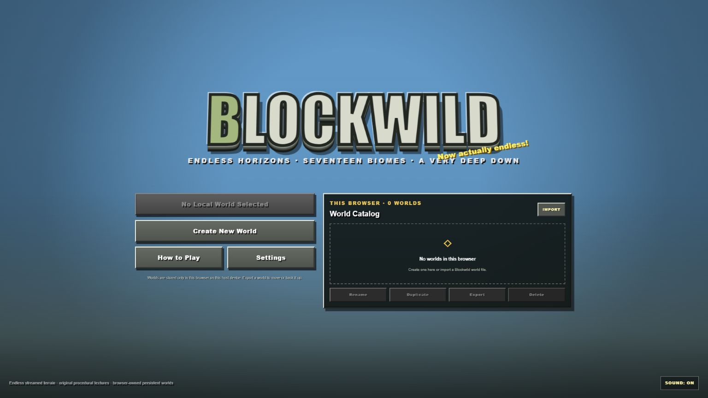
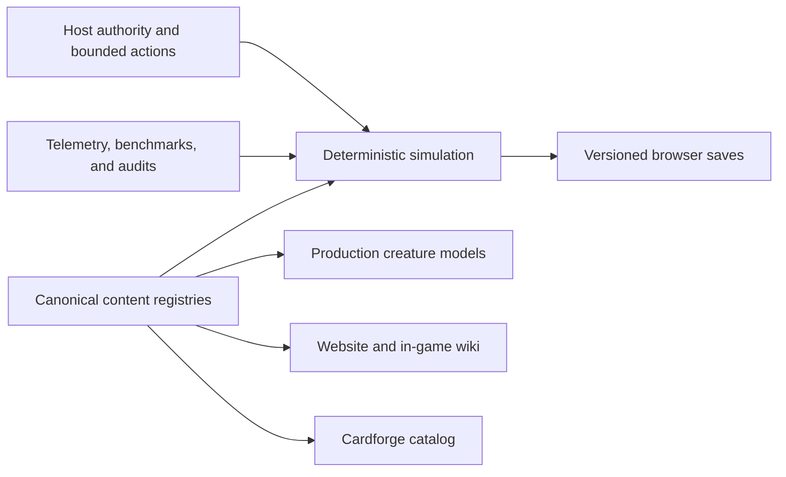

# Blockwild

<p align="center">
  
</p>

<p align="center">
  <a href="https://github.com/RedLynx101/blockwild/actions/workflows/ci.yml"></a>
  <a href="https://github.com/RedLynx101/blockwild/actions/workflows/codeql.yml"></a>
  <a href="LICENSE"></a>
  <a href="https://blockwild.app"></a>
</p>

Blockwild is an open-source, systems-dense browser voxel survival RPG built with TypeScript, React, Three.js, and deterministic procedural generation. It is a playable world rather than a static technical demo: streamed terrain, ecology, combat, building, farming, settlements, dungeons, creature research and capture, host-authoritative multiplayer, magic, dragons, and Cardforge all operate on a persistent simulation.

The current release is **v1.12.0 Field Archive**.

- **Play:** [blockwild.app](https://blockwild.app)
- **Browse the living wiki:** [blockwild.app/wiki](https://blockwild.app/wiki)
- **Sites mirror:** [blockwild.noahhicks.chatgpt.site](https://blockwild.noahhicks.chatgpt.site)
- **Release history:** [CHANGELOG.md](CHANGELOG.md)
- **Project direction:** [ROADMAP.md](ROADMAP.md)

> Blockwild is an active public prototype. Worlds and characters are stored in the browser, so export important saves from the Worlds screen.

## Scope snapshot

These figures are generated or counted from the v1.12.0 release source, not roadmap promises.

| Area | Current release |
|---|---:|
| Authored creatures | 232 |
| Items / flora / surface biomes | 537 / 52 / 24 |
| Guilds / quest chapters | 9 / 72 |
| Spells / legendary encounter contracts | 20 / 21 |
| Cardforge definitions / deterministic printings | 254 / 819 |
| Searchable wiki entries | 855 |
| TypeScript/JavaScript source and test code | 139,707 lines across 325 files |
| Automated validation | 1,000+ checks across 128 test files |

The numbers matter because the systems are connected. Creature definitions feed ecology, combat, rendering, capture, persistence, the Bestiary, wiki articles, Cardforge printings, and audits. World generation feeds streaming, maps, settlement placement, cave ecology, lighting, liquids, and compatibility tests. That shared-source design is what keeps the game's breadth maintainable.

## What makes it Blockwild

- An effectively endless deterministic world streamed in 16 x 16 chunks, with 24 surface biomes, oceans, rivers, settlements, roads, POIs, dungeons, and a connected cave world from Y -64 to Y 127.
- 232 authored creature entries and 52 flora entries sharing production data across simulation, rendering, the Bestiary, Cardforge, tests, and the wiki.
- Survival and Builder modes, mining, construction, crafting, machines, farming, alchemy, magic, equipment, boats, maps, quests, factions, guilds, trade, and progression.
- One understandable Capture Orb contract. Capture establishes custody; eligible creatures become usable companions through a visible care-and-bonding path.
- Direct host-authoritative multiplayer with persistent browser-local characters and optional, capability-scoped AI companion drones.
- No runtime-generated creature art or rules text. Canonical models are the source of truth for gameplay portraits and Cardforge creature identity.

## Living wiki and field guides

The public [`/wiki`](https://blockwild.app/wiki) route and the in-game **Blockwild Wiki** are built from one maintained knowledge source. The current archive contains 855 searchable entries:

- 537 items with deterministic origins, recipes, stations, and downstream uses
- 232 creatures with habitat, disposition, types, ecology, capture or recruitment guidance, and known drops
- 52 plants with habitat, cultivation, utility, and yields
- all 24 surface biomes
- maintained system guides for starting out, crafting, capture and bonding, research, farming, exploration, the World Below, multiplayer, Cardforge, and controls

Stable links such as `/wiki?entry=creature:fire-dragon` open a specific article. In the game, press `?` while an inventory or workstation item is selected to open that exact item page. Creature and plant articles can hand off to the character's personal Bestiary or Plant Compendium.

The distinction is deliberate: the wiki documents stable public rules, while the Bestiary records what a particular character has actually seen, captured, tamed, bred, and researched. Locked field notes are not bypassed by the website.

The source registry is [`app/game/wiki-content.ts`](app/game/wiki-content.ts). `npm run build:wiki` emits compact public index and category shards under `public/knowledge/`, which the website loads on demand.

## Quick start

Requirements:

- Node.js 22.13 or newer
- A current hardware-accelerated WebGL browser
- Bash/WSL for the exact production build and full validation path

```bash
git clone https://github.com/RedLynx101/blockwild.git
cd blockwild
npm ci
npm run dev
```

On Windows, `npm.cmd run dev` avoids PowerShell script-policy issues. For the same bounded Vinext/Cloudflare path used by Sites, run the lifecycle scripts in WSL:

```bash
npm run install:ci
npm run build
npm test
```

## Useful commands

| Command | Purpose |
|---|---|
| `npm run dev` | Start the local Vite/Vinext development server |
| `npm run build:vercel` | Generate wiki data and build the Next.js/Vercel application |
| `npm run build` | Generate wiki data, build the Sites Worker artifact, and validate it |
| `npm run lint` | Run ESLint outside generated and work directories |
| `npm test` | Build, validate, and run the full deterministic test suite |
| `npm run test:wiki` | Check wiki coverage, links, shards, and UI boundaries |
| `npm run test:cardforge` | Check the catalog, art, layouts, economy, and matches |
| `npm run models:render -- --creatures --portraits outputs/model-portraits --portrait-only` | Render canonical creature review portraits |
| `npm run cardforge:render-art` | Regenerate canonical-model Cardforge Full Art |
| `npm run audit:ecology` | Report flora, fauna, sound, and POI coverage by habitat |
| `npm run audit:mobs` | Report sound, drops, and biome coverage per creature |
| `npm run benchmark:simulation` | Run the deterministic simulation benchmark |
| `npm run benchmark:spatial` | Compare indexed and whole-population creature queries |

Generated inspection output belongs under ignored `output/`, `outputs/`, or `work/`. Review visual sheets before publishing regenerated assets.

## Architecture

React owns menus and HUD surfaces. `VoxelEngine` owns mutable simulation, authority, physics, interaction, audio, and compact HUD snapshots. `ChunkWorld` owns deterministic terrain, streamed chunk sections, player edits, liquids, lighting, and meshes. Frame-by-frame simulation does not flow through React state.

The same principle applies to content:

- `data.ts` is the block, item, recipe, fuel, and smelting registry.
- `mobs.ts`, `mob-models.ts`, and creature-domain modules separate ecology and persistence from canonical geometry.
- `world.ts`, `caves.ts`, `structures.ts`, and settlement modules own deterministic world planning.
- `wiki-content.ts` projects those registries into public knowledge without creating a second truth source.
- Cardforge definitions remain deterministic; standard and Full Art creature printings reference canonical production models.
- Multiplayer is host-authoritative. Guests send bounded actions rather than owning shared world mutation.



See the [engineering overview](docs/ENGINEERING_OVERVIEW.md) for a guided codebase tour, then [Architecture](docs/ARCHITECTURE.md), [Development and validation](docs/DEVELOPMENT.md), [Creature model style](docs/CREATURE_MODEL_STYLE.md), [visual theme](docs/BLOCKWILD_VISUAL_THEME_PROPOSAL.md), and [lighting system](docs/LIGHTING_SYSTEM.md) for the working contracts.

## Engineering depth

- **Bounded real-time work:** chunk generation, voxel lighting, meshing, ecology, pathing, and persistence are scheduled in resumable budgets so local actions remain immediate.
- **Deterministic worlds:** terrain and authored structures derive from seeds and compatibility versions; saves store edits and durable state instead of copying untouched terrain.
- **Multiplayer authority:** shared mutations are validated by the host, encoded as bounded actions, and covered for reconnect, replay, stale revisions, and guest interaction.
- **Living content pipeline:** canonical registries project into runtime systems, searchable public knowledge, Cardforge, audits, and generated model art without hand-maintained duplicate catalogs.
- **Measured optimization:** in-game telemetry, deterministic benchmarks, soak tests, and a tracked comparison log support evidence-driven performance work.
- **Reproducible release gates:** GitHub Actions checks generated-content drift, types, lint, the production builds, the full deterministic suite, dependencies, and CodeQL analysis.

## Saves and privacy

Worlds and character profiles live in `localStorage` for the current browser and origin. Saves contain the seed, edits, player state, persistent creatures, machines, structures, world knowledge, and compatibility versions rather than copies of untouched generated terrain.

- Clearing site data, changing origin, using a temporary profile, or exceeding browser storage can remove or block local saves.
- Saves do not automatically follow a player to another device.
- The host browser owns a multiplayer world's persistent record.
- Use **Export** and **Import** on the Worlds screen for backups and transfers.
- Optional AI companion voice credentials belong only in the external runner. `.env.agent.example` contains names, never real keys.

## Deployment

`main` is the release branch. GitHub is the source of truth for Vercel's [blockwild.app](https://blockwild.app) deployment. The same exact commit is built through Vinext for the Sites mirror. Release validation must identify the deployed Git SHA; a passing local build is not proof that either public target is current.

The application does not currently require D1, R2, or a server database. The empty Drizzle scaffold is reserved and should not acquire game persistence without an explicit ownership and migration design.

## Project documentation

- [Engineering overview](docs/ENGINEERING_OVERVIEW.md) — a concise tour of the simulation, content, persistence, multiplayer, validation, and release architecture
- [Building Blockwild with Agentic Autoresearch](BLOCKWILD_AGENTIC_AUTORESEARCH_CASE_STUDY.md) — the human-directed agent workflow, telemetry loop, and optimization case study
- [Performance comparison log](docs/PERFORMANCE_COMPARISON_LOG.md) — measured browser and deterministic benchmark history
- [Living Bestiary release contract](docs/LIVING_BESTIARY_RELEASE.md)
- [Capture and bonding simplification](docs/CAPTURE_ORB_AND_CREATURE_BONDING_SIMPLIFICATION_PROPOSAL.md)
- [AI companion implementation ledger](docs/AI_COMPANION_DRONE_PLATFORM_IMPLEMENTATION.md)
- [Cardforge proposal](docs/BLOCKWILD_TCG_CARDFORGE_PROPOSAL.md)

## Contributing and security

Read [CONTRIBUTING.md](CONTRIBUTING.md) before changing content or systems, and use [SECURITY.md](SECURITY.md) for vulnerability reports. Changes should preserve deterministic generation, save compatibility, host authority, bounded runtime work, canonical visual identity, and accessible UI behavior.

Blockwild is open source under the [MIT License](LICENSE). Original third-party media, where present, remains subject to its recorded attribution and license.
