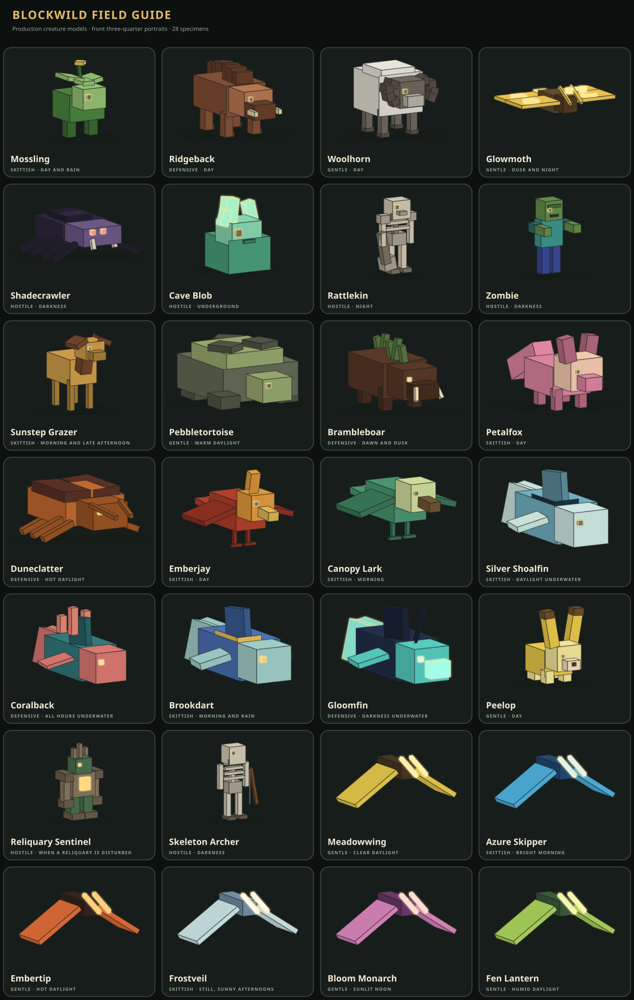

# Blockwild

Blockwild is an endless browser voxel-survival game built with TypeScript, React, and Three.js. A seed produces a deterministic world of streamed 16 x 16 chunks, 24 surface biomes, seven underground habitat layers, surface, underwater, and subterranean settlements, temples, dragon lairs, changing weather, creatures, and terrain running from Y -64 to Y 127. The game supports survival and builder modes, browser-local world management, adaptive touch controls, and direct host-authoritative multiplayer sessions. The current in-game release is **v1.5.3 The World Below**.

The project is a real game rather than a voxel-rendering demo. You can mine, build, craft, smelt, farm, fight, collect field notes, manage several worlds, and carry those worlds between browsers with export files.

**Play the current hosted build:** [blockwild.noahhicks.chatgpt.site](https://blockwild.noahhicks.chatgpt.site)



The integrated creature-design pass expands the Courser family with Rimehoof, Sunscar, Mirestride, and Starbough ecological breeds plus the forge-built Deepgear Courser. It also gives all six dragon families production stage forms, rebuilds birds, pets, crabs, mosslings, foxes, harts, deer, longhorns, terrapins, and other core wildlife, and preserves one model path for gameplay, Bestiary portraits, and visual audits.

## v1.5.3 The World Below

This ecology update integrates the latest pushed `design-1` work. Natural creatures now populate six separate local pools—surface animals, ambient life, large and small aquatic life, underground ecology, and monsters—so one abundant category no longer crowds every other category out. Connected players receive separate nearby targets while the host retains one bounded, sublinear global workload.

Wildlife spawns through bounded placement retries outside visible pop-in and preferentially fills whichever compatible local pool is most deficient. Hunting pressure temporarily slows only the defeated species in that 64-block sector and fades over in-game days. Ordinary distant wildlife now leaves after a grace period instead of an absolute age purge; protected and rare creatures sleep as lightweight save records and wake in bounded batches when a player returns.

## v1.5.2 The World Below

This repair release adds a recoverable Terraria-style trash slot and Minecraft-style carried-stack controls: left click moves a whole stack, right click takes half or places one, left drag places the equal floor share and keeps the remainder carried, and right drag paints one item into each compatible slot. Creature health readouts stop at two useful decimal places, while the Bone Shard icon stays within its real inventory socket.

Multiplayer guests now throw real host-owned drops, consume leads exactly once, recover led ground animals from floating states, Shift-craft the complete legal batch, and break grass or torches without a false wrong-tool warning. Host ecology round-robins its existing spawn clock across connected players, activates nearby POIs, and simulates/culls wildlife relative to the nearest player without multiplying the full population budget per guest.

Forest Temples have complete walls, windows, and an intentional working entrance. POI clearings suppress entire intersecting tree plans rather than leaving crowns behind. Leaf canopies diffuse skylight gradually, every directional torch competes in a larger nearest-first light pool, placed torches are brighter, and lava contributes warm baked and dynamic light without indexing every lava voxel. Wild Rune Stone is weathered fieldstone with sparse shiny green mineral flecks and a restrained green glow. Fresh and already-discovered Lantern Piehouses anchor their keeper behind the counter and reliably sell a new craftable Hearthberry Apple Pie alongside their Hearthkin provisions.

## v1.5.1 The World Below

This polish release integrates the three newest `design-1` commits. The nine World Below signature creatures receive a second authored model pass with distinct anatomy, secondary motion, and regenerated Bestiary portraits. Two-block meadow grass now survives later decoration as an intact pair, submerged water and waterlogged flora meet without false air seams, and one shared schedule slows crops, orchards, saplings, berry bushes, flowers, and aquatic plants to the intended pace. Survival travel, sprinting, and natural healing now consume food at the updated rates.

The title screen is reorganized around a clean centered menu with dedicated character and world submenus, while all seven playable races gain distinct modeled face profiles. Merchant panels add direct quantities, ±1/±5 controls, safe Buy All and Sell All presets, exact limiting-factor explanations, and a separate confirmation step. Large trades are no longer silently capped at one stack, and the same validated quantity contract is used for local and multiplayer transactions.

## v1.4.5 Dragon Renaissance

Dragon Renaissance treats dragons as six related species rather than six palettes. Fire, Steel, Sea, Gold, and Silver adults have been rebuilt around distinct silhouettes, while the existing Ice adult remains intact. Every family now develops through authored cute hatchling and juvenile forms before reaching its adult plan, and the shared rig adds calmer idle life, more convincing wing and tail follow-through, and sharper attack anticipation without accumulating transform drift.

Dragon tack and armor follow each body instead of floating as generic boxes. The related inventory art, scale equipment, panniers, saddle, and layered gold hoards are readable at their actual UI sizes. Lairs are substantially larger, reproductively mature dragons guarantee a preserved egg when defeated, loose eggs survive lava and persist for at least one configured world day, and progressive Bestiary notes teach the whole path from first encounter to incubation, bonding, shoulder carry, riding, breeding, and scale husbandry.

## v1.5.0 The World Below

The World Below gives new worlds a new deterministic generator profile without rewriting old terrain. Coherent regional seeds make surface biomes about 35% broader by default, while separate transition and rare-biome guarantees keep all 24 surface identities expedition-accessible. Meadows and fens retain broad flats; Rainveil country gains ravines and ridges; Highlands, Snowcap systems, badlands, and Ember Wastes use substantially more of the unchanged -64-to-127 world range. Coasts now follow actual water adjacency instead of recoloring broad low ground.

Caves are planned as a connected three-depth graph before noise shapes their walls. Natural mouths receive explicit descents into a looped network of rooms, chambers, great caverns, rare cathedral caverns, narrow routes, streams, waterfalls, aquifers, and authored destinations. Rootweave Grotto, Starbloom Hollows, Glasswater Deeps, Pillarstone Reaches, Crystaldeep Gallery, and Emberdeep Fumaroles form six distinct ecological centers, with deliberately dark Stone Roads between them. Their 41-block family includes roots and fungi, lake plants, fossils and flowstone, crystals, sulfur and vents, traversal pieces, Living Veins, and Deepgear lifts.

Nine production creatures inhabit those systems: Grotto Grazer, Lanternray, Prismtail Swift, Glassback Newt, Sailfin Skimmer, Ashnose Bat, Chimewing, Cinder Kite, and Veinling. Each has an authored model, locomotion and idle motion, habitat-weighted spawning, custom sound, staged field notes, and flock, family, roost, pond, thermal, or colony behavior. The explored cave map records only the upper, middle, or deep band the player has physically entered. Rope, anchors, ladders, pitons, bridges, temporary markers, waterfall movement, mounts, and paired settlement lifts provide the matching traversal toolkit.

Ordinary Iron replaces every player-facing Sunmetal name while preserving its historical numeric IDs and accepting old string keys at compatibility boundaries. Copper now has Raw Copper and Copper Ingots instead of becoming Iron; Gold retains its independent chain; and rare, faintly pulsing Veinmetal remains deliberately unresolved. New worlds store word-sized block IDs, while generator-v14 and older saves remain on `legacy-v14` with their blocks, inventories, equipment, machines, quests, merchants, storage, and multiplayer records intact.

Settlement site search evaluates real terrain before faction and spacing decisions. Villages remain uncommon but all six cultures remain represented across ordinary audit seeds; failed village regions can leave wayposts rather than nothing. Dwarven holds are mountain-compatible cave-graph anchors with civic caverns, golem forges, clear paired lift shafts, surface gatehouses, lit switchback mine roads, and map markers. Run `npm run test:world-overhaul` for the release contracts and `node --import tsx scripts/audit-world-overhaul.ts` for the three-seed world report.

Deepgear engineering also gains two blueprint-gated companions: the fast Clockwork Hound interceptor and the eight-legged Webspinner ranged controller. Both use detailed production rigs, planted mechanical locomotion, distinct combat roles, exact Capture Orb metadata, and spatial metallic voices. Direct hostile hits now use the supplied player-damage recording at a restrained mix, while the authored rain bed and its procedural support layer are fifteen percent quieter.

## v1.4.4 Harbor Homecoming

Harbor Homecoming makes a multiplayer character arrive as the same person regardless of whether they join from the title screen or from an existing world. Host-owned character state now restores vitals and personal progression on reconnect while keeping large exploration data out of the frequent inventory channel. Guests can launch, reliably board, helm, leave, and pack an empty Wayfarer sailboat through validated host actions; placed beds and other eligible blocks use the same authoritative pickup rules. Crafting recipes now link through craftable ingredients, spell tomes have readable full-frame icons, saplings accept Meadow Grass, Saltwind Lighthouse furniture rests on its floor, and the explored map includes the latest `design-1` performance work.

## v1.4.3 Shared Lanterns

Shared Lanterns separates high-frequency guest presentation traffic from reliable inventory and interaction transactions, reducing scroll and world-update contention without surrendering host authority. Shared furnaces, creature cargo, conservatories, aquarium storage, and other facilities now open from host state; merchant trades, dragon-care actions, and leads carry the acting player's identity; and stale revisions or invalid remote mutations are rejected. Furnaces, ordinary containers, conservatories, aquariums, and creature cargo support validated shared interaction; the remaining heterogeneous production stations expose their host-authored state read-only until each has a typed operation protocol. The release also quiets the empty spell wheel, closes it on Q release, makes filled creature orbs singleton records with descriptive names, expands stable nearby lighting, repairs Bloomrot Cathedral, and polishes peppermint, rune, Surveyor Table, and cricket presentation.

## v1.4.2 Shared World Repair

Shared World Repair is a focused multiplayer hotfix. Guest clients now advance tree-fall and creature-remains presentation after host-authoritative removals, so accepted destruction completes instead of leaving frozen, non-interactive models. Player block placement consumes its item inside the same host-owned transaction as the voxel edit. Chest shift-clicks submit immediately and safely replay a second local transfer after the first shared-container revision is acknowledged.

## v1.4.1 Wildlife Voices

Wildlife Voices merges the latest `design-1` sound pass into the complete v1.4 world. Six lossless recordings give rabbits, small companions, Runeowls, and underwater leviathans distinct calls and alternates through the existing spatial audio system, without replacing the broader environment, movement, combat, settlement, and creature soundscape.

## v1.4 Living Ruins

Living Ruins replaces the repeated box language in several landmarks and dungeons with authored silhouettes. Skyglass Observatory is now a broken crescent of lens supports and terraces; Emberwatch tapers through ribbed balconies; the Pilgrim Bathhouse wraps two irregular springs; Clockwork Burrow occupies a collapsed elliptical survey hull; and the Shattered Colossus has a rounded hollow skull, articulated arm, fingers, rubble, and vines.

The four underground dungeon families now grow from deterministic connected tile graphs. A guaranteed entrance-to-vault spine is joined by seeded same-level side chambers, so layouts contain seven to eleven modules and vary in footprint without exceeding the existing generation envelope. Rootbound grottoes, Starless lens rooms, Brassdeep assembly bays, and Palimpsest stacks retain distinct decoration, reversible stairs, stable progression, encounters, and loot. Their thresholds introduce craftable Wrought-Iron Doors with real see-through bar geometry, correct two-block interaction, both orientations, family-preserving open/close behavior, and a readable held model.

All six factions still use the shared connected-road planner, but hamlets, villages, and towns now choose deterministic building counts within category bands instead of repeating one exact size. The world stamp honors building rotation, faces entrances toward the intended side, chamfers civic footprints, and gives Hearthkin, Goblin, Sugarcourt, Wood Elf, Atlantian, and Dwarven construction more individual roof or arch profiles.

The merged `design-1` tip `f8a0205` rounds out the living-world side of the release: natural spawning respects activity windows and microhabitats, passive and hostile spawn cadences are separated, field notes support staged dragon milestones, missing discovery hints are filled in, Highlands and Volcanic ground cover are richer, and the Plant Compendium now covers 46 production-rendered species. Generator version 14 preserves edits while regenerating untouched structure terrain from the new plans.

## v1.3.8 Quiet Wayfinding

Quiet Wayfinding makes the Trail Compass respond four times faster while keeping its presentation restrained: cardinal headings live on the rail itself, and a softly fading landmark name appears only when the player points directly at a visible POI. The parchment map can render detailed sampled terrain at any zoom through an explicit toggle and now supports a wider strategic view.

This polish pass also adds naturally generated, connected two-block grass; darker and more legible breaking cracks; shared Pack and Recipes panel dimensions; attached, branched Thimbledeer antlers; a softer authored grass footstep; and a sampled default block-impact cue for mining and breaking. The final `design-1` sync adds detailed wildlife upgrades, Lightning Bugs and jarred light, Iron Shears, better held lighting, and five new creature calls while leaving the design branch intact.

## v1.3 Echoes and Ruins

Echoes and Ruins adds a real spatial soundscape. The release integrates 31 lossless WAVs—18 supplied environment/action recordings and all 13 creature calls from the merged `design-1` history—alongside the existing music and effects. HRTF-positioned world emitters track creatures, doors, chests, magic, and dragon attacks; player-local footsteps, water entry, UI, and achievement cues remain clean authored signals. Rain, crickets, wind, winter wind, caves, oceans, and swimming crossfade as bounded ambient beds according to the world around the listener.

Exploration now draws from exactly 28 deterministic POI archetypes: eight tiny details, 14 medium encounters, and six large destinations. Six separate three-stage dungeons occupy a much sparser grid: Rootbound Labyrinth, Starless Observatory, Brassdeep Foundry, and Palimpsest Vault below ground; Stormglass Citadel and Bloomrot Cathedral above it. Each has a material and lighting identity, reversible traversal, persistent encounters, caches, spell opportunities, a boss, a master vault, and a discoverable map heart.

Nine authored encounter creatures—Auric Scarab, Rootwrithe, Bellroot Matron, Vaultwing, Cinder Maw, Ossuary Keeper, Mossback Kite, Clockwork Marmot, and Inkmaw Curator—use detailed production rigs and the same runtime/Bestiary render path as the rest of the ecology. Dawnthread Saber and Deepdelver's Promise are infinite-durability legendary heirlooms; Briarheart Crook is a 6,000-use legendary with its own hostile-creature bonus. All three have authored dungeon provenance, models, loot keys, and situational mechanics.

The atmosphere pass repaints nine major biome surfaces with unique 16-pixel atlas recipes and coordinated vertex tints. Rabbit ear roots are attached across all four variants. Birds use a fixed-budget three-dimensional obstacle router, route caching, canopy recovery, and scored perch approaches; ground routes reuse short proven paths, and size-aware attack reach keeps larger creatures from crowding inside their targets. Generator v13 adds the adventure grids while preserving authored edits when version-12 worlds migrate. The final release also includes the latest pushed `design-1` work at `789bf43`: its expanded fish and sea-slug redesign plus mythic Gold and Silver Dragons.

## v1.2 Trailbound

Trailbound makes the browser profile—not the route used to join—a player's durable multiplayer identity. Title-screen and in-world joins now resolve the same saved character and host-owned session record, including vitals, inventory, equipment, skills, Capture Orbs, companions, appearance, and reconnect state. Guest tree felling and creature deaths apply the host's authoritative removal immediately, play their fall or death feedback locally, and use revisioned inventory and chest acknowledgements instead of resurrecting stale state.

The rebuilt title flow includes as many as twelve named characters per browser. Each character stores race, sex, clothing, skin and hair colors, a twenty-point starting-skill allocation, and the last selection. Wayfarer, Hearthkin, Goblin, Atlantian, Confectkin, Wood Elf, and Dwarf bodies share one equipment and animation contract in first person, third person, and multiplayer. Atlantian characters breathe underwater, move faster while swimming, and travel more slowly on land. Sprint-swimming pitches the whole character forward and uses a proper arm stroke, while impact momentum carries a falling player below the surface before buoyancy takes over.

Survival polish now includes a left-hand equipment slot, Wildwood and Iron shields, off-hand torches and Deepgear lanterns, readable block-breaking cracks, tool-suitability outlines, quieter periodic saves, sorted and one-click chest transfers, charcoal-compatible recipes, and four Capture Orbs per recipe. The Trail Compass adds heading, tracked players, landmarks, and waypoints above the world; the map keeps high-detail local colors at close zoom and biome summaries farther out. Two new skills cover Bartering and Luck, skill descriptions state their actual effects, and character/faction quest handoffs use the relevant resident rather than a settlement-wide remote menu.

Field Cotton, Suncrest Carrots, and Bluepod Beans expand farming. Four tameable rabbit families, two sea slugs, and Pocket Goldfish join the ecology; connected aquariums provide a bounded pebble-and-plant habitat with one resident per block and slow same-species breeding. Fireplaces, revised tiled settlements, plant-sized interaction bounds, smoother clouds and daylight, sky-gated sun and moon lighting, rain ambience, thunder, lightning, and supported POI lights round out the world pass. The bestiary now separates humanoids, rabbits, and sea slugs, while the Plant Compendium renders all 42 specimens—including complete example trees—from production geometry.

## v1.0 Realms and Recall

Realms and Recall adds Wood Elves and Dwarves as optional world factions. Luminous Moonbough Enclaves occupy the new Glimmerwood biome with Moonbough trees, glowing flora, Glowfin ponds, Glimmerharts, Runeowls, Moonveil butterflies, leaf-magic guards, tomes, bows, potions, and tiled walled towns. Deepgear Holds sit beneath the snowcapped Snowcap Range, connected to the surface by guarded mountain entrances and lit with high-output brass lanterns. Their carved streets contain powderworks, flintlocks, Copper Moles, aligned automatons, and a mana-fed Golem Forge for six blueprint-gated constructs.

Sea Dragons extend the persistent dragon lifecycle with fast swimming, capable land travel, deliberately slower flight, deep-ocean nests, tide-aware incubation, aquatic attacks, Tideglass armor, and Atlantian-sold nest charts. Dragon care exposes individual stage, travel, power, ward, growth, and equipment information. All four dragon families keep sex, genetics, growth, lair, ownership, commands, cargo, armor, carried scales, and survival records when their chunks unload.

Capture Orbs can be attuned to a specific conscious creature. An attuned companion can be summoned or recalled from the same orb at any distance; recall preserves its exact state and returns it in a white sparkle. A fainted companion returns automatically, remains locked to its orb, and must heal before it can be summoned or unattuned. Crafted apiaries accept neutral or bonded queen entities and exact worker-bee records, and friendly colonies allow workers to be inserted or removed through the hive interface.

The Waygrid adds searchable digital item and creature storage. Item cells provide 1,000, 10,000, or 100,000 units of capacity; connected terminals show exact use, search stacks, and spill only the precise overflow if capacity is removed. The creature archive preserves complete Capture Orb metadata and heals stored creatures more slowly than a dedicated Healing Station. Crafting can atomically draw a complete recipe from the player, the Waygrid, and nearby owned chests without consuming a partial set on failure.

Multiplayer state is explicitly host-owned for every player. Inventories, selected slots, equipment, health, hunger, appearance, skills, mob health/death, drops, PvP, shared chests, and reconnect state come from the host world instead of leaking in from a guest's local save. The host ending the session returns guests to the title screen, and a departed guest can rejoin with the same code. Renderer previews share one disposable WebGL context, preventing menu remounts from evicting the live world renderer into a white canvas.

## What is in the game

- **Endless deterministic terrain.** Twenty-four named surface biomes are generated from a text seed, including variable ocean shelves and basins, rivers, Sunwash Coast, forests, wetlands, deserts, snowfields, highlands, volcanic wastes, Cloudreed Glen, Rainveil Jungle, Sakurabloom Grove, Lumen Trench, Sugarplum Vale, bioluminescent Glimmerwood, and the snowcapped Snowcap Range. A graph-first cave network links reliable mouths, looped routes, aquifers, streams, waterfalls, great caverns, and six ecological centers through the full Y -64 to Y 127 range. Nine major surfaces and every underground family use dedicated deterministic atlas recipes and coordinated biome tints without enlarging the nearest-filtered 16-pixel atlas contract.
- **Survival and builder modes.** Survival tracks health, hunger, armor, XP, tool durability, fall and lava damage, hostile nights, and dropped inventory. Builder mode provides fast harvesting, infinite placement, and a creative catalog.
- **A full item loop.** The 36-slot inventory supports stacking, splitting, double-click collection, hotbar selection, equipment slots, dropped items, and shift-click transfers. Hand crafting uses a 2 x 2 grid; crafting tables unlock shaped 3 x 3 recipes. The searchable recipe book previews patterns on hover and stages ingredients into the board when clicked; it never silently crafts an output. Mirrored axe patterns work from either side. Advanced crossbows, spears, faction tonics, Honeymead, Sugarcourt arms, Sugarplate armor, dragonbone arms, scale armor, dragon husbandry, and incubation stay locked until their physical blueprints are learned; duplicate blueprints remain saleable. Tools, armor, materials, plants, food, torches, doors, beds, boats, Capture Orbs, nets, dragon tack, eggs, tomes, workstations, bottles, jars, and filled buckets have purpose-built full-size inventory icons and held models instead of flat color swatches.
- **Machines, storage, farming, and brewing.** Furnaces continue processing against real elapsed time. Chests hold 27 slots, adjacent chests merge into 54-slot storage, and the searchable Waygrid scales from 1,000-item cells through 100,000-item cells while supporting atomic area crafting from the pack, digital storage, and nearby chests. Capture Orb Racks display preserved creatures, Healing Stations restore four at a time, and a separate searchable creature archive heals larger collections slowly. Alchemy Stands turn bottles, water, fruit, cave materials, honey, flowers, gold, and dragon hearts into health, travel, faction-specific, Tidebreath, Peppermint Rush, Marshmallow Ward, Moonstep, Verdant Renewal, and permanent-capacity Manaheart Draughts. Distilleries ferment Honeymead, Sugarworks run timed candy batches, and mana-fed Golem Forges assemble six blueprint-gated constructs, including the rideable Deepgear Courser, interceptor Clockwork Hound, and ranged-control Webspinner, only after every resource is committed. Farming covers hydrated soil, scythe replanting, cultivated flowers, regrowing berries, orchards, and waterlogged flora.
- **Placement-aware building pieces.** Floor torches stand upright, while torches placed against a side face lean out from that wall, persist their direction, and break when their support disappears. Doors render textured narrow edges instead of exposing an untextured slab.
- **Connected enclosures.** Wildwood fences join neighboring fences, gates, and solid blocks; closed pieces use 1.25-block collision while open gates remain pathable. Braided Leads attach creatures to the player and can be hitched to an enclosure.
- **Beds and flexible time skipping.** A Wildwood Bed can advance the world from any hour to the next dawn or next dusk, always moving forward. Multiplayer worlds can require any player, a configurable percentage, or every connected player to choose the same destination.
- **Material progression through draconic craft.** Wood, stone, iron, and star-crystal tools have different mining speeds, damage, harvest requirements, and durability. Trailhide and iron armor reduce incoming damage and wear down in use. The Dragonwake branch adds a 2,400-use Dragonbone Greatsword, 2,600-use Pickaxe, 2,500-use Axe, and complete Fire, Ice, and Steel scale-armor sets behind learned treatises.
- **Two living field guides.** The filterable creature bestiary tracks discovery, kills, captures, taming, breeding, food, sentience, drops, habitat, activity, behavior, utility, lore, and dedicated Humanoid, Rabbit, Sea Slug, Golem, and habitat categories. Each of the 178 entries and list icons uses a front-three-quarter portrait rendered from the same model as gameplay, with a completion ring and an append-only sequence of independently unlocked field notes. Unknown entries retain a habitat clue instead of becoming blank cards, while complex creatures such as dragons can keep accumulating milestone-gated research without another save-schema change. A separate plant journal covers 46 trees, crops, bushes, flowers, aquatic plants, and wild growths with their habitat, growth rules, drops, practical use, and a production render.
- **Creature keeping.** Waykeeper Capture Orbs preserve health, age, baby state, name, temperament, faction alignment, ownership, pet commands, taming progress, and species-specific state. Friendly and neutral creatures can be moved freely; hostiles must be below half health or at one heart. Tamed, named, POI-resident, and enclosed creatures are protected from normal despawning. Eligible wildlife can be fed, healed, bred, and raised from babies. Shadecrawlers, Reedstriders, Wildwood Coursers, Wargs, Worldshells, Aetherbells, and Taffalo have distinct trust, growth, saddle, cargo, and riding paths; Tidepups, Sakurakits, Taffy Hounds, and Praline Cats cover different companion roles. Aligned borough pets retain their Sugarcourt provenance through capture and release and remain untameable; only unaligned stock can bond with a player. Connected Butterfly Conservatory blocks fuse into clean habitats up to 20 blocks, accept jarred butterflies and eligible small orb-preserved wildlife with exact metadata, add flowers and branches by tier, contain flight to their cells, and permit capped in-habitat breeding.
- **Persistent dragons.** Fire, Ice, Steel, Sea, Gold, and Silver Dragons use one migration-safe state contract for age, five growth stages, sex, genetics, health, ownership, home lair, commands, equipment, two cargo modules, carried scales, breeding cooldown, and survival outside the active simulation radius. Wild dragons can unload at distance but are exempt from ordinary cleanup. Sea Dragons use swim-first travel attributes and abyssal nests; mythic Gold and Silver Dragons add rarer lairs, celestial hatching rites, unique breath effects, equipment, surveys, and trade stock. Hatchlings can bond and perch on a shoulder, while stage-three adults can be saddled and flown. Same-type, opposite-sex breeding yields physical eggs, food heals injuries, Dragon Meal adds a growth day, and renewable scales accumulate every three world days for collection through the dragon care interface.
- **Apiaries and living pollinators.** Wild hives hold a queen and up to eight workers. Workers seek flowers, gather nectar, and return at dusk; crafted apiaries activate from a Queen Cell or an exact neutral/tamed queen entity, accept and release friendly worker records, grow their own workforce, and store up to 12 Wildflower Honey and 12 Royal Jelly. Breaking a wild hive releases an angry colony. A neutral queen can bond through Royal Jelly, while an agitated queen must first be weakened; workers can be netted and transferred without losing their hive metadata.
- **Physical, path-aware wildlife.** Medium and large ground creatures collide with players and each other, route around blocked terrain, liquids, ledges, crowds, and closed doors, and pass through open gates and doors. Following companions match travel speed, form widening offset rows instead of crowding the camera, and safely teleport back when separated beyond recovery distance. Birds add bounded three-dimensional look-ahead probes, safe-route reuse, canopy escape choices, and obstruction-aware perch approaches; ground creatures cache short proven routes, while attack reach includes a bounded body-size allowance.
- **Water and food-liquid ecology.** Water animates, flows downward and outward, renews a source between supported adjacent sources, and has oxygen/drowning mechanics. Players naturally sink, can swim upward, crouch-dive, and get enough lift at a bank to climb onto land. Honey and syrup use the same bounded liquid queue but spread less far, never renew, and slow movement more heavily; Syrupfins remain confined to natural syrup rather than ordinary water or honey. Variable rivers and oceans run deeper and reject surface flora from occupied water cells. Seven waterlogged flora species render inside water without replacing its source; they can be targeted, broken back into water, replanted, and, where appropriate, grow upward to bounded heights. Habitat-weighted schools include Glassfins and Lanternjaws, while Abyss Skaters stay near the seafloor, rare Dreadcoils hunt exposed swimmers, and leviathans remain much rarer than ordinary fish. The two-seat Wayfarer is a larger sailboat with a working sail and an 18-slot cargo hold opened with crouch-right-click.
- **Temples, ruins, dungeons, and biome landmarks.** Existing temples, groves, sanctuaries, apiaries, healing grottoes, dragon lairs, and settlements remain sparse deterministic destinations. Wayposts and Palimpsests expands the adventure catalogue to 28 POI archetypes—eight tiny, 14 medium, and six large—plus six rarer three-stage dungeons on an independent grid. Six faction-aligned wayposts add named merchants, personal side-work sources, and directions to known faction towns; Whistlekite Roost and Clockwork Burrow add creature-centered destinations. Rootbound Labyrinth, Starless Observatory, Brassdeep Foundry, and Palimpsest Vault descend underground; Stormglass Citadel and Bloomrot Cathedral rise above it. Their cross-chunk plans include bounded encounters, spell opportunities, map hearts, midway caches, bosses, and resolved master vaults.
- **Legendary heirlooms.** Dawnthread Saber never wears out and gains 35% damage against undead and constructs. Deepdelver's Promise never wears out and mines relevant stone, ore, and crystal 50% faster. Briarheart Crook has 6,000 durability and gains 20% damage against hostile creatures. Each is tied to an authored dungeon vault, uses a dedicated held model, and follows ordinary item/save rules rather than a one-off quest flag.
- **A map that records actual exploration.** Press `M` to open a biome-inked parchment map of chunks that have rendered for the local player. It supports panning, heading, connected-player markers, wider Exploration-gated zoom limits, and detailed sampled terrain that can be toggled at any scale. A retained, viewport-culled canvas keeps large explored maps responsive; one shared projection keeps chunks square, while water always takes precedence over the ground beneath it. Discovered natural POIs, all four dragon lair/nest types, the active bed spawn, and crafted wayshrines appear automatically; manual markers can be named and removed but are never legal fast-travel targets. Type-specific Lair Survey Charters and Atlantian Sea Dragon Charts reveal the nearest still-unknown matching elder lair without generating its chunks. A two-seat Cartography Table merges explored chunks and transferable markers without leaking personal beds or travel charges.
- **Bounded fast travel.** Drinking a Wayskip Draught banks one map journey to a known natural POI, active bed spawn, or wayshrine. A player standing at one wayshrine can travel to another known shrine without spending a charge. Both routes channel for five seconds and cancel if the player moves or takes damage.
- **Branching quests with real failure state.** Press `J` for the Hearthroads quest journal. The opening main line branches through surviving, settlement discovery, first trade, and Dragonwake progression; faction branches now include Glimmerwood, Deepgear, and Sea Dragon work. Quests can carry multiple objectives, prerequisites, gold/item/blueprint/alignment rewards, deadlines, and giver-dependent failure. As many as three active quests can be pinned at once. Side quests can be abandoned and reaccepted when their definition allows it; delivery rewards resolve through the giver rather than appearing at the moment an objective counter changes.
- **Reusable tomes and attuned spellcasting.** Reading a spell tome records knowledge without consuming the item. Knowledge can therefore precede attunement, while actual casting requires completion of the Dragonwake Accord. Flame Jet, Frost Lance, Steel Spear, Healing Light, Blinkstep, and Arcane Ward cover five schools and use authored mana costs, cooldowns, targeting, projectile/effect plans, hand poses, particles, and sound cues. The spell journal owns a configurable favorite list; tap `Q` to cast the current spell or hold it for the radial wheel, which grows from one to ten slots.
- **Uncapped character progression.** Melee, Ranged, Mining, Crafting, Survival, Husbandry, Exploration, and Magic advance through relevant play. Next-rank XP rises linearly to rank 1000, each rank adds one percent to its core multiplier, every 25 ranks grants a perk point, and the overall character level has no ceiling. Mining changes break speed; Melee and Ranged change damage; Ranged changes reload time; Magic changes damage, mana regeneration, and summon effectiveness. Each discipline unlocks its own opt-in Ascendant trait independently at rank 1000, and Magic mastery removes mana cost.
- **Surface, underwater, and subterranean settlements.** Sparse Hearthkin Freeholds, Brassroot Clanholds, Sugarcourt Bonbon Boroughs, Lethari Moonbough Enclaves, Deepgear Holds, and Atlantian Lumen Tidemoots generate with biome-aware spacing and culture-specific topologies. Wood Elves use connected tiles, paths, a continuous living perimeter and one guarded gate; Dwarves use a surface entrance, guarded ramp, civic cavern, deep forge layer, brass lanterns, and automatons. Named residents follow role-aware daily plans, civilians avoid danger, guards protect approaches with faction equipment, and settlement lights suppress nearby monster spawns.
- **Faction standing and direct trade.** The player plus Hobbits, Goblins, Atlantians, Sugarcourt, Wood Elves, and Dwarves have separate faction records. Quests and fair work raise standing; killing residents or aligned animals lowers it, and sufficiently low standing makes a faction hostile. Merchants carry finite stock and gold, value goods by profession, accept ordinary inventory items, and restock over time. Wood Elf stock covers bows, tomes, formulas, and neutral magical companions; Dwarf stock covers flintlocks, ammunition, alloys, golem plans, and Copper Moles. Trade commits inventory and payment atomically so a failed transaction cannot mint gold or lose stock.
- **Hobbit banking and local ventures.** Goldkeepers accept free deposits and withdrawals. Deposits compound by exactly 5% for each elapsed world day. Four fictional settlement ventures change price deterministically over time, trend upward over a long horizon, and split shares when their nominal price grows too high. This is a game economy, not a market simulation.
- **Sentient residents and new wildlife.** Seven Wood Elf and seven Dwarf professions bring the sentient roster to 39 entries. Glimmerwood adds Glimmerharts, Runeowls, Glowfins, and Moonveil Wings; Snowcap's Dwarven ecology now includes Copper Moles and six forge constructs, with aligned hounds and Webspinners defending Deepgear Holds and neutral specimens able to bond with players. Sea Dragons join the ocean food web without displacing ordinary schools. All earlier Sugarcourt, Tidelight, Hearthroads, and wilderness creatures remain in the same production-model field guide.
- **Crossbows and mounted combat.** Hobbit blueprints unlock a one-bolt Hearthguard Crossbow and a stronger Wayfarer Crossbow; Goblin blueprints unlock a reach-focused spear. Hold right mouse to aim a crossbow, use left mouse to fire, and press `R` to load a bolt from the pack. The HUD shows loaded and spare ammunition, and melee and ranged attacks remain available while riding supported saddled mounts.
- **A changing sky and spatial soundscape.** Day/night lighting, larger sun and moon discs, stars, layered puffy white cloud banks, biome-aware rain, thunder, snow, mist, sandstorms and ashfall, underwater and underground atmosphere, falling leaves, animated torchlight, terrain-aware footsteps, falling cues, and biome/activity-driven music respond to the world state. Rain particles and ambience require open sky, so caves and covered interiors stay dry. Sampled world events use bounded HRTF positioning, distance rolloff, voice culling, and listener orientation. Seven lazy ambient beds crossfade through rain, crickets, wind, winter wind, cave, ocean, and active-swimming states; the v1.3 asset pass contributes 18 supplied WAVs plus all 13 merged `design-1` horse, bird, cat, hound, and crab calls. Combat music persists through the post-fight cooldown, and settlement themes follow the current owner or culture.
- **First- and third-person play.** The camera cycles between first person, rear third person, and front third person. Local and remote player models are articulated and animate for movement, crouching, running, mining, and held items. Shared production models put tools at a forward working angle and render nets, chests, apiaries, Capture Orbs, workstations, buckets, and captured butterflies clearly ahead of the hands. The female variant has a distinct black-haired, shorter rig and matching eye height.
- **Adjustable performance policy.** Render distance defaults to 10 chunks and scales to 16, while simulation distance defaults to 8 and never exceeds the view. Adaptive budgets protect frame time; optional CPU and memory reserve modes trade additional local resources for steadier streaming. The settings menu can enable a compact live FPS counter.
- **One-code multiplayer.** A host chooses one short invite code and shares it with guests. Guests can join directly from the title screen and wait for the host's authoritative snapshot without creating or saving a throwaway local world. A lightweight [Trystero](https://github.com/dmotz/trystero) rendezvous exchanges the underlying WebRTC offer and answer automatically. Per-peer offer/answer flights are idempotent, guest-first joins retry transient signaling races, and normal WebRTC cleanup cannot overwrite a successful join with a false error. The existing manual exchange remains under an advanced fallback. The host stays authoritative for the world, multiplayer menus do not pause the simulation, and there is no cloud-owned save.
- **Browser-owned, culture-selectable worlds.** The title screen manages multiple local worlds with rename, duplicate, delete, import, and export operations. Advanced creation exposes one switch per NPC faction plus All and None controls. Those choices are saved, validated in multiplayer snapshots, and projected into deterministic settlement planning; omitted legacy data enables every faction, while an explicit empty list remains a valid wilderness-only world. Saves are versioned and older supported saves are migrated without regenerating their edited blocks.

## Gameplay loop

Start with a few moonberries and whatever the seed gives you. Harvest a tree, turn a log into planks, build a crafting table, then move through wood, cobblestone, iron, and star crystal. A furnace opens smelting, cooked food, glass, and charcoal. Chests make a permanent base practical; doors, directional torches, crops, saplings, armor, and a bed make it survivable.

The surface is safer in daylight, though not empty. At night and underground, hostile creatures become a larger part of the resource loop. Their drops unlock equipment and building materials while the bestiary records what you have learned. Deeper terrain carries better ores, lava, aquifers, and more dangerous encounters.

The ocean is its own progression route. A Wayfarer carries two players and a small hold across the surface; a Tidebreath Philter brewed from one Water Bottle, two Lumen Kelp Fronds, and one Abyss Bloom Nectar gives five minutes of underwater breathing. Tameable sea companions and rare leviathans reward longer expeditions, while Atlantian Tidemoots add trade, quests, and safe lit destinations below the waterline.

Sugarplum Vale offers a separate craft route. Harvest Gumdrops, Lollipop Petals, Marshmallow Tufts, peppermint, cocoa, Candywood, honey, and pond syrup; farm the two new crops; then build a Sugarworks to boil masonry and Tempered Candy Alloy. Sugarcourt Candysmiths and Sugarboilers sell finished goods and the physical patterns needed to make equipment or brew their two potions yourself. Bonbonwings release with ordinary use and can instead be eaten with crouch-use. Wild Taffalo can be bonded and saddled, while neutral Taffy Hounds and Praline Cats come from Kennelkeeper Capture Orbs rather than from the borough's aligned companions.

The Dragonwake route begins after the first Hearthroads trade. Explore until a deep lair is revealed naturally or buy the matching Survey Charter, then prepare for a stage-four or stage-five guardian whose attacks change with distance and line of sight. Its hoard supplies Gold Blocks, scales, bones, rare tomes, and the treatises needed for dragonbone gear, scale armor, incubation, and husbandry. A recovered egg can hatch in its element or become a controlled placement through an Incubator. A bonded hatchling grows over world days, produces harvestable scales, accepts broader equipment at stage three, and eventually becomes a combat-capable flying mount.

Spell knowledge is collectable before the character can use it. Read a tome to copy the spell into the journal, place the still-intact volume on a Tome Display or six-book Archive Shelf, and complete the Dragonwake Accord to awaken mana. The initial six-spell set mixes direct attacks, healing, defense, and movement; favorites live on the `Q` wheel. Normal play feeds the eight skill tracks, while crafted Manaheart Draughts and quest rewards expand the long-horizon magic progression.

Craft a Wildwood Bed at a crafting table with three Cloudwool across the top row and three Wildwood Planks below. It needs two clear, supported blocks and points away from the player when placed. Right-click either half to choose the next dawn (about 6:30 AM) or next dusk (about 6:30 PM); this works at any time and never rewinds the clock.

World creation exposes controls for difficulty, day length, multiplayer rest policy, mob and butterfly density, cave frequency, biome scale, resource abundance, structures, inventory retention, friendly fire, and which of the six NPC factions may generate settlements and aligned residents. Selecting no factions creates a valid wilderness-only world without removing those cultures' home biomes or ordinary wildlife. Weather belongs to the seeded biome-aware world simulation rather than a player-facing toggle. Percentage-based rest rules accept a 10%-100% threshold and default to 50%.

## Controls

| Input | Action |
| --- | --- |
| `W` `A` `S` `D` | Move relative to the camera; double-tap `W` to sprint |
| Mouse | Look; click the world to capture the pointer |
| `Space` | Jump, swim upward while held, dismount a boat or ordinary creature, or ascend while flying a dragon |
| `Shift` | Crouch, move quietly, stop at ledges, dive faster, descend while flying a dragon, or bypass a block's normal use action while placing |
| `Ctrl` | Sprint while moving (alternate to double-tap `W`) |
| `V` | Cycle first person, rear third person, and front third person |
| Left mouse | Hold to mine, swing a melee weapon, attack a creature, or fire a loaded crossbow |
| Right mouse | Use, place, open, eat, plant, milk, till, harvest, pour, rest, board, catch, or release; hold to aim a selected crossbow; crouch-use places on interactive blocks, eats a held Bonbonwing, opens boat cargo and pet commands, or hitches a lead to a fence |
| `1`-`9` / mouse wheel | Select a hotbar slot |
| `E` | Open the inventory and 2 x 2 crafting grid |
| `M` | Open the explored-world map |
| `J` | Open the quest journal |
| `K` | Open the spell journal and favorite editor |
| `L` | Open the skill trees and Ascendant controls |
| `R` | Reload the selected crossbow from loose bolts |
| Tap `Q` | Cast the selected learned spell after attunement |
| Hold `Q` | Open the dynamic favorite-spell wheel; release after choosing a slot |
| `G` | Drop one item from the selected stack |
| `Z` / `X` / `C` | While riding a dragon: melee / breath / ranged attack; held items remain usable |
| `F` | Dismount a dragon without consuming its flight controls |
| Middle mouse | Pick the targeted block in builder mode |
| `F3` | Toggle coordinates, depth, chunk, seed, mode, and weather diagnostics |
| `H` | Show the compact control reminder |
| `Esc` | Pause or close the current menu |

Rideable creatures must be bonded, adult where required, and equipped by right-clicking them with a Trail Saddle or Dragon Saddle. Right-click again to mount. Adult leviathans accept a Chest while bonded; crouch-right-click opens their cargo. Mounted Aetherbells follow the camera pitch while moving through water or air, and `Space` dismounts ordinary creatures or boats. A stage-three-or-older saddled dragon uses `Space` and `Shift` for vertical flight, `F` to dismount, and `Z` / `X` / `C` for its three independent attacks.

Touch-primary devices get an on-screen movement pad, touch-look zone, jump, mine, place/use, hotbar, and pause controls. Hybrid touchscreen PCs stay in mouse/keyboard layout until an actual primary touch event; Settings can force touch controls on or off.

## Multiplayer model

Multiplayer is a session layer over the host's existing world, not a shared cloud account:

1. The host opens **Pause > Multiplayer**, chooses a name and invite code, then selects **Host with this code**.
2. Each guest enters the same code from the title screen or **Pause > Multiplayer**, then selects **Join with code**. Blockwild performs the WebRTC negotiation in the background.

The host owns the world catalog entry and sends authoritative state for player poses, appearance, per-player inventory/equipment/skills/vitals, selected hotbar slot, terrain edits, shared chests, creatures and health, drops, PvP, Wayfarer positions/passengers, held lights, time, weather, world options, settlements, and rest votes. A time skip resolves only when enough connected players choose the same dawn or dusk target under the world's Any Player, Percentage, or All Players rule. Map knowledge remains personal until two players use the same Cartography Table; that exchange is bounded, idempotent, and omits personal beds and travel charges. Guests receive session state but do not gain ownership of the host's save. Reconnect state is keyed to the same player identity, and closing the host session returns guests to the title screen. The invite code scopes the decentralized signaling room and should only be shared with people you trust.

Sessions require a secure context and browser WebRTC support. One-code discovery uses Trystero's Nostr signaling strategy; the negotiated game session remains peer-to-peer and host-authoritative. The default connection uses a public STUN server but has no TURN relay, so restrictive NAT or firewall configurations can still prevent peers from connecting. The advanced manual offer/answer flow is retained for rendezvous outages, but it does not solve a network that blocks direct WebRTC.

## Repository layout

```text
blockwild/
|- app/
|  |- page.tsx                 Next.js entry; mounts the game
|  |- globals.css              Game UI, menus, HUD, and responsive controls
|  |- chatgpt-auth.ts          Optional Sites identity helper; unused by the game
|  `- game/
|     |- VoxelGame.tsx         React shell: menus, HUD, inventory, and overlays
|     |- CharacterStudio.tsx   Saved characters, races, colors, and starting skills
|     |- NavigationHud.tsx     Heading rail, tracked targets, and active effects
|     |- engine.ts             Three.js simulation, physics, combat, and interaction
|     |- world.ts              Terrain generation, chunks, meshing, and block edits
|     |- biome-atmosphere.ts   Nine production surface recipes and atlas painters
|     |- caves.ts              Cave mouths, chambers, chimneys, and strata
|     |- world-storage.ts      Local catalog, migration, exports, and faction options
|     |- data.ts               Blocks, items, recipes, loot, fuel, and smelting
|     |- adventure-content.ts  Twenty-eight POIs, six staged dungeons, and map markers
|     |- adventure-models.ts   Nine authored adventure-creature production rigs
|     |- legendary-items.ts    Heirloom durability, bonuses, models, and provenance
|     |- map-system.ts         Explored chunks, markers, cartography, and fast travel
|     |- navigation.ts         Compass headings, target projection, and map detail policy
|     |- quests.ts             Questlines, objectives, failure state, and turn-ins
|     |- HearthroadsPanels.tsx Map, quest, station, trade, bank, and town interfaces
|     |- dragons.ts            Pure dragon lifecycle, care, breeding, combat, loot, and saves
|     |- dragon-world.ts       Lairs, survey scans, incubation content, and book storage
|     |- dragon-effects.ts     Fire, ice, steam, spear, and impact render effects
|     |- DragonPanel.tsx       Dragon care, commands, tack, scales, and cargo interface
|     |- magic.ts              Spell catalog, tomes, mana, casting, and Q-wheel input state
|     |- skills.ts             Rank-1000 skills, linear XP, perks, and Ascendant state
|     |- DragonMagicPanels.tsx Spell journal, wheel, mana HUD, and skill interfaces
|     |- blueprints.ts         Save-backed recipe knowledge and duplicate resale
|     |- digital-storage.ts    Waygrid item/creature cells, search, healing, and area craft
|     |- WaygridPanels.tsx     Searchable item and creature archive interfaces
|     |- v1-cultures.ts        Wood Elf/Dwarf tile layouts, golem plans, and Sea attributes
|     |- GolemForgePanel.tsx   Blueprint/resource/mana-gated automaton forge interface
|     |- alchemy.ts            Potion and distillery recipes, batches, and timed effects
|     |- candyworks.ts         Sugarworks recipes, atomic batches, output, and save codec
|     |- factions.ts           Alignment, diplomacy, cultures, and canonical spawn choices
|     |- economy.ts            Gold wallet, merchants, banking, and local ventures
|     |- settlements.ts        Surface, aquatic, subterranean, and tiled culture settlements
|     |- hearthroads-adapter.ts Item/resource translation for economy and stations
|     |- plants.ts             Flora journal, aquatic entries, and discovery records
|     |- farming.ts            Crops, aquatic growth, tree felling, and husbandry blocks
|     |- world-effects.ts      Bounded falling leaves and shared torch flicker samples
|     |- mobs.ts               Creature definitions and bestiary data
|     |- mob-models.ts         Canonical production models shared by game and tools
|     |- fauna.ts              Habitats, social groups, leviathan lifecycles, and mount rules
|     |- creature-pathing.ts   Collision profiles, routing, follower formations, and recovery
|     |- creature-care.ts      Generic feeding, breeding, babies, and maturation
|     |- creature-sounds.ts    Species event cues and synthesized fallback metadata
|     |- peelop.ts             Pet taming, care, commands, naming, breeding, and persistence
|     |- shadecrawler.ts       Trust, taming, growth, saddle, and mount progression
|     |- creature-cage.ts      Exact creature metadata capture/release codec
|     |- capture-orbs.ts       Attuned orbs, exact recall, four-slot racks, and timed healing
|     |- aquarium.ts           Connected aquatic habitats, residents, poses, and breeding
|     |- apiary.ts             Queen/worker lifecycle, nectar, honey, jelly, and hive breaks
|     |- ecology.ts            Herds, shoals, connected tree forms, and submerged flora
|     |- butterflies.ts        Butterfly spawning, flight, capture, and release
|     |- butterfly-exhibit.ts  Connected habitat topology, capacity, flowers, and poses
|     |- boats.ts              Two-seat Wayfarer model, storage, and water movement
|     |- liquids.ts            Bounded water, lava, honey, and syrup flow contracts
|     |- shields.ts            Off-hand blocking arcs, durability, and movement rules
|     |- status-effects.ts     Timed fire, poison, potion, and passive HUD effects
|     |- block-hitboxes.ts     Visual-size foliage and produce interaction bounds
|     |- weather.ts            Biome weather, fair cloud fields, and storm overcast planning
|     |- structures.ts         Temples, groves, sanctuaries, markers, and loot tables
|     |- projectiles.ts        Visible swept-collision arrow projectiles
|     |- performance.ts        View-distance policy, sampling, and adaptive budgets
|     |- version.ts            Human-visible release identity used by saves and title UI
|     |- model-specs.ts        Shared box-model specifications and grounding data
|     |- player-model.ts       Local/remote player model and pose interpolation
|     |- held-items.ts         Shared first-person, third-person, and remote held models
|     |- multiplayer.ts        WebRTC signaling, channels, protocol, and peer state
|     |- invite-rendezvous.ts  One-code Trystero discovery and automatic negotiation
|     `- audio.ts              Music scenes, sampled effects, and synthesized audio
|- public/                     Music, effects, generated creature portraits, and icons
|- scripts/
|  |- render-models.ts         Inspection sheets, creature portraits, and manifest
|  |- render-adventure-audit.ts
|  |                            Dungeon blueprints and creature/heirloom review sheets
|  |- render-biome-texture-comparison.ts
|  |                            Legacy/current production surface comparison artifact
|  |- render-v13-creature-ai.ts Rabbit attachment and route-budget visual audit
|  |- render-dragon-magic-audit.ts
|  |                            Responsive spell/skill interface audit captures
|  |- benchmark-simulation.ts  Repeatable liquid/POI/weather/chunk CPU benchmark
|  |- install-ci.sh            Bounded, locked Sites dependency install
|  |- build-verified.sh        Bounded Vinext build plus artifact validation
|  `- validate-artifact.sh     Checks the Worker export and hosting manifest
|- tests/                      Node test suite for game and deployment behavior
|- worker/index.ts             Cloudflare Worker/Vinext request entry point
|- build/sites-vite-plugin.ts  Packages the Sites deployment artifact
|- vite.config.ts              Vinext, Sites, and local Worker configuration
|- CHANGELOG.md                Current named-release notes and compatibility highlights
|- ROADMAP.md                  Explicit post-v1.3 feature boundary
|- .openai/hosting.json        Sites project and optional binding declaration
|- db/                         Unused Drizzle/D1 scaffold; schema is intentionally empty
`- examples/d1/                Optional database example, not part of game state
```

### Runtime boundaries

React owns the interface and translates player actions into method calls on `VoxelEngine`. The engine owns mutable simulation state and emits compact HUD snapshots back to React. Keeping the frame loop outside React avoids rerendering the component tree for physics and animation updates.

`ChunkWorld` owns deterministic generation, streamed chunk sections, geometry, terrain edits, skylight data, and nearby light indices. Generated terrain is reproducible from the seed, so saves store player-made edits rather than a copy of every generated block.

`mob-models.ts` is the canonical builder for 170 non-butterfly creatures, including six articulated dragon rigs, 39 sentient residents, six golem rigs, five living Courser breeds, four rabbit families, 14 sea slugs, Pocket Goldfish, Lightning Bugs, the redesigned fish and core wildlife, nine authored adventure encounter rigs, and nine new underground species. The game engine instantiates those models directly, while the inspection script extracts their actual posed Three.js geometry for grounding checks and Bestiary portraits. Eight butterfly builders complete the 178-entry field guide. `held-items.ts` reuses those builders and centralizes player-held geometry, while aquariums, conservatories, attuned Capture Orbs, Waygrid archives, racks, healers, eggs, mount cargo, and faction pet sales preserve the same exact creature records.

`adventure-content.ts` owns the release-guarded 28-POI/6-dungeon catalog, deterministic sparse-grid selection, cross-chunk slices, faction waypost resident contracts, staged rooms, persistent spawn markers, caches, vaults, and map hearts. `adventure-models.ts` owns the nine production encounter rigs. `legendary-items.ts` keeps infinite durability and situational heirloom bonuses semantic and save-stable. `biome-atmosphere.ts` paints nine isolated top/edge atlas recipes without expanding the 16-pixel texture contract, and `creature-pathing.ts` keeps both ground routing and fixed-budget bird flight decisions independent of rendering.

The progression modules keep save-normalizable rules away from presentation code. Map transfer and travel validation live in `map-system.ts`; quest transitions in `quests.ts`; surface, aquatic, and Sugarcourt settlement planning in `settlements.ts`; authority-checked gold, trade, banking, and venture mutations in `economy.ts`; potion and distillery batches in `alchemy.ts`; atomic blueprint-gated Sugarworks batches in `candyworks.ts`; and deterministic populations, eggs, growth, morphing, cargo limits, and riding profiles in `fauna.ts`. `dragons.ts` owns dragon state independently of Three.js, `dragon-world.ts` plans lairs and bounded survey scans, `magic.ts` owns tome knowledge and cast plans, and `skills.ts` owns XP and mastery. Their React panels render engine snapshots and dispatch actions but do not become alternate simulation owners.

Faction selection has one canonical boundary. `factions.ts` defines the ordered NPC faction IDs and removes duplicates or unknown values. `world-storage.ts` normalizes the saved option, treating a missing legacy field as all cultures enabled while preserving an explicit empty list, then projects it into `world.ts`. Deterministic settlement planning consumes that list; it does not remove the corresponding biome or ordinary wildlife. `multiplayer.ts` accepts the same bounded list in host snapshots and rejects duplicate or invalid faction IDs.

The deployment is a Next.js 16 app compiled through Vinext and Vite for a Cloudflare Worker. D1 and R2 are currently disabled, and the game does not depend on a server database.

## Local development

Requirements:

- Node.js `>=22.13.0`
- A current WebGL-capable browser with hardware acceleration
- Linux or WSL for the checked-in lifecycle scripts: Bash, `flock`, `curl`, `sha256sum`, and GNU `timeout`

Recommended setup on Linux or WSL:

```bash
git clone https://github.com/RedLynx101/blockwild.git
cd blockwild
npm run install:ci
npm run dev
```

Open the local address printed by Vite. `install:ci` runs one bounded `npm ci`, verifies the lockfile-pinned Vinext package, and keeps its writable home, cache, temporary files, and Wrangler state under `.sites-runtime/`.

For a native PowerShell development loop, `npm ci` followed by `npx vite` can run the local server. The production build and full-test wrappers remain Bash/Linux scripts, so use WSL for the same path used by Sites. `.gitattributes` pins shell scripts to LF line endings so Windows checkouts do not corrupt those helpers.

## Tests and model inspection

```bash
npm run lint
npm test
npm run benchmark:simulation
```

`npm test` first creates and validates the production artifact, then runs the Node test suite. Core coverage includes deterministic generation, cave and river variance, chunk boundaries and streaming, save migration and failure isolation, world options, meshing, lighting, directional torches, farming and orchards, buckets, fences and leads, beds, one-code multiplayer, inventory and crafting, doors, leaves, machines and storage, creature grounding and collision, pathing and follower recovery, husbandry, apiaries, Capture Orbs, conservatories, mounts, dragon lifecycle and combat, spellcasting, rank-1000 progression, player animation, held models, water and boats, weather, map and quest transitions, blueprints, alchemy, faction authority, trade, banking, settlements, and deployment metadata. `npm run benchmark:simulation` separately profiles liquid settling, structure planning, weather/cloud planning, and radius-16 chunk ordering.

The focused release suites cover all 24 biomes, nine atmosphere recipes and atlas ownership, exact 28-POI/6-dungeon catalogs, connected variable dungeon tiles, wrought-door state families, reversible underground traversal, nine adventure-creature rigs, three legendary contracts, HRTF runtime and 54 integrated WAV assets, bounded bird routing, attached rabbit ears, tree topology and full felling, waterlogged flora, renewable water and nonrenewing food liquids, Sugarcourt production, map/weather plans, exact apiary transfers, attuned-orb faint/recall rules, three quest pins, Waygrid capacity/search/overflow/area crafting, host-authoritative reconnect state, trade atomicity, connected variable-sized culture settlements, aquariums, shields, character profiles, Glimmerwood ecology, six golem rigs and their forging/defense contracts, six five-stage dragon families, Sea Dragon nests/charts/incubation, Gold and Silver celestial hatch rites, spellcasting, per-skill Ascendant traits, responsive interfaces, all 178 production-model portraits, and all 46 plant renders.

A focused test can be run without the build wrapper:

```bash
node --import tsx --test tests/world-engine.test.ts
```

Ecology audits are deliberately separate from gameplay. The biome view reports flora, fauna, sound coverage, and possible POIs by habitat; the mob view reports every creature's authored sound-event/assets, drop entries and yields, and number of natural surface or underground biome contexts. Both are safe to rerun after extending the Bestiary, and the detailed mob report is written under ignored `output/`.

```bash
npm run audit:ecology
npm run audit:mobs
```

The model inspector reads the production creature and player models. It is useful for checking orientation, silhouettes, and ground contact after changing a creature, player pose, or held tool:

```bash
npm run models:render -- --out outputs/model-inspection
```

The command writes isometric, front, and side SVG sheets plus a machine-readable grounding manifest. PNG copies are also written when `sharp` is available.

To render all 178 Bestiary entries as individual front-three-quarter portraits and a field-guide sheet:

```bash
npm run models:render -- --creatures --portraits outputs/model-portraits --portrait-only --portrait-png
```

The browser-facing SVGs under `public/creatures/` are generated with the same path:

```bash
npm run models:render -- --creatures --portraits public/creatures --portrait-only
```

The plant renderer exports the matching production-specimen sheet:

```bash
npm run plants:render -- --out public/plants
```

Review the contact sheet before committing regenerated portraits. `outputs/` is ignored so temporary inspection artifacts do not enter commits by accident.

### Audio provenance

The release MP3s under `public/music/` include Suno-generated combat, Hearthkin, Goblin, Tidelight, Atlantian, Wood Elf, and Dwarf themes. The v1.0 additions are `13_blockwild_moonbough_lanterns.mp3` and `14_blockwild_deepgear_hearth.mp3`; the runtime selects them near Moonbough Enclaves and Deepgear Holds and never calls Suno during play.

The integrated audio library now contains 54 lossless WAV files under `public/sfx/`, covering environment beds, movement and interface feedback, creature voices, combat and magic, four Deepgear mechanical cues, and the supplied direct-player-damage recording. `audio.ts` owns the audited manifest, seven environment-loop mappings, lazy decode/cache, crossfades, HRTF world positioning, distance culling, and bounded voice reuse. `tests/audio-assets.test.mjs` verifies declared MP3 and WAV assets are present, substantive, and correctly encoded.

## Build and deployment

```bash
npm run build
npm run validate:artifact
npm run start
```

The build is intentionally bounded and non-retrying. It produces `dist/server/index.js`, packages `.openai/hosting.json`, and verifies that the Worker has an ESM `default.fetch` export. The configured Sites builder runs `npm run build` against the pushed commit. Generated `dist/`, `.sites-runtime/`, and Wrangler state should remain untracked.

No `wrangler.jsonc` is required. Local Cloudflare bindings are derived from `.openai/hosting.json`; both D1 and R2 are currently `null`.

## Saves, ownership, and limits

Worlds live in `localStorage` for the current browser and origin. A save includes its last-written game version, terrain and liquid edits, player and multiplayer-member records, inventory metadata, equipment, crafting state, loaded ammunition, vitals, time, weather, machines, shared chests, apiaries, Waygrid item/creature networks, Golem Forges, book furniture, Capture Orb racks and attunement, healing stations, conservatories, boats, persistent creatures and mount bonds, faction provenance, leviathan and dragon lifecycle/equipment/cargo data, drops, growth timers, POIs, all settlement cultures, merchants, economy state, map knowledge, quests and pins, learned blueprints and tomes, mana and favorites, skill XP/perks/Ascendant preferences, field guides, and world options including faction-spawn choices.

That design keeps single-player play private and serverless, but it has consequences:

- Clearing site data, changing origin, using a temporary browser profile, or exceeding the browser's storage quota can remove or block saves.
- Saves do not automatically follow a user to another browser or device.
- The host's browser is the only owner of a multiplayer world's persistent catalog entry.
- Long-running, heavily edited worlds can approach browser storage limits.

Use the title screen's **Export** action to create a `.blockwild.json` backup, and **Import** to restore or move it. Keep important exports outside the browser profile.

## Contributor notes

- Keep frame-by-frame simulation in the engine rather than React state. React should receive HUD snapshots and overlay state, not every entity transform.
- Preserve deterministic generation. Changes to voxel indexing, world height, seed sampling, or generated features need migration coverage and may require a generator-version change.
- Treat save compatibility as a feature. New persistent fields should have safe defaults so existing worlds still load.
- Block IDs remain byte-backed and some newer block values overlap historical item numbers. Route inventory-facing forms through `itemForBlock` and `BLOCK_ITEM_ALIASES` instead of assuming a placeable block and its item always share one numeric code.
- When adding a block or item, update its definition, placement and support rules, drop behavior, rendering or icon path, recipes where appropriate, and focused tests.
- When changing a full-size creature, start in `mob-models.ts`, then keep its `mobs.ts` definition, dimensions, foot offset, animation semantics, and tests aligned. Regenerate the bestiary portraits and review the inspection sheets visually.
- Treat dragons as durable records, not ordinary spawn-table mobs. Change lifecycle rules in `dragons.ts`, normalize every persisted field, keep lair and survey planning deterministic in `dragon-world.ts`, and verify both unloaded state and production-rig poses before touching engine-only behavior.
- Keep spell definitions, tome acquisition, casting checks, mana mutations, and `Q` key transitions in `magic.ts`; keep XP, rank curves, perk prerequisites, and Ascendant gates in `skills.ts`. React panels should render snapshots and invoke bounded engine actions rather than duplicating either rule set.
- New world options must be normalized in `world-storage.ts`, represented in multiplayer snapshots/codecs when session-relevant, and given backward-compatible defaults.
- Multiplayer changes should preserve host authority, bounded codecs, versioned envelopes, and the separation between reliable actions and disposable movement updates.
- Audio under `public/` ships with the application. Compress new tracks and effects before committing them, then wire them into scene selection rather than leaving unreachable assets.
- Do not add game persistence to the empty D1 scaffold unless the ownership and migration model is deliberately being changed.

No license file is currently included in this repository.
