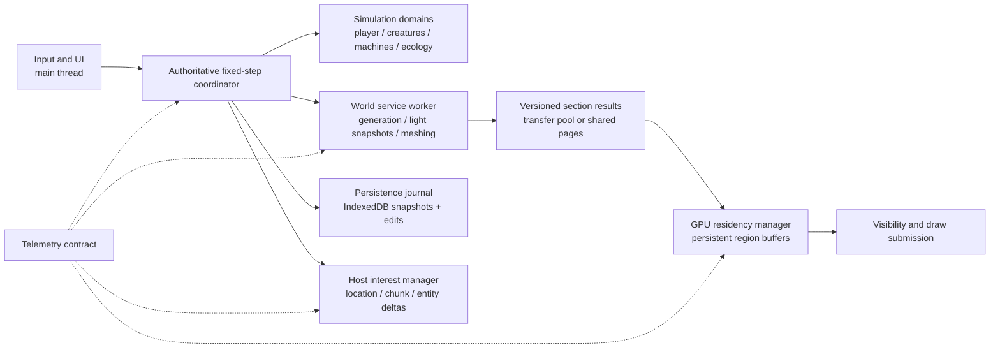

# Blockwild Bedrock-Inspired Performance Architecture Plan

Status: proposal only; no engine behavior is changed by this document

Prepared: 2026-08-11

Target branch: `main`

Primary outcome: make Blockwild remain responsive, complete, and visually stable during long exploration by adopting the most transferable *system boundaries* visible in Minecraft Bedrock Edition, while temporarily disabling Blockwild's Basic Render Distance proxy ring until its value can be proven against its scheduling and geometry cost.

## Executive decision

Blockwild should not try to “become Bedrock” or imitate undocumented internals. Bedrock is a proprietary native engine with years of platform-specific work; public creator documentation exposes useful behavioral contracts, not its complete renderer or memory architecture. The plan therefore separates:

- **Verified Bedrock behavior:** public Microsoft documentation explicitly describes separate render and simulation distances, bounded ticking areas, device-aware resource choices, representative profiling, entity and script cost controls, and resource-pack memory constraints.
- **Blockwild adaptation:** the concrete worker, storage, mesh, visibility, scheduling, and data-layout changes proposed here are engineering inferences designed for Blockwild's TypeScript, Three.js, browser, deterministic-generation, and host-authoritative architecture.
- **Experiments, not promises:** WebGPU, occlusion techniques, shared-memory workers, and GPU-driven submission must earn adoption through the existing performance benchmark contract. They are not assumed wins.

The recommended program has three layers:

1. **Immediate stabilization:** disable the Basic Render Distance ring through a reversible feature gate; preserve its setting for later experiments; make full-detail render distance the sole visual horizon; verify no camera, cave, map, or settings regression.
2. **High-return architecture work:** move toward section-granular world state, persistent mesh buffers, a long-lived worker-owned terrain service, budgeted fixed simulation, data-oriented entity updates, and explicit always-active chunk leases.
3. **Evidence loop:** extend telemetry with frame-phase attribution, memory pressure, worker ownership, section residency, network activity, and long-soak completeness; ship only changes that improve the Pareto frontier without reducing world content or configured view distance.

The largest plausible gain is not “more threads” alone. It is eliminating repeated representation changes and redundant work: generate or load compact section state once, update only dirty sections, reuse memory, submit fewer stable render regions, and let simulation run on a deterministic cadence independent of presentation frames.

## Goals

- Preserve a responsive player-control and interaction lane even while new terrain is arriving.
- Keep the occupied chunk and immediate visual ring complete; a high FPS counter with missing terrain is a failure.
- Reduce main-thread CPU time, allocation churn, garbage-collection spikes, draw submissions, and worker transfer overhead.
- Keep simulation deterministic and host-authoritative across single-player and multiplayer.
- Separate render distance, simulation distance, and deliberately anchored activity.
- Make device adaptation affect fidelity and presentation cost, not core content, creature diversity, drops, or rules.
- Preserve authored block geometry, liquids, connected flora, lighting, POIs, caves, creatures, edits, and save compatibility.
- Produce measurements that can support future recursive autoresearch without letting experiments rewrite their own acceptance test.

## Non-goals

- Rewriting Blockwild in C++, Rust, or a native engine during this program.
- Assuming WebGPU alone will solve CPU-side generation, mesh construction, simulation, or storage stalls.
- shortening the player's selected full render distance behind their back.
- removing creatures, flora, POIs, caves, weather, or automation to improve a benchmark.
- changing deterministic terrain output unless a separately approved generator migration provides explicit old-world behavior.
- enabling unbounded chunk loading, machine ticking, or entity AI through the future Anchor block.
- claiming private Bedrock engine details that are not supported by public material.

## Repository-grounded current state

### Existing strengths to retain

Blockwild already has important foundations that many browser voxel engines lack:

- `app/game/performance.ts` normalizes separate simulation, full render, and basic render distances and owns performance constants.
- `app/game/engine.ts` separates a player-correctness lane from bounded streaming work, exposes detailed performance telemetry, applies creature simulation tiers, and remains the authoritative owner of gameplay state.
- `app/game/world.ts`, `app/game/terrain-generation-pipeline.ts`, and `app/game/terrain-buffer-pipeline.ts` support deterministic generation, transferable worker output, progressive readiness, light/mesh stages, and version rejection.
- `app/game/basic-world-renderer.ts` deliberately keeps its distant proxy presentational: it creates no real blocks, collision, fluids, creatures, POIs, or light arrays.
- `docs/PERFORMANCE_OVERHAUL_MASTER_PLAN.md` records the first major scheduler, worker, batching, simulation-tier, cache, and telemetry pass, including the evidence that passed and the remaining gaps.
- IndexedDB and in-memory world-data caches are versioned by generator and edit contracts rather than storing live Three.js objects.
- Multiplayer already treats the host as authority for world and progression state.
- The main loop already retains 60 Hz fixed-step player physics, fixed-cadence liquids, host-authoritative networking, and mature creature render-admission/tier systems. The fixed-clock work below should unify remaining variable-time world domains without replacing proven player physics or creature visual LOD wholesale.

These are not discarded. The plan strengthens their ownership boundaries.

### Current pressure points

The repository and prior benchmark program identify the following structural risks:

| Pressure point | Current shape | Why it matters |
| --- | --- | --- |
| Main-thread concentration | `app/game/engine.ts` remains a very large mutable coordinator for simulation, streaming, rendering, UI-facing state, persistence, and multiplayer | Even individually bounded systems can aggregate into frame spikes; ownership and observability become difficult |
| Section-to-chunk conversion | Workers produce data, but main-thread installation, light reconciliation, scene object creation, and lifecycle management remain significant | Transfers do not help if installation reallocates or rebuilds too much |
| Stable geometry | Existing consolidation reduces submissions, but exact meshes and buffers still have lifecycle cost; hybrid greedy meshing and buffer pooling remain incomplete | Repeated allocation and upload cause GC and GPU-driver pressure |
| Full vertical chunks | Many decisions are chunk-oriented even when only a few vertical sections are visible or dirty | Bedrock documentation warns that activity can cover a chunk's full vertical extent; Blockwild should avoid paying for unrelated sections |
| Basic proxy ring | `BasicWorldRenderer` can request up to a 32-chunk horizon, build surface/cave proxies, allocate geometry, transfer buffers, and upload on the main thread | It is useful in principle but competes with the full-detail ring during motion; current request is to disable it temporarily |
| Simulation locality | Creature tiers exist, but other environment, machine, routing, fluid, plant, and future automation systems can still multiply work | The celestial/automation expansion will make explicit ticking ownership essential |
| Save shape | `WorldSave` remains a broad single-world snapshot with embedded progression and map knowledge | Future planets, stations, and anchors need shardable location state and dormant summaries |
| Multiplayer interest | Authority exists, but location/chunk interest and delta scopes need to become first-class before multiple worlds and orbit are added | Replicating or simulating irrelevant locations would dominate cost |

### Basic Render Distance today

The feature is implemented as a low-detail outer ring:

- defaults are declared in `app/game/performance.ts` and surfaced in `app/game/VoxelGame.tsx`;
- settings enforce `simulationDistance <= renderDistance <= basicRenderDistance`;
- `app/game/engine.ts` creates and updates `BasicWorldRenderer`, extends camera far distance to the basic ring, and reports proxy telemetry;
- `app/game/basic-world-renderer.ts` uses a worker when possible, maintains surface and cave proxy meshes, caps visible triangles, and suspends installation under frame pressure;
- setting Basic Render Distance equal to Render Distance disables proxy geometry.

This is already a reversible boundary. The temporary disable should use that boundary instead of deleting the renderer.

## What Bedrock publicly establishes

### 1. Render, simulation, and always-active regions are different products

Microsoft's creator guide defines render distance as client-visible content, simulation distance as the smaller-or-equal radius in which game mechanics tick, and ticking areas as explicit exceptions that remain active away from players. It also warns that ticking areas have real performance cost and should be minimized.

**Transferable rule for Blockwild:** every system must declare whether it is presentation, interactive simulation, or background persistent work. Being visible must not automatically mean full AI or machine simulation; being persistent must not imply a rendered chunk.

### 2. Cost is vertical and entity-heavy, not only horizontal

Bedrock documentation describes chunks as full vertical columns and warns creators about entities arrayed through vertical space, pathfinding density, repeated per-tick scripts, and complex frequently placed block models.

**Transferable rule for Blockwild:** use vertical sections as the unit of geometry residency, visibility, lighting dirtiness, and most simulation indexing. Treat the 2D chunk as an address and persistence partition, not a requirement to fully mesh or tick its entire height.

### 3. Expensive work should be staggered and profiled in representative play

Microsoft recommends profiling normal gameplay sessions, limiting per-tick work, using intervals, and offsetting recurring work across ticks. Its developer tools expose CPU profiles, runtime statistics, and in-world debug shapes.

**Transferable rule for Blockwild:** recurring systems get deterministic phase buckets and declared budgets. The benchmark suite must exercise ordinary exploration, caves, settlements, machines, creatures, multiplayer, and backtracking rather than only a static scene.

### 4. Device adaptation should preserve the game

Bedrock resource guidance supports performance-tiered resources and fidelity, but explicitly cautions against changing fundamental gameplay—for example, lowering monster presence on weaker devices.

**Transferable rule for Blockwild:** tune particles, shadows, anisotropy, transparent effects, proxy detail, animation cadence, and post-processing. Do not alter authoritative spawn tables, drops, biome richness, combat logic, or machine throughput by client tier.

### 5. Resource count and memory ownership matter

Microsoft warns about texture dimensions, texture-handle count, file count, complex repeated models, and high entity density.

**Transferable rule for Blockwild:** continue atlasing blocks and compatible icons, share immutable geometries/materials, instance repeated props, pool typed arrays, and track live GPU/CPU bytes—not only FPS.

### 6. Bedrock publicly documents section assembly and pooled terrain buffers

Mojang's 2026 RenderDragon presentation describes 16x16x16 terrain assembly units queued as the player moves, a preallocated page-based vertex pool, a buffer range per terrain unit, separate index ranges for opaque/foliage/water/blended layers, baked lighting/AO, and an atlas. It also describes a frame registry that decouples gameplay submissions from drawing and opaque handles for GPU resources.

**Transferable rule for Blockwild:** the strongest directly evidenced renderer analogue is section-granular assembly plus stable pooled GPU ownership. It supports the section and persistent-buffer proposals below. It does **not** prove that Bedrock uses Blockwild's proposed greedy-mesh compatibility signature, occlusion design, or browser worker structure.

### 7. Bedrock actor storage demonstrates individually addressed persistence

Microsoft's actor-storage documentation explains a migration away from rewriting every actor in a chunk when one actor changes. Modern storage assigns stable actor keys and maintains per-chunk digests of actor identities.

**Transferable rule for Blockwild:** stop serializing the entire authoritative world document for an ordinary dirty creature, machine, container, or map change. Use stable IDs, individually addressed records, spatial digests, transactional dirty sets, and a small checkpoint manifest. This is a higher-confidence near-term opportunity than an immediate entity-layout rewrite.

### 8. Bedrock exposes distance-aware network controls, not a mandate to rewrite Blockwild multiplayer

Bedrock server documentation exposes movement/block-breaking authority, compression thresholds, independent view/tick distances, and an experimental conditional bandwidth optimization for spatial updates. Blockwild already has host authority, reliable/unreliable channel separation, deterministic client terrain generation, and recipient-scoped snapshots.

**Transferable rule for Blockwild:** extend current interest scopes and replacement/keyframe cadence; do not replace the network stack merely to resemble another engine.

## Architecture target

The fixed-step coordinator remains authoritative, but it becomes a scheduler of typed domain state instead of directly doing every operation. Workers never mutate Three.js or authoritative gameplay objects. Render interpolation never changes collision authority.

## Immediate action: temporarily disable Basic Render Distance

### Product behavior

- Full Render Distance remains unchanged and user-selectable.
- Simulation Distance remains independently user-selectable, clamped to Full Render Distance.
- Basic Render Distance is temporarily unavailable in normal settings and contributes no proxy generation, transfer, geometry, draw call, camera range, or telemetry queue.
- Existing saved preferences are preserved as a dormant “last requested basic distance” so a future opt-in experiment can restore the user's choice.
- Debug and benchmark builds may re-enable the feature with an explicit feature flag. Production cannot enable it accidentally through stale local storage.

### Concrete implementation contract

1. Add a single build/runtime capability, for example `BASIC_RENDER_DISTANCE_ENABLED`, defaulting to `false` in production and tests unless a test opts in.
2. Extend `normalizeViewDistances` so the effective `basicRenderDistance` equals `renderDistance` while the capability is off. Do not mutate the remembered preference.
3. Replace the current settings slider with a disabled explanatory row or hide it behind an “Experimental” disclosure. Copy: “Simplified distant terrain is temporarily disabled while its streaming cost is being rebuilt.”
4. Do not instantiate `BasicWorldRenderer` when the capability is off, or instantiate a zero-work null implementation with the same telemetry interface. Prefer construction avoidance so no Worker, material, geometry, or event ownership exists.
5. Derive `camera.far`, fog reach, cave backdrop transitions, map sampling, and sky visibility from full Render Distance while disabled.
6. On world/load settings migration, retain `rememberedBasicRenderDistance = max(savedBasic, renderDistance)` in a versioned preferences object; effective distance remains full distance.
7. Agent mode must also use full distance only; its low-resource contract should not silently create the basic worker.
8. Telemetry must record `basicRenderer.enabled = false` and `reason = "feature-gated"`, with zero proxy jobs/bytes/draws. This differentiates intended disablement from a broken worker.

### Acceptance tests

- Production defaults and every migrated settings case normalize to `basicRenderDistance === renderDistance`.
- No basic-world worker is constructed and no proxy request is issued during a five-minute flight.
- Camera far plane and fog never expose an empty band beyond full terrain.
- Deep-cave background remains dark and celestial occlusion remains correct without cave proxies.
- Settings persist full/simulation distance; the old basic value is recoverable but cannot affect runtime.
- The debug feature flag restores current proxy behavior and existing focused tests.
- Performance export explicitly reports deliberate disablement, not missing data.

### Re-enable gate

Do not re-enable by calendar date. Re-enable only if a controlled A/B route shows all of the following:

- no regression in occupied/immediate-ring completeness;
- no increase over 0.5 ms in main-thread p95 installation cost;
- no upward trend in near-ring weighted debt;
- stable geometry and ArrayBuffer memory in a 30-minute flight/soak;
- a meaningful navigation benefit confirmed by visual review;
- no cave-layout, POI, ore, or ecology information leak;
- no horizon crack or deep-cave daylight flash at the full/proxy handoff.

Before any re-enable experiment, split the current two giant surface/cave meshes into bounded spatial sectors or a cullable batch. `BasicWorldRenderer` currently sets both meshes `frustumCulled = false`, which means an off-camera proxy still reaches submission. Preserve the 2/4/8 sample-ring logic, but give sectors conservative bounds and prove lower submitted triangles/GPU time while rotating and moving. This is the first repair to test—not a larger proxy radius.

## Major system 1: fixed simulation clock with interpolated presentation

### Why

Simulation should not execute more often because a display refreshes at 144 Hz, nor become unstable because rendering drops to 25 FPS. Bedrock documentation frames game mechanics as tick-driven; Blockwild already has partial cadence controls but needs one explicit clock contract.

### Design

- Authoritative gameplay uses a 20 Hz fixed step (`50 ms`) by default, matching the well-understood Minecraft cadence without requiring identical rules.
- Input is sampled every animation frame and consumed by the next authoritative step; camera look and UI remain frame-rate responsive.
- The coordinator accumulates elapsed time but caps catch-up steps per frame. Excess debt is recorded and recovered gradually; the game never runs an unbounded “spiral of death.”
- Player movement may use a dedicated 60 Hz correctness substep or swept collision inside the 20 Hz step if 20 Hz proves too coarse. This is measured, not assumed.
- Render transforms interpolate between last and current authoritative snapshots. Existing creature step interpolation becomes the general presentation pattern.
- Timers use authoritative elapsed ticks or wall-clock deadlines as appropriate. Growth, hunger, machines, breeding, cooldowns, O2, and fuel must not vary with FPS.
- Multiplayer packets contain tick/sequence IDs, not render-frame timestamps.

### Domain schedule

| Lane | Nominal cadence | Examples | Rule |
| --- | ---: | --- | --- |
| Input/camera presentation | every animation frame | look, cursor, HUD hover | no world mutation |
| Player correctness | 20–60 Hz | collision, attacks, breaking, swimming | hard bounded |
| Nearby combat/AI | 20 Hz | attack contact, projectiles, mounts | full authority |
| Ordinary active creatures | 10 Hz | steering, social behavior | interpolate visually |
| Coarse creatures | 2–5 Hz | distant navigation, needs | accumulated elapsed time |
| Machines/networks | 5–20 Hz by machine | recipes, transfer, power | phase-staggered |
| Ecology | 0.2–2 Hz | growth, spawning, regrowth | deterministic buckets |
| Dormant summaries | event/deadline driven | anchored farms, remote stations | no frame polling |

### Module boundary

Create a small `SimulationClock` and `DomainScheduler` rather than embedding more counters in `engine.ts`. Domain systems receive immutable inputs plus a mutation command buffer. The engine applies results at deterministic boundaries.

## Major system 2: section-first world residency

### Why

A chunk address is useful, but a full vertical column is too coarse for rendering, lighting, caves, machines, and entity lookup. Blockwild should only keep detailed state for vertical sections that are visible, interactive, edited, or required by dependencies.

### Design

- Keep 16x16 horizontal chunk coordinates for generation determinism and persistence compatibility.
- Make a `SectionKey = locationId + chunkX + sectionY + chunkZ + contractVersion` the unit of:
  - block palette storage;
  - dirty revision;
  - light residency;
  - mesh residency;
  - occlusion metadata;
  - entity/machine spatial indexing;
  - GPU buffer ownership;
  - cache eviction.
- Store block IDs in palette-compressed typed arrays. Choose byte, 16-bit, or direct representation based on palette cardinality.
- Maintain a compact per-section summary: occupancy mask, solid-face mask, min/max occupied Y, transparent/emissive flags, water presence, edit count, entity count, machine count, and last-access class.
- Empty sections are represented by summary only. Uniform sections use a constant palette value without a full array.
- A chunk manifest references section records and a height/biome surface summary; it does not force all sections resident.
- Neighbor halos are immutable snapshots with revision IDs so worker tasks remain deterministic.

### Persistence compatibility

Existing saves store player edits rather than all base blocks. Preserve that contract. A migration builds section-grouped edit journals lazily on load; unchanged base terrain is regenerated by the same generator version. Old saves are never rewritten until a successful save completes.

## Major system 3: long-lived world service worker

### Why

Workers help only when tasks are large enough and transfer/install costs are controlled. Short-lived request workers and repeated structured-clone transformations simply move overhead.

### Design

- Create one long-lived `WorldServiceWorker` per active location, with a bounded internal work graph for generation, light initialization, face extraction, and mesh packing.
- Keep a conservative worker count: usually one world worker plus an optional mesh worker. More workers are allowed only when telemetry shows parallel speedup without memory or contention regressions.
- Main thread sends versioned intents: desired sections, priority rings, camera frustum summary, edit revisions, and cancellation epochs.
- Worker owns compact generated section data while the location is active. It returns render/collision snapshots, not mutable authoritative objects.
- Use a pool of transferable ArrayBuffers with explicit ownership states (`worker-free`, `worker-writing`, `main-installing`, `gpu-owned`, `recyclable`). Never transfer the same buffer ambiguously.
- If cross-origin isolation is reliably configured on both websites, experiment with `SharedArrayBuffer` pages and atomic revision headers. Keep transferable buffers as the production fallback until the security headers and browser matrix are verified.
- The worker performs no network calls and is deterministic from seed, generator version, options, coordinates, edits, and neighbor revisions.
- Failures degrade to the bounded synchronous path and emit one clear diagnostic; they never strand the occupied section.

### Scheduling contract

Priority order:

1. occupied collision/support sections;
2. player-edited dirty sections;
3. immediate visible opaque terrain;
4. immediate water/cutout/emissive layers;
5. movement-forward near ring;
6. current-frustum mid ring;
7. backfill, cache warming, and nonvisible detail.

Age is part of priority so a valid job cannot starve under constant movement. Full-detail work always outranks any future distant proxy.

## Major system 4: persistent mesh pages and render regions

### Why

The previous pass cut terrain submissions substantially. The next gains should come from avoiding rebuild/upload/allocation rather than making larger monolithic meshes that hurt culling and editing.

### Hybrid mesh rules

- Greedily merge ordinary cube faces only when block material, atlas tile, face direction, biome tint, packed corner light, ambient occlusion, emission, and transparency class match.
- Keep dedicated authored paths for water, glass, flora, connected plants, fences, slopes, furniture, machines, doors, beds, and irregular models.
- Do not merge across section or edit revision boundaries.
- Generate stable per-layer submeshes: opaque, cutout, emissive, glass, water/transparent.

### Buffer architecture

- Introduce typed `MeshBuilderPage` pools with geometric capacity classes; reuse them across rebuilds.
- Upload into persistent render-region buffers. A render region should cover a small fixed group such as 2x2 chunks by a bounded vertical span, not an entire horizon.
- Track free ranges and dirty upload ranges. Compact only in an idle maintenance phase or rebuild the region when fragmentation crosses a measured threshold.
- Preserve the previous mesh until the replacement buffer is installed, then retire it after the render boundary.
- Instance repeated static props and simple decorations when material/lighting semantics permit.
- Keep exact per-section bounds inside a region for CPU frustum and occlusion decisions even if the GPU draw is consolidated.

### Acceptance

- At least 50% lower terrain geometry allocations per traversed chunk than the current baseline.
- At least 30% lower terrain upload bytes on edit/revisit routes.
- No increase in draw calls large enough to erase CPU gains.
- No UV stretch, light/AO mismatch, transparent-order regression, seam, or stale-edit flash.

## Major system 5: conservative visibility before submission

### Layer A: section rejection

- Frustum-cull section bounds.
- Reject empty and fully enclosed sections using the section summary.
- Maintain six-direction boundary openness masks so cave/solid regions can be conservatively excluded.

### Layer B: render-region occlusion

- Build a low-resolution depth pyramid or CPU occluder grid from stable opaque terrain after ordinary rendering is correct.
- Query only large candidate regions, with one-frame-late conservative results.
- Require hysteresis: a recently visible region remains visible briefly to prevent flicker.
- Never occlusion-cull the occupied chunk, immediate neighbors, translucent surfaces, or a region with a pending edit.

### Layer C: optional WebGPU path

- If the dual renderer matures, evaluate GPU compute visibility and indirect draw preparation.
- WebGPU remains optional until visual parity, browser coverage, shader compilation behavior, and device-loss recovery pass the benchmark matrix.

This is a Blockwild design, not a claim that Bedrock uses the same occlusion implementation.

## Major system 6: data-oriented entity and machine state

### Problem

Hundreds of mutable creature objects with per-frame closures, searches, and Three.js ownership make AI, culling, networking, and persistence harder to budget. Future machines and planetary ecosystems would worsen it.

### Design

- Give every simulated object a stable numeric runtime ID and durable string ID.
- Store hot numeric state in typed, chunked structures: position, velocity, radius, health, timers, behavior state, flags, current target, location, and spatial cell.
- Keep rich definitions, bestiary text, inventories, names, quests, and rare extension data in cold maps keyed by ID.
- Presentation objects are a view pool. A creature may remain simulated or summarized without owning a Three.js group.
- Use a spatial hash per location/section. Nearby queries visit cells, not the whole population.
- AI writes movement/action intents; collision and combat authority resolve intents in deterministic order.
- Machines use compact runtime records and recipe deadlines. Visual state is derived from fill/progress bands rather than stored as animated scene objects in dormant chunks.

### Correctness exceptions

Players, projectiles in contact range, combat participants, mounts, followers, led/fenced/protected creatures, bosses, and active quest actors stay in full correctness tiers. Optimization never despawns or forgets protected state.

## Major system 7: ticking leases and the future Anchor block

### Bedrock lesson

Always-active areas are useful and expensive. They need explicit ownership, minimal extent, observability, and cleanup.

### Blockwild contract

Call the engine primitive an `ActivityLease`; the player-facing block can be the **Wayanchor** (working name). One placed Wayanchor requests one exact chunk in one exact location.

An active lease keeps:

- machine recipe deadlines and network summaries advancing;
- deterministic crops and managed farm growth advancing;
- storage, power, fluid, gas, heat, and logistics endpoints available;
- persistent creatures retained, with coarse needs only where safe;
- scheduled transfers and launch/arrival jobs advancing.

It does **not** keep:

- meshes, particles, sounds, or animated models alive;
- natural mob spawning active without a nearby player;
- full pathfinding or combat AI running;
- an entire planet or neighboring chunks loaded implicitly.

### Player UX and safeguards

- The block is cheap to craft as requested, but consumes a small continuous power draw while active; zero power pauses the lease without destroying state.
- Holding the block highlights the targeted chunk outline and its vertical column.
- A dedicated key and a Settings toggle show chunk outlines globally; both default off.
- The block UI shows owner, location, chunk coordinates, power reserve, active systems, estimated simulation cost, and why it is paused.
- Host/server settings expose a soft budget by player and world. Exceeding it does not delete anchors; it queues or degrades leases with a visible reason.
- Removing, losing ownership, disabling, or moving a location cleanly releases the lease.
- Multiplayer host is the sole authority. Guests submit placement/configuration requests.

### Performance implementation

Activity leases tick dormant summaries and deadlines. They do not instantiate full chunks. Network/machine changes are journaled transactionally; when a player returns, the detailed location reconciles from the same authoritative records.

## Major system 8: persistence journal and cache hierarchy

### Tiers

1. **Hot:** active section palettes, light, collision, entity/machine hot state.
2. **Warm:** compressed generated sections and mesh source data in a byte-bounded memory LRU.
3. **Cold:** IndexedDB base-section cache, edit journal, location snapshots, and dormant summaries.
4. **Reconstructible:** deterministic untouched terrain with no stored payload.

### Journal rules

- Player edits, container transactions, machine progress, entity persistence, map knowledge, and travel state append idempotent records with location and tick IDs.
- Periodic snapshots compact old records only after a checksum and read-back succeeds.
- Cache keys include generator/content contract, celestial location, seed, coordinates, palette version, light contract, and edit revision.
- Quotas are measured in bytes. Eviction removes cache data, never authoritative edits or durable inventory.
- Save UI reports storage usage and last successful durable checkpoint.

### IndexedDB record layout

Adopt individually addressable stores rather than one repeatedly stringified document:

- universe/world manifest and checkpoint pointer;
- player profiles;
- chunk/section edit records;
- stable actor records plus per-chunk actor digest;
- containers and machine records;
- map/location knowledge records;
- large subsystem snapshots and append-only transaction journal;
- disposable generated terrain/cache records in a distinct eviction class.

Dirty IDs accumulate during play. Autosave writes one IndexedDB transaction containing the changed records and a new checkpoint only after the payload records succeed. Export still assembles a portable full archive on explicit request. `localStorage` becomes catalog/preferences/legacy fallback rather than the authoritative hot save path.

The existing terrain-cache prune path should also stop loading every record through `getAll()` merely to sort it. Traverse the `accessedAt` index with a cursor over oldest entries and delete incrementally under an idle budget.

### Why it matters

Planetary travel and space stations should unload an entire location to a compact snapshot. A monolithic `WorldSave` that retains live structures for every planet would turn progress into memory pressure.

## Major system 9: multiplayer interest and delta replication

- Scope every entity, block edit, machine, network, marker, and environmental event to a `locationId` and spatial region.
- Host maintains interest sets for each player: occupied location; immediate simulated chunks; visible chunks; party/map exceptions; explicitly subscribed remote machine panels.
- Send versioned deltas and periodic compact keyframes, not repeated full state.
- Prioritize player correction, nearby combat, direct interactions, and inventory transactions above background machine telemetry.
- Coalesce repeated state changes within a tick; never coalesce distinct inventory or crafting transactions.
- Remote anchored chunks send summaries only until a player opens a monitor.
- A joining client receives catalog and current-location state first; other celestial locations remain metadata until requested.
- Telemetry records bytes/messages by channel, stale corrections, reconciliation count, and host simulation cost per interest set.

## Major system 10: device calibration and fidelity profiles

### Startup probe

On first run after a renderer contract change, perform a short, skippable, deterministic calibration:

- WebGL/WebGPU capability and adapter class;
- logical cores and worker startup/transfer latency;
- a small atlas/material compile;
- buffer upload bandwidth proxy;
- conservative memory-pressure signals;
- stable pixel ratio and resolution.

Store the result by renderer/build/browser signature and let players override it.

### Allowed adaptation

- shadow distance and cascade/detail;
- particle density and lifetime;
- transparent-effect layering;
- creature animation update distance while preserving simulation;
- cloud and sky sample count;
- water reflection/refraction resolution;
- static-prop instancing and decoration LOD;
- texture filtering and optional atlas resolution;
- UI blur and decorative motion.

### Forbidden adaptation

- spawn rarity or population rules;
- biome, cave, POI, loot, or resource generation;
- combat timing, machine throughput, oxygen consumption, crop timing, drops, or quest behavior;
- multiplayer authority.

## Telemetry v3

The current telemetry is already unusually strong. V3 should add the data needed to prove the proposed representation changes.

### Frame phases

- input and UI;
- authoritative fixed steps and catch-up count;
- player correctness;
- each simulation domain;
- world-service messaging;
- mesh installation/upload;
- visibility and render submission;
- post-render and browser presentation;
- asynchronous GPU time where supported.

### Residency and memory

- section counts by hot/warm/cold/uniform/empty state;
- palette bytes, edit-journal bytes, light bytes, mesh-source bytes, GPU bytes;
- buffer-pool capacity, live use, fragmentation, allocation, reuse, and compaction;
- Three.js geometry/material/object counts by owner;
- worker buffer ownership and transfer bytes;
- IndexedDB read/write/eviction latency and quota failures;
- JS heap where exposed, plus GC/long-animation-frame evidence.

### Simulation and anchors

- fixed-step debt, catch-up, dropped/deferred work;
- entities by full/active/coarse/dormant tier and CPU time;
- machine networks by resource type and active/dormant status;
- ActivityLease count, chunk count, tick cost, deadline backlog, and power-paused count;
- natural spawn checks versus actual spawns without device-dependent rule changes.

### Completeness

- occupied and ring readiness by collision, opaque, water, cutout, light, and fully complete domains;
- oldest valid job and debt slope;
- holes or stale revision rejections;
- location transition and save checkpoint duration.

## Benchmark program

### Fixed tracks

1. Fresh spawn to complete immediate ring.
2. Five-minute straight sprint through biome and water boundaries.
3. High-speed dragon flight with rapid turns.
4. Deep cavern route with liquids, emissives, and transparency.
5. Settlement orbit with many NPCs and containers.
6. High-fauna combat and capture scene.
7. Dense machine/logistics testbed at idle and full throughput.
8. Wayanchor farm/machine test with player absent and return reconciliation.
9. Two-player divergence: players on different chunks and later different celestial locations.
10. Thirty-minute exploration/revisit soak.

### A/B rules

- Same seed, save snapshot, input trace, camera trace, resolution, renderer, device, browser, settings, and build mode.
- At least three cold and three warm runs where variance matters.
- Report medians and tail values; do not compare one lucky run.
- Inspect screenshots/video for holes, seams, stale edits, liquid faces, lighting changes, LOD transitions, and animation discontinuity.
- Keep benchmark harness and acceptance thresholds outside experiment branches or protect them with checksums.

### Primary acceptance metrics

| Metric | Release gate |
| --- | --- |
| Player input-to-visible-action | p95 <= 50 ms outside network latency; breaking/placing begins immediately |
| Occupied chunk readiness | no outage > 250 ms after initial spawn; no collision hole |
| Immediate ring | 100% collision and opaque after warmup; water/cutout converges within declared deadline |
| Main-thread active CPU | p95 <= 12 ms on reference hardware; streaming install p95 <= 2 ms target |
| Long frames | >50 ms under 0.1% outside explicit loading/travel screens |
| Fixed-step debt | returns to zero after bounded stress; no upward long-soak trend |
| Memory | stable plateau in 30-minute soak; all evicted owners release buffers/scene objects |
| Draw submission | no regression; target another 25–40% reduction in representative terrain |
| Correctness | deterministic generation, edits, collision, lighting, liquids, saves, and multiplayer parity pass |

Hardware-limited misses must be reported honestly. Fidelity changes can improve lower tiers, but must remain player-visible settings and cannot falsify core metrics.

## Implementation phases and commit boundaries

### Phase P0 — Basic renderer suspension

- Add the feature gate and remembered preference.
- Remove production construction/work and update settings copy.
- Rebase camera/fog expectations on full render distance.
- Add migration, telemetry, and regression tests.
- Benchmark before/after on flight and deep-cave tracks.

**Exit:** zero proxy work in production and no horizon/cave regression.

### Phase P1 — Clock and domain budgets

- Introduce fixed-step clock, bounded catch-up, phase buckets, and interpolation snapshots.
- Migrate one low-risk domain, then player/creature correctness with tests.
- Add v3 tick debt telemetry.

**Exit:** gameplay timing is FPS-independent and interaction latency is no worse.

### Phase P2 — Section residency and palette storage

- Add section keys, summaries, compressed palettes, and lazy old-save edit grouping.
- Preserve generator output and cache behavior.
- Add byte-level parity and order-independence tests.

**Exit:** empty/uniform vertical space no longer owns full arrays or mesh work.

### Phase P2.5 — Incremental authoritative persistence

- Introduce the IndexedDB record layout, dirty sets, stable actor/container/machine IDs, chunk actor digests, and transaction checkpoints.
- Retain current full-document import/export and a rollback checkpoint.
- Replace terrain-cache `getAll()` pruning with indexed incremental eviction.
- Measure autosave main-thread stall, bytes written, write amplification, interrupted-commit recovery, and long-soak quota behavior.

**Exit:** an ordinary dirty object no longer requires synchronous `JSON.stringify` and `localStorage` replacement of the entire world.

### Phase P3 — World service and transfer pool

- Introduce the long-lived worker protocol and ownership state machine.
- Migrate generation, then light snapshots, then mesh packing.
- Keep synchronous fallback and fault injection tests.

**Exit:** main-thread generation/mesh CPU and transfer allocations fall without readiness loss.

### Phase P4 — Persistent mesh pages

- Implement typed builders, hybrid greedy rules, region buffers, and stable replacement.
- Add visual parity galleries and edit stress.

**Exit:** allocation/upload targets pass and visual review is clean.

### Phase P5 — Visibility

- Add section openness and conservative region rejection.
- Experiment with occlusion only after section culling is stable.

**Exit:** fewer submitted regions in caves/terrain with zero visible popping.

### Phase P6 — Data-oriented simulation

- Migrate ordinary creature hot state and spatial queries.
- Migrate machines/networks once their celestial architecture exists.
- Keep rare rich state in cold maps.

**Exit:** high-fauna and factory scenes show lower CPU/allocations with identical outcomes.

### Phase P7 — Activity leases and persistence journal

- Implement the internal lease service before the Wayanchor item.
- Add dormant deadline reconciliation and transactional journal compaction on the P2.5 record foundation.
- Expose chunk outlines and anchor diagnostics.

**Exit:** remote farms/machines advance deterministically without live meshes or full AI.

### Phase P8 — Multiplayer interest

- Add location/chunk interest sets, prioritized deltas, and remote summaries.
- Test reconnect, host migration policy, and two-location play.

**Exit:** unrelated locations produce no steady replication cost.

### Phase P9 — Device profiles and optional renderer experiments

- Add calibration and safe fidelity profiles.
- Run WebGPU/occlusion/shared-memory experiments independently.

**Exit:** default choice is evidence-backed; WebGL fallback remains supported.

## Test matrix

### Unit and deterministic

- view-distance feature gate and preference migration;
- fixed-step accumulator, cap, interpolation, timer invariance;
- section palette encoding/decoding and summaries;
- neighbor halo revision and worker/synchronous byte parity;
- transferable buffer ownership and fault recovery;
- greedy face compatibility, atlas UV, tint, light, AO, emission, transparent exclusions;
- buffer allocation/reuse/retirement;
- spatial hash and tier transitions;
- activity lease lifecycle and dormant deadline advancement;
- journal idempotency, checksum, compaction, quota failure;
- interest-set delta ordering and reconciliation.

### Integration

- block edit while a worker result is in flight;
- chunk unload/reload and world switch during jobs;
- water/ice/glass/flora/machine seams across section and chunk boundaries;
- player movement and damage during frame pressure;
- multiplayer simultaneous container/machine edits;
- old save load, new save, read-back, and old-world terrain parity;
- context loss and renderer recovery;
- worker crash and synchronous fallback;
- anchor continues eligible systems but not natural spawning or full AI.

### Visual/manual

- surface and underwater chunk seams;
- deep cave darkness and sky occlusion with basic renderer disabled;
- fast flight horizon behavior;
- mesh rebuild without holes or stale frames;
- transparent and emissive ordering;
- device-tier comparison showing the same world content;
- chunk outline readability and no accidental always-on debug clutter.

## Risk register

| Risk | Failure mode | Mitigation |
| --- | --- | --- |
| Fixed clock changes feel | input lag or different movement/combat | retain frame-rate input sampling; allow measured player substeps; input replay tests |
| Worker ownership complexity | stale installs, leaks, detached buffers | explicit epochs and ownership enum; fault injection; counters must return to zero |
| Region batching too large | poor culling and expensive edits | small fixed regions; per-section bounds; rebuild thresholds |
| Greedy mesh visual change | texture/light/AO artifacts | strict compatibility signature; specialized-shape exclusions; screenshot gallery |
| Occlusion errors | visible popping or missing terrain | conservative results, hysteresis, immediate-ring exclusions, off by default first |
| Data-oriented migration | rare creature state lost | hot/cold split; schema adapters; save parity and bestiary/quest fixtures |
| Anchors become perf exploit | too many active farms/machines | one-chunk leases, coarse summaries, small power cost, visible host budget |
| IndexedDB quota | save/cache failure | edits are authoritative and separated from disposable cache; explicit UI diagnostics |
| Device adaptation changes gameplay | inconsistent worlds/multiplayer | server-authoritative rules; fidelity-only allowlist |
| WebGPU fragmentation | browser/device regressions | dual renderer; no default switch without parity and recovery evidence |

## Rollback strategy

- Every phase lands behind a focused feature flag until its data migration and tests pass.
- Persisted schemas are additive; old fields are retained through at least one stable release.
- Worker, greedy mesh, occlusion, and WebGPU paths retain known-good fallbacks.
- A failed benchmark disables only the experiment; it does not roll back unrelated correctness fixes.
- Basic Render Distance remains compiled but production-disabled, making re-evaluation possible without recreating the feature.

## Open decisions for Noah before implementation

1. Should Basic Render Distance appear as a disabled row explaining the temporary suspension, or disappear into an Experimental submenu? The recommendation is a disabled row for one release, then Experimental.
2. Should the default authoritative clock be 20 Hz with a player collision substep, or 30 Hz globally? Recommendation: 20 Hz plus measured player correctness substeps; it gives background systems a clear budget.
3. Should Wayanchors use continuous power? Recommendation: yes. The item remains cheap, while operation has a transparent, recoverable cost instead of a hard arbitrary item cap.
4. Should device calibration run automatically once or only on request? Recommendation: once per renderer/browser signature with a clear skip and manual override.
5. Should SharedArrayBuffer be a production requirement? Recommendation: no. First ship transferable buffer pools; enable shared pages only after both hosting surfaces provide verified cross-origin isolation.

## Definition of done for the future implementation

- [ ] Basic Render Distance is effectively disabled in production, preferences are preserved, and the renderer performs zero work.
- [ ] Fixed-step simulation is independent of render FPS and player feedback remains immediate.
- [ ] Section-first storage avoids full vertical work for empty/unrelated space.
- [ ] The long-lived worker and transfer pool reduce main-thread work without stale installs or leaks.
- [ ] Persistent mesh pages and conservative visibility improve allocation, upload, and submission metrics.
- [ ] Entity/machine updates use declared deterministic budgets and spatial indexes.
- [ ] Activity leases support exact anchored chunks through dormant summaries, not full remote worlds.
- [ ] Persistence and multiplayer are scoped by location and interest.
- [ ] Device profiles affect presentation only.
- [ ] Telemetry v3 and the fixed benchmark suite demonstrate a real Pareto improvement.
- [ ] All deterministic, gameplay, save, multiplayer, visual, and production-build gates pass.
- [ ] A before/after report includes failures and rejected experiments, not only accepted wins.

## Sources and evidence boundary

### Primary external references

- [Microsoft — Simulation Distance, Render Distance, and Ticking Areas](https://learn.microsoft.com/en-us/minecraft/creator/documents/simulationrenderdistanceguide?view=minecraft-bedrock-stable)
- [Microsoft — Improving performance and resource usage](https://learn.microsoft.com/en-us/minecraft/creator/documents/practices/improvingperformanceandresourceusage?view=minecraft-bedrock-stable)
- [Microsoft — Developer Tools for Minecraft](https://learn.microsoft.com/en-us/minecraft/creator/documents/scripting/developer-tools?view=minecraft-bedrock-stable)
- [Microsoft — Building Sub-Packs](https://learn.microsoft.com/en-us/minecraft/creator/documents/buildingsubpacks?view=minecraft-bedrock-stable)
- [Microsoft — Actor Storage](https://learn.microsoft.com/en-us/minecraft/creator/documents/actorstorage?view=minecraft-bedrock-stable)
- [Microsoft — Bedrock Dedicated Server Properties](https://learn.microsoft.com/en-us/minecraft/creator/documents/bedrockserver/server-properties?view=minecraft-bedrock-stable)
- [Mojang — Modernizing the Rendering of Minecraft: Bedrock Edition (GDC 2026)](https://media.gdcvault.com/gdc2026/Slides/Fairfield_AJ_ModernizingTheRenderingOfMinecraft.pdf)
- [Microsoft — Voxel Shapes](https://learn.microsoft.com/en-us/minecraft/creator/documents/voxelshapes?view=minecraft-bedrock-stable)
- [Microsoft — Block Culling](https://learn.microsoft.com/en-us/minecraft/creator/reference/content/blockcullingreference/examples/blockcullingrules/block_culling?view=minecraft-bedrock-stable)
- [Microsoft — Conditional Bandwidth Optimization](https://learn.microsoft.com/nl-nl/minecraft/creator/reference/content/entityreference/examples/entitycomponents/minecraftcomponent_conditional_bandwidth_optimization?view=minecraft-bedrock-experimental)
- [MDN — IndexedDB API](https://developer.mozilla.org/en-US/docs/Web/API/IndexedDB_API)
- [Three.js — `BufferGeometry`](https://threejs.org/docs/#api/en/core/BufferGeometry)
- [Three.js — `InstancedMesh`](https://threejs.org/docs/#api/en/objects/InstancedMesh)
- [Three.js — `BatchedMesh`](https://threejs.org/docs/#api/en/objects/BatchedMesh)

### Repository references

- `docs/PERFORMANCE_OVERHAUL_MASTER_PLAN.md`
- `docs/PERFORMANCE_AUTORESEARCH_PROTOCOL.md`
- `docs/ARCHITECTURE.md`
- `docs/ENGINEERING_OVERVIEW.md`
- `docs/COMBAT_TRAVERSAL_CAVE_VISIBILITY_PROPOSAL.md`
- `app/game/performance.ts`
- `app/game/basic-world-renderer.ts`
- `app/game/basic-world-geometry.ts`
- `app/game/basic-world-worker.ts`
- `app/game/terrain-generation-pipeline.ts`
- `app/game/terrain-buffer-pipeline.ts`
- `app/game/world.ts`
- `app/game/engine.ts`
- `app/game/world-storage.ts`
- `app/game/map-system.ts`

### Evidence disclaimer

The Microsoft references support the exposed behavioral lessons: distinct distances, bounded always-active areas, representative profiling, staggered work, entity/resource cost awareness, and device-sensitive fidelity. They do **not** document Bedrock's complete native threading, meshing, memory, networking, or renderer implementation. Every Blockwild-specific worker, palette, buffer, visibility, persistence, and multiplayer design in this proposal is an original adaptation that must be benchmarked in Blockwild.
