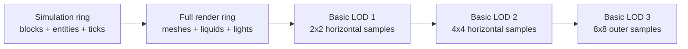

# Combat, Traversal, Cave Integrity, and Distant-World Proposal

**Status:** Implemented and validated for Blockwild v1.10.2; this remains the design and acceptance contract.  
**Prepared:** July 22, 2026  
**Scope:** hostile melee reliability, player hit feedback, creature step presentation, river-bank cave integrity, underground sky correctness, and a low-cost basic render-distance tier.

## Executive decision

These symptoms come from four separate implementation boundaries, not one general rendering bug:

1. Hostile attacks begin from one distance/facing model, keep ordinary steering during the windup, and validate the hit against a different distance model at the active frame. A creature can therefore circle or slide sideways, spend its attack, and fail to make convincing contact.
2. Creature collision and creature presentation share one transform. The collision root correctly snaps to the next valid block elevation, but the model visibly inherits that snap.
3. Cave entrances are approved using individual columns or a single cell-center sample, while their carved footprint is wider. A nominally safe mouth can consequently cut sideways into a wet or steep river bank.
4. Propagated skylight is currently used both to light the world and to help decide whether the player may see the sky. Deep-cave background color also retains part of the daytime sky. These are reasonable lighting signals but insufficient visibility signals.

The recommended update fixes those boundaries independently:

- give close-range attacks an explicit **approach -> face -> commit -> active -> recover** contract;
- double direct-hit horizontal knockback, add a controlled grounded hop, and raise the hurt sample without duplicating it;
- preserve immediate authoritative movement while interpolating a child presentation root over block steps;
- resolve and validate one deterministic cave-mouth descriptor for its entire footprint;
- keep the voxel light field authoritative, but add a cheap enclosure/celestial-visibility presentation state;
- add a purely visual **Basic Render Distance** beyond the full render distance, using worker-built coarse surface and cave proxies.

The basic invariant is:

```text
simulation distance <= render distance <= basic render distance
```

Nothing in the new outer tier may simulate, collide, reveal undiscovered content, or become interactable.

## Goals

- A Veinling and every other ordinary melee creature should deliberately face and strike a reachable player instead of orbiting and presenting its flank.
- A player hit by a creature should hear a clearly stronger hurt cue, move roughly twice as far horizontally when unobstructed, and briefly leave the ground in a Minecraft-like hop.
- A ground creature should traverse a one-block rise or drop quickly but continuously, without changing collision authority or creating wall-clipping exploits.
- Ordinary river banks should not expose accidental cave seams, water curtains, or lateral holes into the cave network.
- The sun, moon, and daytime background should not remain visible through solid terrain or at the end of a deep cavern.
- A player flying or looking down a large cavern should see inexpensive distant silhouettes beyond full chunk detail.
- The change should be observable and benchmarkable rather than hiding new stalls inside world generation.

## Non-goals

- Do not replace the voxel-light propagation system described in `docs/LIGHTING_SYSTEM.md`.
- Do not turn Blockwild combat into a turn-based or lock-on system.
- Do not make normal ground mobs perfectly glued to targets; attacks may still be dodged.
- Do not remove authored strafing, circling, charging, or pouncing from creatures whose move definition intentionally requests it.
- Do not make all river-bank caves impossible. A deliberately authored, structurally supported riverside grotto remains valid.
- Do not generate real chunks, mobs, fluids, plants, POIs, or light arrays in the basic render ring.
- Do not expose undiscovered cave layout, POIs, treasure, or map information through distant proxies.

## Diagnosis

| Symptom | Observed implementation | Root cause | Proposed correction |
| --- | --- | --- | --- |
| Hostile circles, turns sideways, and attacks inconsistently | `beginPlannedCreatureMove` snapshots the target angle; ordinary route/axis steering can continue during the planned move; `advancePlannedCreatureMove` checks the player's current position once at the active frame | Approach, commit, presentation, and hit validation do not share one contact envelope or movement owner | Shared contact envelope; face-to-commit gate; action-owned movement and target tracking during contact attacks |
| Attack appears to happen but does not damage | The close-melee trigger uses `creatureMeleeReach(...) + 0.55`; move selection and the active hit use the move's `range + radius`; the move cooldown/sound can still be consumed | Three definitions of “in range” disagree | One body-aware reach calculation used by approach, selection, commit, and active hit; separate miss outcomes from impact |
| Player hurt response feels quiet and weak | Direct hurt playback uses a `0.78` override on an asset whose base gain is `0.64`; vertical knockback is only `0.72` while normal jump velocity is `8.15` | Effective gain and lift are both modest; existing caps can also hide a naive 2x multiplier | Raise direct-hurt playback, double horizontal impulse and its relevant caps, and add a limited grounded hop |
| Mobs teleport vertically over blocks | `moveMobWithTerrain` writes the resolved `targetY` directly to the root group; that group is both simulation and presentation | There is no visual interpolation layer between authoritative positions | Add a child presentation root and decay a step offset while the authoritative root snaps immediately |
| River banks expose unintended caves | Entrance sampling rejects wet/low individual columns, while graph eligibility samples the center and connector spheres/entrance footprints reach neighboring columns | Eligibility is narrower than the destructive footprint; per-column entrance floors do not define one supported throat | Resolve one full-footprint safe entrance descriptor and use it in both terrain and cave-graph passes |
| Sun/day sky is visible underground | `skyVisibilityAt` represents propagated skylight; deep background only blends about 72% toward cave color; celestial visibility follows the same broad subterranean factor | Illumination and line-of-sight-to-sky are conflated; unloaded/unmeshed distance falls back to scene background | Preserve voxel lighting, add cached enclosure and sparse celestial rays for presentation, and permit a fully dark deep-cave backdrop |
| Distant cave/surface direction is absent | Full chunks end at render distance; missing geometry resolves to scene background; camera far distance is not backed by a coarse world representation | There is no lower-detail geometry tier | Worker-built, capped surface heightfield and cave-shell proxies controlled by Basic Render Distance |

### Current ownership

- `app/game/engine.ts`: planned creature moves, mob steering, terrain movement, player damage/knockback, sky/fog presentation, cameras, and scene integration.
- `app/game/creature-combat-ai.ts`: move selection and range scoring.
- `app/game/creature-pathing.ts`: creature body/reach and pathing helpers.
- `app/game/combat-resolver.ts`: authoritative combat outcome resolution.
- `app/game/caves.ts`: deterministic cave cells, entrances, and connectors.
- `app/game/world.ts`: terrain generation, cave carving, chunk streaming, light queries, and mesh scheduling.
- `app/game/lighting.ts`: voxel-light data and propagation rules.
- `app/game/VoxelGame.tsx`: settings state, persistence, UI, and game/HUD integration.
- `app/game/performance.ts` and `app/game/performance-log.ts`: adaptive quality and telemetry.

## Design rules

1. **Authority and presentation stay separate.** Combat, collision, and terrain queries use authoritative positions. Animation may interpolate only a presentation child.
2. **One concept has one calculation.** Melee reach and cave-mouth eligibility each need one shared resolver, not similar local thresholds.
3. **Indirect light is not an unobstructed view of the sky.** The light field remains authoritative for brightness; enclosure is a separate presentation input.
4. **Outer detail is expendable.** The basic render ring may be incomplete or reduce quality under load. The playable full-render ring may not wait for it.
5. **Transitions are continuous and hysteretic.** Combat states, step offsets, cave backdrop, and LOD rings should not flicker at threshold boundaries.
6. **Procedural decisions are world-coordinate deterministic.** Chunk load order must not change cave mouths, water containment, or proxy shapes.

## 1. Reliable hostile melee contact

### 1.1 Shared contact envelope

Add a pure helper, conceptually:

```ts
interface CombatContactEnvelope {
  acquireDistance: number;
  commitDistance: number;
  activeDistance: number;
  verticalTolerance: number;
  facingCosine: number;
  targetGrace: number;
}

function combatContactEnvelope(
  attacker: CreatureBody,
  target: CombatBody,
  move: CreatureMove,
): CombatContactEnvelope;
```

The helper should combine the authored move reach with attacker and target body radii. It must be used by:

- approach/stop-distance selection;
- `scoreCreatureMoves` range eligibility;
- the face-and-commit gate;
- the active-frame hit check;
- local-player, remote-player, and mob-versus-mob combat paths.

Use small hysteresis: `acquireDistance` is widest, `commitDistance` is narrower, and `activeDistance` includes only a modest target-motion grace. The grace exists to absorb movement across one simulation step, not to make obvious retreats hit.

### 1.2 Explicit close-combat controller

For contact moves, replace the current overlap between ordinary route movement and planned-move movement with these states:

```text
APPROACH -> ALIGN -> WINDUP -> ACTIVE -> RECOVER
    ^          |         |        |          |
    +----------+---------+--------+----------+
       target invalid, obstructed, or too far
```

- **Approach:** ordinary navigation owns translation. It aims for a stand-off point at the edge of the commit band, not the player's center.
- **Align:** translation stops or uses only a tiny separation correction. The creature turns in place until the target is inside the authored forward arc.
- **Windup:** the action owns movement. Ordinary path/axis sliding is disabled for a contact attack. Facing tracks the current target at the creature's authored turn rate.
- **Active:** freeze or tightly constrain facing for the short strike frame and apply the shared contact test once.
- **Recover:** retain action ownership. Return to navigation only after recovery completes or the move is explicitly cancelled.

Dash, leap, sweep, fly-by, and intentional circling moves should expose a movement policy such as `stationary`, `track`, `lunge`, or `authored`. The rule must not flatten authored behavior into the stationary contact policy.

### 1.3 Body-aware hit test

At the active frame:

1. Resolve the target's current authoritative capsule/circle.
2. Check vertical overlap and unobstructed line of sight.
3. Check a forward arc from the attacker's current facing.
4. Sweep between the target's previous and current simulation position, capped by `targetGrace`, to avoid frame-boundary phantom misses.
5. Resolve damage once through the existing combat resolver.

Return an explicit result:

```ts
type ContactResult = "hit" | "dodged" | "obstructed" | "invalid";
```

- `hit`: play impact/hurt feedback and consume normal cooldown.
- `dodged`: play an authored whoosh if one exists and use normal recovery/cooldown.
- `obstructed`: recover without an impact sound; permit a shorter retry cooldown.
- `invalid`: cancel cleanly without presenting a successful attack.

The current generic attack sound must not imply that damage landed. Windup/vocal, swing, and impact cues should be distinguishable.

### 1.4 Separation without accidental orbiting

Creature-to-player and creature-to-creature body separation may remain size/mass based, but it must not feed tangential axis sliding into an active contact move. During `ALIGN`, `WINDUP`, and `ACTIVE`:

- resolve only the minimum radial separation required to prevent overlap;
- do not ask the path follower to reach the target's exact center;
- preserve stable left/right choice only for authored strafing;
- suppress repath churn unless the target leaves the acquire envelope or line of sight is lost.

### 1.5 Multiplayer parity

`updateRemotePlayerMobDamage` currently has a simpler distance/cooldown route than the local planned-move path. Move both local and remote player targets through the same host-authoritative phase machine. The host publishes move phase, facing, and result; clients only interpolate presentation and play confirmed feedback.

This prevents a creature from animating one attack locally while the host applies a different proximity hit remotely.

## 2. Stronger player damage feedback

### 2.1 Knockback contract

For direct creature attacks:

- multiply the current horizontal impulse by **2.0** before body/mass modifiers;
- increase the per-hit and accumulated horizontal caps so ordinary hits actually demonstrate that 2x change instead of immediately reclamping to today's limits;
- retain collision sweeps and fixed-step integration so the stronger response cannot pass through walls;
- use reduced horizontal and vertical response in water;
- damp repeated airborne hits to prevent indefinite juggling.

Keep horizontal and vertical strengths separate, following the same useful separation exposed by Minecraft Bedrock's knockback rules. Proposed initial tuning for playtest:

| Parameter | Current behavior | Proposed starting point |
| --- | --- | --- |
| Direct horizontal strength | mass-derived, capped at 4.6 | 2x current result, per-hit cap 9.2 |
| Total horizontal velocity cap | 6.2 | 9.5, benchmark and collision-tested |
| Grounded vertical response | at least 0.72 | 3.8 velocity and clear `grounded` |
| Airborne vertical response | at least 0.72 | no forced hop; small capped additive response |
| Swimming response | common direct response | 55–65% horizontal, 35–45% vertical |

With current gravity, a vertical velocity near `3.8` produces a visible hop well below the normal `8.15` jump. It should feel like being knocked off balance, not voluntarily jumping.

Environmental damage, hunger, poison ticks, suffocation, and drowning should not invent an attacker direction or use this contact knockback.

### 2.2 Audio

Raise the one-shot direct player-hurt playback override from `0.78` to an initial `1.10`, then listen-test at minimum, default, and maximum SFX settings. Preserve the asset's configured base gain and global bus controls; do not hard-code a bypass around the mixer.

Every confirmed direct hit must issue exactly one hurt cue. Damage paths that already call the common helper must not call a second local sample. A short concurrency guard may suppress identical duplicates within the same authoritative hit ID, but must not mask distinct rapid hits.

### 2.3 Feedback order

The same confirmed event should drive:

1. health change;
2. hurt sound;
3. camera/model feedback;
4. horizontal knockback and grounded hop;
5. multiplayer replication.

This creates one event ID for telemetry and prevents visual/audio results from disagreeing with combat authority.

## 3. Smooth creature elevation changes

### 3.1 Transform split

Change a ground mob's scene hierarchy from:

```text
authoritative group (also visible model)
```

to:

```text
authoritative group
└── presentation root
    ├── detailed model
    └── sentient/coarse LOD model
```

The authoritative group continues to snap immediately to `moveMobWithTerrain`'s valid ground height. Collision, attacks, navigation, networking, and save data use that root without interpolation.

When an ordinary ground step changes root height by at most one block, transfer the inverse delta into `presentationRoot.position.y`. Ease that offset to zero over roughly `0.12–0.18` seconds. The result begins at the old visible world height and quickly arrives at the new authoritative height.

### 3.2 Presentation curve

- Step up: fast ease-out with a small mid-step lift only if the creature's gait supports it.
- Step down: fast ease-in with a softer landing; never visually pass below the authoritative ground.
- Repeated steps: accumulate the remaining world-space offset before starting the next decay, avoiding saw-tooth resets.
- Legs/feet: update the existing gait phase rather than rotating the entire body to fake climbing.

### 3.3 Do not interpolate

Clear the presentation offset immediately for:

- respawn and explicit teleport;
- mount/dismount correction;
- follower recovery or anti-stuck warp;
- save/load placement;
- large network reconciliation;
- flying, swimming, burrowing, or otherwise continuously vertical movement;
- a height delta above the authored step threshold.

The same presentation root must contain both the detailed and coarse mob LOD so a distance transition does not reintroduce the snap.

## 4. River-bank cave integrity

### 4.1 One resolved entrance descriptor

Replace per-column and center-only approval with a shared pure resolver:

```ts
interface SafeCaveEntranceSite {
  cellId: string;
  centerX: number;
  centerZ: number;
  rimY: number;
  radius: number;
  throat: ReadonlyArray<CaveThroatSample>;
}

function resolveSafeCaveEntranceSite(
  cell: CaveCell,
  sample: SurfaceSampler,
): SafeCaveEntranceSite | null;
```

For each realized entrance cell, test a small deterministic set of candidate centers. A candidate is valid only when its full mouth radius plus a two-block support collar:

- is dry and not River, Ocean, Deep Ocean, Lumen Sea, or another aquatic surface biome;
- remains safely above the effective local waterline;
- stays within a maximum relief/slope range;
- has sufficient solid overburden around its lateral walls;
- does not intersect a water/lava column or an already authored structure;
- can connect downward without breaching the nearby bank face.

Trying deterministic alternatives within the same 48x48 cell preserves the intended realized-entrance density better than merely rejecting wet cells.

### 4.2 Supported throat shape

Both the terrain pass and the cave graph/connector pass must consume the exact same descriptor. Carve a coherent funnel and descending throat around one shared rim profile rather than independently extending every accepted surface column down to its own floor.

The throat needs:

- a solid lateral collar around the mouth;
- a descending centerline before joining the wider cave connector;
- a minimum roof/side thickness beneath steep banks;
- a sealed abort path if later validation finds liquid or insufficient support.

Underwater cave mouths remain possible only through a separate authored underwater-entrance rule that deliberately contains and dresses them.

### 4.3 Chunk-order determinism

All samples must use world coordinates and pure generation functions. No entrance decision may depend on whether the neighboring chunk is already loaded. The same seed must produce identical mouth descriptors when chunks load:

- east-to-west or west-to-east;
- serially or through workers;
- across positive or negative coordinates;
- before or after save reload.

## 5. Correct underground sky and cavern background

### 5.1 Separate lighting from visibility

Keep these current responsibilities unchanged:

- voxel skylight and block light determine surfaces, ambient contribution, and gameplay light queries;
- missing chunks remain hard boundaries for light propagation;
- subterranean transitions remain continuous rather than a binary cave flag.

Add a presentation-only state:

```ts
interface CameraEnvironmentState {
  propagatedSkyLight: number;
  directSkyExposure: number;
  enclosure: number;
  depthBelowSurface: number;
  caveBackdropBlend: number;
  sunVisible: boolean;
  moonVisible: boolean;
}
```

`propagatedSkyLight` continues to come from the light field. The other terms answer different questions.

### 5.2 Enclosure and celestial tests

Build the state from inexpensive, rate-limited inputs:

- cache the local top solid/opaque height per horizontal column;
- sample a small cross around the camera, not one fragile column;
- perform a low-frequency voxel DDA ray from the camera toward the sun and moon when those bodies could enter the view;
- use a few sparse upward/diagonal probes for openings and cave mouths;
- if a celestial ray exits loaded information while the camera is deeply enclosed, conservatively keep the body hidden until data proves exposure;
- ease and hysteretically debounce the final values so crossing a chunk or cave-mouth boundary does not flash.

A roofed house can therefore hide the sun without receiving full deep-cave atmosphere: it has low direct exposure but little depth and limited enclosure. A deep side-lit cavern can retain indirect illumination while using a dark distant backdrop.

### 5.3 Background and fog

Replace the fixed partial deep-cave blend with a curve that can approach a fully cave-appropriate background under strong depth and enclosure. It should preserve daylight at a cave mouth, then progressively remove blue daytime sky as the player moves inward.

- Sun/moon planes use direct celestial visibility, not propagated skylight.
- Scene background and far fog use `caveBackdropBlend`.
- Existing directional and voxel-light contributions remain driven by the lighting system.
- Basic cave geometry uses the same dark palette and fog, preventing a bright seam where full chunks end.
- No new fog rule may make an open surface valley appear underground merely because mountains surround it.

This is a presentation correction, not a global lighting rewrite.

## 6. Basic Render Distance

### 6.1 Settings contract

Extend `GameSettings` with `basicRenderDistance` in chunks.

| Setting | Proposed range | Initial default | Notes |
| --- | --- | --- | --- |
| Simulation Distance | existing range | existing default | Full simulation only |
| Render Distance | existing range, up to 16 | existing default | Full blocks, light, transparency, interaction |
| Basic Render Distance | current render distance to 32 | 20 desktop; render distance on constrained/touch profiles | Purely visual proxy; equal to Render Distance disables it |

Rules:

- normalize atomically to `simulation <= render <= basic`;
- raising Render Distance automatically raises Basic Render Distance if necessary;
- lowering Basic Render Distance clamps at current Render Distance;
- migrate old settings by selecting the benchmarked platform default;
- explicitly keep the low-resource agent client at `3 simulation / 4 render / 4 basic` unless an operator overrides it;
- increase camera far distance to `(basicRenderDistance + transitionMargin) * CHUNK_SIZE`, never independently.

The default of 20 is provisional. It ships only if representative hardware meets the acceptance budget; otherwise default to Render Distance while retaining the opt-in slider.

### 6.2 Ring architecture



The outer tiers should be consolidated indexed `BufferGeometry` ring meshes rather than one Three.js `LOD` object per chunk. Distance-based LOD and hysteresis are useful concepts, but per-chunk scene objects would spend the draw-call savings.

### 6.3 Surface proxy

Build a deterministic heightfield summary in a worker from the same pure terrain/biome samplers used by world generation:

- top height and broad material/biome color only;
- coherent sea-level blue plane for water-dominant cells;
- no atlas textures, AO, cutouts, transparency, flora, structures, mobs, POIs, block lights, or particles;
- vertex colors and a cheap fog-compatible material;
- skirts plus one-cell overlap at ring/full-mesh boundaries;
- dither/cross-fade or hysteretic handoff so a proxy is removed only after its full replacement is ready.

Near-basic rings can use 2x2 block samples, then 4x4 and 8x8 farther out. This gives a dragon rider directional landforms without pretending the distant terrain is interactable.

### 6.4 Cave proxy

When the camera environment is subterranean, substitute a coarse macrovoxel cave shell for the surface heightfield in the relevant view volume:

- sample occupancy at roughly 4x4x4 near the full-render edge and 8x8x8 farther away;
- limit generation to a vertical band around the camera and the visible cavern graph;
- use deterministic cave density/connectivity samplers refactored from generation, not full chunks;
- flood/connectivity-filter from the currently visible cavern so sealed, unrelated spaces are not revealed;
- render only coarse cave-facing surfaces with dark vertex colors and strong matching fog;
- omit ecology, ores, water detail, loot, structures, POIs, and light propagation.

The cave proxy is deliberately impressionistic: large walls, floors, ceilings, and openings. It supplies spatial continuity, not tactical information.

If connectivity filtering or generation cannot meet the budget, fall back to a dark background/fog for that tile. Never block the full chunk queue to finish cave proxy geometry.

### 6.5 Scheduling and cache

- Worker generation uses cancelable, versioned requests keyed by seed, ring level, and summary tile coordinate.
- Full chunk generation/meshing always outranks proxy work.
- Fast dragon travel cancels stale proxy requests before upload.
- Cache compact sample tiles, not full block arrays.
- Upload under a strict per-frame time/byte budget.
- Adaptive quality may reduce proxy resolution, radius, or update frequency before reducing the full render distance.
- A bounded pool reuses typed arrays and geometries; no unbounded per-flight allocations.

### 6.6 Provisional budgets

These are acceptance gates to validate, not current performance claims:

| Metric | Desktop target | Constrained/touch target |
| --- | ---: | ---: |
| Added steady draw calls | <= 6 | <= 4 |
| Basic-ring geometry memory | <= 16 MiB | <= 8 MiB |
| Visible proxy triangles | <= 180,000 | <= 80,000 |
| Main-thread proxy upload in one frame | <= 1.5 ms p95 | <= 1.0 ms p95 |
| Full-chunk queue delay caused by proxy work | 0 ms intentional priority delay | 0 ms intentional priority delay |

The performance log should add:

- requested/completed/cancelled/stale proxy jobs;
- proxy queue depth and oldest-job age;
- generation and upload milliseconds;
- vertices, triangles, geometry bytes, and draw calls by ring;
- ring completeness around the camera;
- full-to-basic transition counts and late replacements;
- adaptive downgrades caused by the proxy system.

## Settings and UX

Settings copy:

> **Basic Render Distance**  
> Shows simplified distant land and cavern shapes beyond fully rendered blocks. It does not simulate creatures, fluids, plants, or structures.

The slider displays both chunks and approximate blocks. Its lower bound follows Render Distance. A small “Performance cost” indicator should reflect actual selected radius and hardware profile, not a universal warning.

Debug overlay additions:

```text
Sim 8 | Full 10 | Basic 20 chunks
Full queue 3 | Proxy queue 5 | Basic complete 91%
Proxy 4 draws | 104k tris | 9.2 MiB | upload p95 0.7 ms
Environment: enclosed 0.94 | cave backdrop 0.98 | sun blocked
```

## Implementation sequence

Each phase should land independently with tests and an easy feature-flag rollback.

### Phase 1 — Combat contact and hit feedback

1. Add the shared contact envelope and tests.
2. Add action movement policies and the close-combat state contract.
3. Route local player, remote player, and mob-versus-mob contact through the same phase/result logic.
4. Increase direct-hit audio, horizontal response, caps, and grounded hop.
5. Playtest Veinling plus small, large, fast, and slow hostile archetypes.

### Phase 2 — Creature step presentation

1. Add the presentation root to ground creatures and both mob LOD representations.
2. Add bounded step-offset interpolation and reset conditions.
3. Verify combat/collision continue to use authoritative root positions.
4. Test stairs, alternating terrain, slopes, chunk edges, multiplayer correction, mounts, and swimming/flying exclusions.

### Phase 3 — Cave-mouth safety

1. Create the deterministic full-footprint entrance resolver.
2. Use the descriptor in both surface terrain carving and graph connection.
3. Add the supported throat/collar shape.
4. Run seed/property scans over river belts, chunk borders, load orders, and negative coordinates.
5. Confirm cave-network connectivity and realized entrance density remain acceptable.

### Phase 4 — Underground environment presentation

1. Add cached column enclosure metadata and rate-limited DDA helpers.
2. Create `CameraEnvironmentState` with easing/hysteresis.
3. Move sun/moon visibility and background/fog presentation to the new signals.
4. Compare open surface, overhang, house, vertical shaft, cave mouth, side-lit cave, and deep cavern by day/night.
5. Run the full voxel-lighting suite to prove authoritative lighting did not change.

### Phase 5 — Basic render distance

1. Add setting schema, migration, normalization, UI, and telemetry fields.
2. Implement the worker/cancel/cache framework and surface heightfield rings.
3. Add full-to-basic skirts and replacement hysteresis.
4. Benchmark on foot, sprinting, boating, and fast dragon flight.
5. Implement connected cave macrogeometry and match it to cave atmosphere.
6. Tune or disable the platform default based on captured p50/p95/p99 frame and queue behavior.

## Acceptance matrix

### Combat

- A stationary player within Veinling commit distance is faced and struck on the active frame for at least 50 consecutive attack cycles without orbit-induced misses.
- A player who clearly exits reach or breaks line of sight during windup can still dodge.
- A creature cannot damage a player behind it or through a solid block.
- Contact attackers do not translate tangentially during windup unless their move explicitly requests it.
- Local player, remote player, and mob targets use the same reach and result rules.
- Impact and hurt sounds occur only on confirmed hits; a hit ID cannot double-play player hurt audio.
- Ordinary unobstructed direct hits produce approximately 2x the previous horizontal impulse below the cap and a visible grounded hop.

### Creature traversal

- Authoritative root height is correct immediately after a valid one-block step.
- Visible model height moves monotonically and settles within 0.18 seconds without crossing below terrain.
- Rapid alternating one-block steps do not accumulate drift.
- Teleports, recovery warps, mounts, and aquatic/flying motion do not use ground-step interpolation.
- Detailed/coarse mob LOD switching does not pop to a different elevation.

### Cave integrity

- Automated scans find no accidental open lateral cave faces inside the protected river-bank band.
- No entrance or connector intersects surface liquid unless it is an authored underwater entrance.
- Mouth output is identical across reverse chunk load order and worker/serial generation.
- The cave graph retains required connected-component and entrance-count thresholds.
- Existing worlds do not rewrite already stored player-edited chunks; only newly generated terrain receives the new mouth algorithm unless an explicit safe migration is designed.

### Underground visibility

- Sun and moon are hidden when a loaded opaque path blocks the camera-to-celestial ray.
- A deep cavern background approaches the authored dark cave palette at midday.
- A shallow roof hides the celestial body without turning a house into a deep cavern.
- Cave mouths and vertical shafts transition continuously without flashing.
- Propagated skylight and gameplay light test results remain unchanged.

### Basic render distance

- No block, entity, POI, structure, fluid tick, plant tick, light array, or collision object is created outside full Render Distance.
- Full chunk generation and meshing retain priority under every proxy load case.
- Surface and cave proxies never reveal undiscovered POI/loot/ore/ecology information.
- Basic/full handoff has no open horizon crack and no bright day-sky flash in deep caves.
- Changing the slider clamps all three distances correctly and persists across reload.
- Setting Basic Render Distance equal to Render Distance removes proxy work and memory.
- Provisional frame, draw-call, triangle, memory, and upload budgets pass representative captures before the feature is enabled by default.

## Test additions

Recommended focused suites:

- `tests/creature-combat-ai.test.ts`: shared envelope, facing gate, dodge, obstruction, movement policy.
- `tests/world-engine.test.ts`: direct hit event, doubled uncapped impulse, total cap, hop, water/air modifiers, audio deduplication.
- `tests/multiplayer-authority.test.ts`: matching planned-move result for local and remote players.
- New `tests/mob-step-presentation.test.ts`: authoritative/presentation split and reset cases.
- `tests/world-overhaul.test.ts` and `tests/terrain-generation-pipeline.test.ts`: river-bank footprint and deterministic mouth scans.
- `tests/voxel-lighting.test.ts`: explicit proof that lighting values did not change.
- `tests/lighting-engine.test.ts`: environment-state day/night/enclosure cases.
- `tests/chunk-cache.test.ts`, `tests/performance.test.ts`, and a new `tests/basic-world-renderer.test.ts`: no full-chunk leakage, cancellation, geometry caps, settings invariants, and transition behavior.

Browser/playtest scenes should include deterministic debug commands or fixtures for:

- a Veinling in a flat fenced arena;
- mixed-size melee mobs around one player and two remote players;
- a one-block stair loop;
- a river-bank cave candidate at a four-chunk junction;
- a house, overhang, cave mouth, skylight shaft, and large deep cavern;
- fast dragon flight across several basic/full ring replacements.

## Save, world, and compatibility policy

- Combat and presentation fields are runtime-only; do not persist action interpolation offsets.
- Old settings missing `basicRenderDistance` receive the normalized platform default.
- Existing generated chunks remain byte-for-byte intact. The cave-mouth rule applies to new generation; a separate opt-in repair tool would be required to alter old terrain safely.
- Proxy caches are disposable and versioned. A generator version mismatch invalidates only those summaries.
- Multiplayer hosts remain authoritative for combat and full world data. A client may choose a smaller Basic Render Distance without changing gameplay.

## Risks and mitigations

| Risk | Mitigation |
| --- | --- |
| Stronger knockback causes wall clipping or excessive juggling | Preserve swept collision, separate grounded/air/water tuning, raise caps deliberately, add repeated-hit tests |
| Stopping contact translation makes slow-turning mobs feel inert | Use `ALIGN` before windup, authored turn rates, and per-move movement policies |
| Target tracking makes attacks impossible to dodge | Freeze/tighten facing at active frame, retain forward arc and a strictly capped motion grace |
| River safety removes too many entrances | Deterministically try alternative candidate centers and measure realized density |
| Celestial rays add per-frame cost | Cache, rate-limit, move only with camera/celestial changes, and reuse column metadata |
| Cave backdrop makes houses unnaturally dark | Require depth as well as enclosure for strong cave blend |
| Basic LOD competes with full chunk loading | Separate low-priority queue, cancellation, hard upload budgets, and adaptive degradation |
| Proxy surfaces expose hidden caves or POIs | Connectivity filter cave shells and omit all semantic/detail data |
| Outer ring increases draw calls more than it saves | Consolidated ring geometries, pooled buffers, and a measured draw-call cap |

## Minecraft and renderer comparison

The proposal borrows useful system boundaries, not Minecraft's exact feel or implementation:

- Minecraft Bedrock explicitly separates simulation distance from render distance. Blockwild should retain that separation and extend it with a third, purely visual coarse ring.
- Bedrock melee behaviors expose target tracking, cooldown, reach, path recalculation, and control flags. Blockwild's dynamic combat can use the same principle that an attack action owns its movement/facing without becoming Minecraft combat.
- Bedrock knockback rules separate horizontal and vertical strength/caps. That maps cleanly to the requested 2x horizontal response plus a smaller controlled hop.
- Minecraft fog resources demonstrate the practical role of environment-specific fog in hiding render boundaries. Blockwild should drive that presentation from its own continuous enclosure state.
- Three.js provides distance LOD with hysteresis and efficient indexed `BufferGeometry`. Blockwild should apply those concepts in consolidated rings rather than creating an object-heavy LOD tree per chunk.

The proposed Basic Render Distance is a Blockwild-specific feature. The sources do not establish that Minecraft uses the exact surface-heightfield or connected cave-shell system described here.

### Research references

- [Minecraft Creator: Simulation Distance, Render Distance, and Ticking Areas](https://learn.microsoft.com/en-us/minecraft/creator/documents/simulationrenderdistanceguide?view=minecraft-bedrock-stable)
- [Minecraft Creator: Entity Components Guide](https://learn.microsoft.com/en-us/minecraft/creator/documents/entitycomponentsguide?view=minecraft-bedrock-stable)
- [Minecraft Creator: `minecraft:behavior.melee_attack`](https://learn.microsoft.com/fr-fr/minecraft/creator/reference/content/entityreference/examples/entitygoals/minecraftbehavior_melee_attack?view=minecraft-bedrock-stable)
- [Minecraft Creator: `minecraft:navigation.walk`](https://learn.microsoft.com/en-us/minecraft/creator/reference/content/entityreference/examples/entitycomponents/minecraftcomponent_navigation.walk?view=minecraft-bedrock-stable)
- [Minecraft Creator: `minecraft:apply_knockback_rules`](https://learn.microsoft.com/en-us/minecraft/creator/reference/content/entityreference/examples/entitycomponents/minecraftcomponent_apply_knockback_rules?view=minecraft-bedrock-stable)
- [Minecraft Creator: Introduction to Fog](https://learn.microsoft.com/en-us/minecraft/creator/documents/fogs/fogsintroduction?view=minecraft-bedrock-stable)
- [Three.js `LOD`](https://threejs.org/docs/pages/LOD.html)
- [Three.js `BufferGeometry`](https://threejs.org/docs/pages/BufferGeometry.html)
- [Three.js `Fog`](https://threejs.org/docs/pages/Fog.html)

## v1.10.2 validation record

- The standard pretest matrix passes 240 checks, including the complete combat, multiplayer-authority, world-overhaul, Dwarven-settlement, ecology, and agent-platform audits. The main gameplay/content matrix passes 822/822, rendered-page/audio validation passes 10/10, and native TypeScript, changed-file ESLint, whitespace validation, and the five-stage production build are clean.
- Deterministic contact checks exercise range, facing, obstruction, target-motion grace, shared remote-player resolution, exact one-hit feedback, doubled horizontal recoil, grounded hop, and the stationary contact movement policy. Ground-step tests prove immediate authority plus monotonic presentation settlement.
- River-mouth generation scans the complete support collar, tries deterministic dry alternatives, consumes the same descriptor in terrain and graph carving, rejects flora at the relocated mouth, and retains the connected cave/aquifer and Dwarven-hold audit thresholds.
- The Basic Render benchmark records 82,360 triangles/4.94 MB/2 draws at 10 -> 20 chunks, 102,960 triangles/6.18 MB/2 draws during maximum dragon-flight coverage at 10 -> 32, and 84,664 triangles/5.01 MB/2 draws for a deep cavern. Equal full/basic distance produces zero proxy geometry, and the browser playtest demonstrates adaptive suspension under a deliberately slow SwiftShader renderer.
- The production browser renders v1.10.2, creates a live world without console errors, reports `simulation 8 <= render 10 <= basic 20`, and presents the Basic Render Distance control as 20 chunks/approximately 320 blocks. All browser images were manually reviewed.
- Cave proxies deliberately use the already globally connected authored cave graph instead of building a second per-request flood-fill. They are capped to 192 nearby graph nodes, omit semantic content, fade behind cave fog, and fall back to darkness under pressure. This is the benchmark-backed tradeoff retained from the proposal's permitted fallback rule.

## Definition of done

- [x] All six phases are complete or a documented, benchmark-backed tradeoff is approved.
- [x] Shared combat contact rules replace all player/mob proximity shortcuts.
- [x] Hurt sound, 2x horizontal knockback, and grounded hop meet acceptance tests.
- [x] Authoritative mob movement and visual step interpolation are separate.
- [x] River-bank cave mouths use one full-footprint descriptor in every generation pass.
- [x] Underground sun/moon/background correctness is fixed without changing voxel-light authority.
- [x] Basic Render Distance exists with `simulation <= render <= basic`, migration, UI, cancellation, telemetry, and strict visual-only behavior.
- [x] Focused tests, full test suite, production build, and deterministic browser playtests pass.
- [x] Baseline/after performance captures cover disabled proxies, deep caves, river generation, fast dragon flight, and combat/contact load.
- [x] Documentation and settings help text match the shipped behavior.
