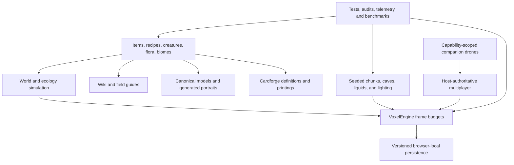

# Blockwild engineering overview

Blockwild is a browser voxel survival RPG whose difficulty comes from the interaction of many persistent systems, not from a single rendering showcase. The public release combines deterministic procedural terrain, resumable chunk streaming, ecology, combat, construction, farming, machines, settlements, quests, creature capture, multiplayer, optional AI companion drones, and a deterministic card game. This guide gives reviewers a fast, evidence-based route through that scope.

## Release snapshot

The v1.12.0 source contains 139,707 lines of TypeScript and JavaScript across 325 application, worker, script, and test files. Its canonical data currently describes 232 creatures, 537 items, 52 plants, 24 surface biomes, nine guilds with 72 quest chapters, 20 spells, and 21 legendary encounter contracts. The generated public archive exposes 855 searchable wiki entries. Cardforge projects the same game identity into 254 definitions and 819 deterministic printings.

These counts are a useful index, not the architecture. The important property is that content is connected rather than copied: a creature can participate in habitat selection, population pressure, movement, combat, capture readiness, bonding, breeding, drops, sound, persistence, research, the public wiki, model rendering, and Cardforge without becoming a dozen unrelated records.

## System map

## Runtime ownership

The application deliberately separates interface state from frame-critical simulation.

- `app/components/Game.tsx` and related React surfaces own menus, HUD presentation, dialogs, accessibility, and player input routing.
- `app/game/engine.ts` owns mutable simulation and coordinates world streaming, interactions, physics, combat, audio, and compact UI snapshots.
- `app/game/world.ts` and the world-generation modules own deterministic blocks, chunk sections, edits, lighting, liquids, and mesh eligibility.
- Dedicated systems own ecology, settlements, quests, machines, magic, Cardforge, multiplayer, and AI companion behavior rather than placing all game logic in a monolithic component.

React does not receive the entire world every frame. The engine publishes bounded snapshots when interface-visible state changes, while high-frequency motion and simulation remain in the real-time layer.

## Determinism and persistence

World terrain is regenerated from seeds and compatibility versions. Browser saves keep player-authored edits, characters, inventories, machines, persistent creatures, settlements, exploration, and other durable facts. This avoids storing copies of unchanged procedural terrain while still preserving authored history.

Persistence code normalizes loaded records and supplies defaults for older formats. Generator changes are treated as compatibility changes: they require explicit reasoning about already-created worlds, cached terrain, player edits, and multiplayer ownership. The host browser owns the authoritative multiplayer save.

## Streaming and performance discipline

Blockwild's heaviest work is decomposed into resumable queues. Terrain generation, voxel lighting, geometry construction, boundary reconciliation, ecological updates, and persistence are scheduled against bounded budgets instead of monopolizing a frame. The occupied chunk and local player actions receive priority; distant work can yield and resume.

The repository includes:

- player-action and chunk-pipeline telemetry;
- deterministic simulation, spatial-index, streaming, edit, and agent benchmarks;
- living-world and multiplayer soak tools;
- regression tests for seam presentation, stale chunk results, liquid boundaries, cache compatibility, and workload fairness;
- a maintained [performance comparison log](PERFORMANCE_COMPARISON_LOG.md) and [agentic autoresearch case study](../BLOCKWILD_AGENTIC_AUTORESEARCH_CASE_STUDY.md).

Optimization claims are kept separate from proof. A local benchmark establishes deterministic cost; a browser performance capture establishes player-visible behavior; and production acceptance is tied to an exact deployed Git commit.

## Multiplayer and agent authority

Multiplayer is host-authoritative. Guests propose bounded actions and receive authoritative results rather than directly mutating shared state. Codecs, revision checks, idempotency, ownership, reconnect behavior, and stale-result rejection are tested as contracts.

Optional AI companion drones use the same principle. A drone is a multiplayer peer with explicit capabilities, a host-owned inventory, bounded semantic observations, lease-protected work areas, two-phase construction previews, and revocable voice/chat channels. The external runner can reason and speak, but it cannot silently expand its in-world authority.

## Content as infrastructure

Blockwild treats content catalogs as production infrastructure.

- `app/game/data.ts` defines blocks, items, recipes, fuel, and processing relationships.
- `app/game/mobs.ts` and creature-domain modules define ecology, behavior, progression, persistence, and research identity.
- `app/game/mob-models.ts` is the canonical procedural geometry source for gameplay models and deterministic portraits.
- `app/game/wiki-content.ts` projects the live registries into public articles and in-game reference material.
- Cardforge consumes the same canonical creature identity for standard and Full Art printings.

Build scripts emit sharded wiki data and canonical art. CI regenerates both and fails when committed artifacts drift from their sources.

## Validation and release engineering

The repository has 128 test files and more than 1,000 automated checks across focused pretests, rendered-output checks, content contracts, simulation tests, and integration suites. The primary gates are:

1. repository metadata and public-release contract;
2. canonical brand, wiki, Cardforge, ecology, visual-theme, multiplayer, and agent-platform suites;
3. TypeScript and ESLint analysis;
4. production Vercel and Vinext/Sites builds;
5. the full deterministic gameplay and persistence suite;
6. generated-content drift detection;
7. CodeQL and pull-request dependency review.

`main` is deployed to [blockwild.app](https://blockwild.app) through Vercel. The same Git SHA is independently built for the [Sites mirror](https://blockwild.noahhicks.chatgpt.site). Release reports identify the exact commit and verify both public targets rather than treating a successful local build as deployment proof.

## A fast reviewer route

For a compact technical review:

1. Play [blockwild.app](https://blockwild.app) and open a world.
2. Browse the searchable [living wiki](https://blockwild.app/wiki) to see registry-backed content breadth.
3. Read [Architecture](ARCHITECTURE.md) for module boundaries and [Development](DEVELOPMENT.md) for validation workflows.
4. Read [Building Blockwild with Agentic Autoresearch](../BLOCKWILD_AGENTIC_AUTORESEARCH_CASE_STUDY.md) for the human-directed multi-agent development and measurement loop.
5. Inspect `.github/workflows/ci.yml`, representative tests under `tests/`, and the benchmark scripts under `scripts/` for executable evidence.

The codebase is intentionally broad, but the design goal is not novelty by accumulation. It is to keep a large interactive world understandable through explicit ownership, shared sources of truth, deterministic behavior, bounded work, compatibility contracts, and repeatable validation.
