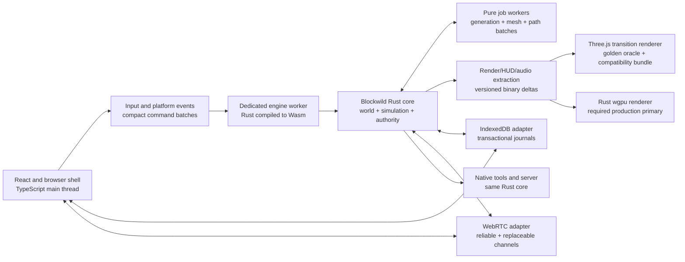

# Blockwild Hybrid Rust Engine Migration Master Plan

Status: approved for full implementation; no runtime behavior, build dependency, save format, or deployment configuration has changed at this preservation checkpoint

Prepared: 2026-08-11

Target branch: `main`

Companion plans:

- `docs/BEDROCK_INSPIRED_PERFORMANCE_ARCHITECTURE_PLAN.md`
- `docs/PERFORMANCE_OVERHAUL_MASTER_PLAN.md`
- `docs/PERFORMANCE_AUTORESEARCH_PROTOCOL.md`
- `docs/CELESTIAL_FRONTIERS_AND_WAYWORKS_MASTER_PLAN.md`

Primary outcome: move Blockwild's complete deterministic game engine from its current TypeScript-centered runtime into a reusable Rust core, compiled to WebAssembly for the browser and natively for tools and future servers, and replace the default Three.js world renderer with a Rust `wgpu` renderer as part of the same migration program. The game stays continuously playable and preserves the existing React interface, browser integrations, content, saves, multiplayer authority, world fidelity, and deployment surfaces throughout the migration.

## Executive decision

Blockwild should pursue a **progressive Rust-engine migration**, not a big-bang rewrite.

The end state is a real Rust engine. It is not merely a handful of isolated Rust math helpers. Rust ultimately owns:

- authoritative time and deterministic scheduling;
- world addresses, locations, chunks, sections, blocks, generation, edits, lighting, and residency;
- collision, ray queries, movement, fluids, atmosphere, and gravity;
- entity storage, creatures, ecology, machines, combat, progression, quests, and other authoritative rules;
- persistence schemas, state hashing, save journals, migrations, and snapshot encoding;
- multiplayer validation, interest selection, authoritative deltas, and replay;
- terrain and creature render extraction;
- the primary Rust `wgpu` renderer and a native headless/server runtime.

TypeScript remains permanently valuable, but as the **platform and product shell**:

- React menus, overlays, wiki, accessibility, and DOM text input;
- browser boot, capability detection, asset fetching, service-worker integration, and error recovery;
- WebRTC objects, WebAudio nodes, speech/TTS APIs, IndexedDB calls, clipboard, fullscreen, pointer lock, and other browser-owned handles;
- translation of Rust-owned state deltas into React view models during the transition;
- the existing Three.js renderer as a temporary visual oracle and compatibility bundle until the Rust renderer passes every visual, performance, and supported-device gate.

This boundary is deliberate. Calling browser APIs from Rust does not make them faster; it usually adds binding complexity. Conversely, leaving authoritative simulation in large mutable TypeScript coordinators prevents the strongest benefits of Rust: compact data ownership, deterministic native tests, predictable allocation, parallel-safe boundaries, and one engine shared by browser, benchmark, tool, and server builds.

The migration follows one rule:

> No subsystem becomes Rust-authoritative until it can consume the same inputs, reproduce the same required outputs, pass differential correctness tests, survive save and multiplayer compatibility tests, and improve or justify its total cost on representative Blockwild workloads.

## Why this plan replaces the earlier non-rewrite assumption

The Bedrock-inspired plan explicitly listed a language rewrite as a non-goal. That was appropriate for its first performance program: changing language before fixing scheduling, residency, geometry ownership, and persistence boundaries would merely translate existing inefficiencies.

This plan does not discard those conclusions. It changes the implementation vehicle after the boundaries have been designed:

| Bedrock-inspired target | Hybrid Rust implementation |
| --- | --- |
| Fixed authoritative clock | Rust `SimulationClock` and domain scheduler |
| Section-first residency | Rust section store and location-sharded world service |
| Long-lived world worker | Rust/Wasm engine resident in a dedicated Web Worker |
| Persistent mesh pages | Rust mesh extraction, page allocator, then `wgpu` buffers |
| Conservative visibility | Rust spatial metadata and render extraction |
| Data-oriented entities | Rust hot/cold entity stores with stable IDs |
| Activity leases | Rust authoritative lease scheduler and dormant summaries |
| Incremental persistence | Rust schema/journal, browser IndexedDB adapter |
| Multiplayer interest | Rust authority and delta builder, browser WebRTC adapter |
| Device profiles | Browser probe plus Rust workload budgets and renderer profiles |

The previous plan remains the product and performance contract. This plan is the implementation and migration contract.

## Decision summary

### Adopt

- Rust workspace with a platform-independent authoritative core.
- `wasm32-unknown-unknown` browser builds behind a narrow `wasm-bindgen` facade.
- One long-lived dedicated engine worker as the baseline browser architecture.
- Transferable `ArrayBuffer` batches first; optional shared memory and Wasm threads only after hosting isolation is proven.
- Native Rust binaries for deterministic tests, benchmarks, world inspection, save repair, and future authoritative servers.
- Differential TypeScript-versus-Rust execution at each phase.
- Rust-produced typed render snapshots shared by both renderers during migration.
- `wgpu` as a mandatory parallel workstream beginning in R0 and the required primary renderer before the migration can close.
- Three.js as a temporary production renderer, golden visual oracle, and separately loaded compatibility bundle during the measured cutover—not an indefinite default engine path.
- Declarative content compiled into both Rust runtime data and TypeScript UI data.
- Feature flags, shadow mode, save backups, protocol negotiation, and per-subsystem rollback.

### Reject

- A separate rewrite branch that cannot ship until everything is complete.
- Per-block or per-entity JavaScript/Wasm calls.
- JSON as a per-frame engine boundary.
- Requiring `SharedArrayBuffer` for the first Rust release.
- Making WebGPU a prerequisite for migrating world or simulation logic.
- Deferring all `wgpu` work until after the authoritative engine has already migrated.
- Treating Three.js as an indefinitely supported default that prevents the renderer migration from ever finishing.
- Porting React, CSS, wiki prose, or DOM-heavy UI into Rust for ideological completeness.
- Recreating `engine.ts` as one equally large Rust file.
- Adopting a general game engine or ECS framework before Blockwild's data and determinism requirements are measured.
- Changing generator output, combat feel, spawn richness, or content merely to make the port easier.

## Renderer mandate

The Rust renderer is not a post-migration aspiration. It is one of the migration's two coordinated delivery tracks:

1. **Authoritative engine track:** Rust takes ownership of deterministic world and game state behind stable protocols.
2. **Presentation engine track:** Rust `wgpu` takes ownership of world, creature, effect, and celestial rendering from the same immutable extraction records.

Both tracks start in R0. They advance at different promotion speeds because a renderer can remain in shadow or comparison mode while Rust simulation becomes authoritative, but neither track may be omitted from the program. Full-engine migration is incomplete until `wgpu` is the production default on the supported browser profile.

Three.js has three bounded roles during this work:

- keep the shipping game playable while Rust rendering is incomplete;
- provide a golden visual oracle for deterministic scene and screenshot comparisons;
- provide a separately loaded emergency compatibility bundle for devices outside the final WebGPU support policy during a defined support window.

It is not a second permanent primary renderer. New renderer-facing features should enter through renderer-independent extraction and receive a `wgpu` implementation in the same feature phase. The team must not add new direct Three.js dependencies to authoritative code.

This mandate still avoids a big-bang cutover. Early phases build a smoke renderer, deterministic galleries, and one vertical slice at a time. Three.js remains the public default until the `wgpu` path earns promotion; after promotion, the fallback is isolated, measured, and retired or explicitly support-limited rather than silently becoming permanent architecture.

## Repository-grounded starting point

### Current code shape

The live checkout is a React 19, TypeScript 5.9, Three.js 0.185 browser game built with Vinext/Vite and deployed through GitHub, Sites, and Vercel-backed surfaces.

The current concentration is substantial:

| Module | Live size on 2026-08-11 | Current ownership |
| --- | ---: | --- |
| `app/game/engine.ts` | 33,178 lines | authoritative gameplay, presentation coordination, world integration, persistence, multiplayer hooks, and browser interactions |
| `app/game/world.ts` | 9,167 lines | deterministic world generation, chunk/section state, lighting, meshing, edits, and streaming |
| `app/game/VoxelGame.tsx` | 5,731 lines | boot, HUD, menus, settings, inventory, overlays, and user-facing state |
| `app/game/mob-models.ts` | 5,523 lines | procedural Three.js creature presentation |
| `app/game/multiplayer.ts` | 2,519 lines | host/guest WebRTC protocol, validation, channel ownership, and snapshots |
| `app/game/data.ts` | 2,617 lines | central blocks, items, recipes, and content definitions |
| `app/game/world-storage.ts` | 995 lines | save/catalog normalization and browser storage integration |

There are also mature focused modules for collision, lighting, liquids, spatial indexing, pathing, creature AI, ecology, machines, maps, quests, guilds, Cardforge, agents, audio, and rendering admission. The plan migrates these boundaries rather than flattening them into a new monolith.

### Existing strengths that must survive

- 16 x 16 horizontal chunks, 16-block vertical sections, and a current vertical range of -64 through 127.
- Deterministic seeded generation with generator-versioned chunk caching.
- Worker-based terrain generation and buffer consolidation with transferable typed arrays.
- Immediate player-edit correctness lanes and bounded streaming work.
- Host-authoritative multiplayer with reliable and replaceable/unreliable channels.
- Creature distance tiers, render admission, instancing, and spatial indexes.
- Detailed telemetry: frame percentiles, phase samples, GPU timing when supported, geometry counts, streaming readiness, debt, and worker/cache diagnostics.
- A ten-scenario deterministic performance evaluator with strict correctness and fidelity vetoes.
- Large automated gameplay, content, rendering, audio, save, and multiplayer test suites.
- Procedural models shared by gameplay, the Bestiary, Cardforge art, and visual audits.
- Existing browser saves and world catalogs that players must not lose.

### Important evidence from prior optimization

The August 2026 ten-pass autoresearch run retained none of ten small TypeScript hot-loop experiments. Several targeted paths improved, but unrelated tail scenarios violated the frozen 5% per-scenario floor. This matters for the Rust program:

1. Microbenchmarks cannot approve a migration.
2. Total frame pacing and world readiness outrank an isolated kernel win.
3. Every Rust phase needs interleaved A/B measurements and scenario-attributed confirmation.
4. Translation alone is not success; removal of allocation, duplicate work, or main-thread ownership must be visible in telemetry.

The old `4.6812 ms` deterministic proxy baseline is historical evidence, not a permanent target. Phase R0 must rebaseline the current commit and current browser build before any migration claim.

## External research findings and constraints

### Rust's browser target is capable but intentionally minimal

The Rust compiler documents `wasm32-unknown-unknown` as the common minimal web target. It provides `core`, `alloc`, and much of `std`, but operating-system services do not exist: filesystem and networking APIs fail, and ordinary `std::thread::spawn` is not a browser threading API.

**Blockwild consequence:** core crates must not depend on a filesystem, socket, wall clock, browser global, or operating-system thread. Platform adapters provide time, persistence, networking, assets, and worker orchestration.

### Wasm/browser interoperability is real work

The current `wasm-bindgen` deployment guide supports browser-oriented outputs, and its numeric vectors map to JavaScript typed arrays. It also documents running Wasm in Web Workers and browser-targeted testing.

**Blockwild consequence:** use `wasm-bindgen` only at one thin facade. Do not annotate the whole engine or expose rich Rust object graphs to JavaScript. Commands and results cross in coarse typed batches.

### Browser parallelism has two distinct levels

Web Workers can run independent Wasm instances without shared memory. Wasm threads use shared Wasm memory and Workers, while adapters such as `wasm-bindgen-rayon` recommend separate threaded and non-threaded builds with runtime feature detection.

Shared memory requires a secure, cross-origin-isolated context. MDN documents the normal requirement as:

```text
Cross-Origin-Opener-Policy: same-origin
Cross-Origin-Embedder-Policy: require-corp  (or credentialless)
```

**Blockwild consequence:** the first production Rust engine uses a dedicated worker plus transferable buffers and works without cross-origin isolation. A separate accelerated build may use shared memory only after GitHub/Sites/Vercel headers, third-party assets, popups, TTS/audio, multiplayer signaling, and agent routes pass a dedicated isolation audit.

### WebGPU and Rust fit; renderer delivery runs in parallel

Current `wgpu` documentation describes a cross-platform Rust API targeting native Vulkan, Metal, D3D12, and OpenGL, plus WebGPU and an optional WebGL path on Wasm. Browser WebGPU can be detected at runtime and is exposed in dedicated workers. The WebGPU specification distinguishes CPU/content, device, and queue timelines; buffer mapping and GPU ownership are asynchronous contracts rather than free shared memory.

**Blockwild consequence:** `wgpu` is part of the main migration from R0 onward and is the required primary renderer at completion. This does not make CPU world migration dependent on GPU availability: authoritative crates, native tools, headless servers, and the compatibility Wasm engine remain renderer-independent. GPU resources remain renderer-owned, and authoritative simulation never waits for GPU readback.

### Wasm output requires size discipline

Rust release profiles support LTO, codegen-unit, panic, debug, and strip choices. Binaryen's `wasm-opt` performs Wasm-specific optimization. The Rust/Wasm guidance recommends measuring output size rather than assuming a language toolchain produces a small download.

**Blockwild consequence:** download bytes, compile/instantiate time, memory reservation, and cache behavior are first-class release metrics. Large optional systems and debug names must not make first play substantially worse.

## Product invariants

The following are vetoes, not preferences:

- A player can keep using the TypeScript engine until the Rust path is proven and migration completes.
- Existing worlds are backed up before schema migration and remain recoverable.
- Identical supported seeds and options retain required world-generation parity for existing generator versions.
- New generator versions require an explicit product migration, never an accidental consequence of Rust arithmetic.
- Full render distance, simulation distance, ecology, drops, POIs, models, lighting, and content are not reduced to win benchmarks.
- Local actions retain immediate visual feedback even when authoritative work is in the engine worker.
- Multiplayer remains host-authoritative. A UI, guest, agent, or renderer cannot mutate Rust state without a validated command.
- A Rust panic, worker crash, device loss, save failure, or protocol mismatch produces a bounded recovery path and diagnostics, not silent corruption.
- TypeScript and Rust never both believe they are authoritative for the same subsystem.
- Browser compatibility is capability-detected. Threads and SIMD remain optional accelerators. WebGPU capability is measured from R0; the final supported primary profile requires the `wgpu` renderer, while a separately loaded compatibility bundle covers the explicitly defined fallback window.
- The world can grow to multiple planets, moons, orbits, stations, atmosphere zones, power networks, and anchored locations without returning to global singleton state.

## Target architecture



### Runtime rule

The main browser thread owns responsiveness and presentation. The engine worker owns authoritative state. The renderer consumes immutable snapshots or deltas. Platform services complete explicit asynchronous requests. No main-thread render frame directly iterates the authoritative world.

### End-state ownership table

| Domain | End-state owner | Browser adapter retained? |
| --- | --- | --- |
| Input sampling | TypeScript | yes; sends timestamped input frames |
| Authoritative clocks | Rust | browser supplies monotonic time only |
| Player physics | Rust | pointer-lock/fullscreen remain TS |
| World generation and blocks | Rust | assets and cache I/O remain TS |
| Lighting and meshing | Rust | renderer uploads extracted buffers |
| Creatures and AI | Rust | model presentation consumes render records |
| Items, inventories, machines | Rust | React renders view models and sends commands |
| Combat, magic, progression | Rust | UI and audiovisual cues remain TS |
| Quests, factions, settlements | Rust authority | authored text/localization may remain data |
| Cardforge rules, RNG, custody | Rust authority | Cardforge UI remains React |
| Persistence schema/journal | Rust | IndexedDB transactions remain TS/Web API |
| Multiplayer rules and packets | Rust | WebRTC connection objects remain TS |
| Terrain/creature rendering | Rust `wgpu` primary | canvas, adapter selection, and surface boot retain a thin browser adapter |
| Audio graph and TTS | TypeScript/WebAudio | Rust emits semantic cues only |
| Wiki/Bestiary presentation | React | Rust/content compiler supplies data |
| Agent command authority | Rust | browser bridge and runner remain TS |

## Rust workspace design

The workspace should begin cohesive and split only around proven ownership boundaries. A proposed layout is:

```text
engine/
  Cargo.toml
  rust-toolchain.toml
  crates/
    blockwild-types/          stable IDs, coordinates, fixed units, errors
    blockwild-protocol/       command/event/render/save envelopes
    blockwild-content/        generated registries and validation
    blockwild-world/          locations, chunks, sections, generation, edits
    blockwild-simulation/     clock, entities, physics, ecology, machines
    blockwild-gameplay/       inventories, combat, capture, quests, progression
    blockwild-persistence/    snapshots, journal, hashes, migrations
    blockwild-network/        authority, interest, packet deltas, replay
    blockwild-render/         extraction plus wgpu renderer from the first vertical slice
    blockwild-engine/         orchestration and public engine API
    blockwild-wasm/           the only wasm-bindgen/browser facade
    blockwild-server/         future native authoritative runtime
    blockwild-tools/          world audit, save repair, benchmark, content compiler
  generated/                  ignored Wasm glue/output
```

Do not create all crates on day one merely to match the diagram. Phase R0 may start with `types`, `protocol`, `engine`, and `wasm`; additional crates are extracted when a migrated subsystem establishes a stable dependency direction.

### Dependency direction

```text
types <- protocol
types <- content
types + content <- world
types + content + world <- simulation
types + content + simulation <- gameplay
types + protocol + gameplay <- persistence/network/render extraction
all authoritative crates <- engine
engine + protocol <- wasm/server/tools adapters
```

Platform crates may depend on the core. The core may not depend on `web-sys`, React concepts, Three.js, IndexedDB, WebRTC, browser globals, or Cloudflare-specific APIs.

### Library policy

- Prefer safe Rust and explicit data layouts.
- Require a written justification and focused tests for every `unsafe` block.
- Avoid framework adoption until a representative vertical slice proves binary size, determinism, browser support, and debugging quality.
- Prefer compact custom structures for hot state over reflection-heavy serialization or general-purpose entity frameworks.
- Allow ergonomic libraries in tools where they do not ship to the browser.
- Pin the toolchain and dependency lockfile; update intentionally through CI.

## Build and delivery architecture

### Toolchain baseline

The current machine already has `rustc 1.91.1` and `cargo 1.91.1`. `wasm-pack` and the `wasm-bindgen` CLI are not currently installed. Phase R0 should add reproducible project configuration before installing or relying on either tool.

Required planned artifacts:

1. **Native debug/test build** for fast unit and differential tests.
2. **Browser compatibility build** using `wasm32-unknown-unknown`, no shared memory, and conservative features.
3. **Browser accelerated build** using validated SIMD and optionally threads/shared memory.
4. **Native optimized benchmark build** for algorithm profiling without browser noise.
5. **Future native server build** using the same authoritative crates and a server transport/storage adapter.

### Suggested profiles

- Development: debuginfo, overflow checks, panic diagnostics, no `wasm-opt` requirement.
- Browser release: `panic = "abort"`, LTO, one or few codegen units, stripped symbols, explicitly measured `opt-level` rather than assuming `s` or `z` is faster.
- Performance lab: separate speed-first Wasm artifact and size-first artifact, compared on download, instantiate, steady-state, and memory metrics.
- Native server/tool: speed-first release with debuginfo retained in a separate symbol artifact.

### Integration with Vinext/Vite

- Generate Wasm and JS glue into a build-owned directory, never hand-edit it.
- Import through one planned TypeScript module named `rust-engine-loader.ts` under `app/game/`.
- Use hashed filenames and immutable caching for `.wasm` assets.
- Verify the server returns `application/wasm` and supports streaming instantiation; retain buffered instantiation fallback.
- Prevent server-side rendering from importing browser-only Wasm initialization.
- Lazy-load the engine only on `/` and `/agent`, not the static `/wiki` route unless an interactive specimen requires it.
- Cache Cargo and Wasm build outputs in CI, but validate the final artifact hash.

### Binary budget

Set budgets in Phase R0 from measured current page weight. Initial proposed gates, subject to baseline:

- report raw and compressed bytes for every Wasm artifact;
- report cold fetch, compile, instantiate, and first-ready time separately;
- do not hide a larger boot behind a better steady-state frame rate;
- split optional debug, renderer, and future celestial systems if they materially delay ordinary world startup;
- fail CI on unexplained binary growth above an agreed percentage or byte threshold;
- retain source maps and symbolication only in non-production or separate artifacts.

## The JavaScript/Wasm contract

### One facade, coarse messages

The Wasm export surface should be small and versioned. An illustrative shape is:

```text
create_engine(config_bytes) -> EngineHandle
engine_ingest(handle, command_batch_bytes)
engine_step(handle, monotonic_time_us, budget_us) -> StepSummary
engine_take_events(handle) -> ByteBufferHandle
engine_take_render_delta(handle) -> ByteBufferHandle
engine_take_persistence_delta(handle) -> ByteBufferHandle
engine_supply_platform_result(handle, result_batch_bytes)
engine_state_hash(handle) -> 128-bit digest
destroy_engine(handle)
```

This is a contract shape, not final syntax. The important rules are:

- one call processes a batch;
- the ABI uses fixed-width numeric fields and explicit schema versions;
- JavaScript never traverses Rust entity objects;
- Rust never calls React setters or manipulates DOM objects;
- errors are structured results, not arbitrary strings or uncaught panics;
- buffers have explicit ownership and release operations.

### Command classes

- `InputFrame`: movement, look, buttons, selected slot, camera-independent intent.
- `PlayerCommand`: interact, break, place, use, craft, transfer, capture, dialogue choice.
- `AdminCommand`: world rules, creative operations, agent approvals, diagnostics.
- `PlatformResult`: save transaction, asset load, network send/receive, permission result.
- `LifecycleCommand`: load, pause, resume, world switch, visibility loss, shutdown.

### Output classes

- `RenderDelta`: transforms, animation state, mesh-page updates, lights, particles, camera environment.
- `HudDelta`: vitals, selected item, inventory revisions, overlay view-model changes.
- `AudioCue`: semantic one-shot/loop start/stop with source position and parameters.
- `PlatformRequest`: IndexedDB transaction, network packet, asset request, clipboard/fullscreen prompt.
- `DiagnosticEvent`: timings, queue lengths, capacity, state hashes, warnings, recoverable errors.

### Buffer policy

#### Baseline path

- Dedicated engine Worker owns the Wasm instance.
- Main thread sends compact input batches through transferable `ArrayBuffer`s.
- Engine returns immutable event and render batches, also transferred.
- Buffers are pooled on both sides and carry an epoch plus capacity class.
- A transferred buffer cannot be reused until ownership returns.

#### Accelerated path

- Cross-origin-isolated builds may use a bounded shared command ring and render-state pages.
- Atomics publish sequence numbers; the renderer reads only completed epochs.
- Variable-size payloads use page handles, never raw pointers retained across memory growth.
- Overflow falls back to a transferred batch or drops only explicitly replaceable presentation data.
- Reliable gameplay commands never disappear because a ring is full.

### Memory safety and growth rules

- Rust owns all authoritative allocations.
- JavaScript receives handles with generation counters, not addresses.
- Typed views into Wasm memory are valid only for the documented epoch; memory growth invalidates cached views.
- Shared-memory builds declare a maximum memory and have explicit capacity telemetry.
- World data is section-paged and location-sharded so the engine does not require one enormous contiguous resident world.
- GPU buffers are not treated as Wasm memory. Upload and ownership transitions are explicit.
- Every exported buffer reports length, capacity class, schema, and release state in diagnostics.

## Determinism contract

Rust only improves multiplayer and testing if deterministic behavior is designed, not assumed.

### Canonical rules

- Fixed simulation steps use integer tick indices.
- Monotonic browser time selects how many steps are due; it is not directly used as game state.
- World positions use a documented representation. Integer block coordinates remain exact; high-frequency local movement may use fixed-point or carefully bounded floats.
- Authoritative timers use ticks or integer micro/milliseconds, not accumulated imprecise frame deltas.
- Randomness uses named deterministic streams with explicit seeds, algorithms, and golden vectors.
- Hash-map iteration order never determines authoritative results. Use stable vectors, sorted keys, deterministic sparse sets, or explicit order indices.
- Parallel jobs may compute independently, but commits occur in deterministic key/revision order.
- Floating presentation is allowed to vary; authoritative outcomes and serialized state are hashed canonically.

### Replay artifact

Every differential scenario should be reproducible from:

- engine/protocol versions;
- content and generator hashes;
- world seed and generation options;
- starting checkpoint hash;
- ordered input/command batches;
- platform-result batches;
- expected periodic state hashes and final assertions.

This replay becomes the migration oracle, multiplayer desync diagnostic, performance benchmark input, and future autoresearch fixture.

### State hashes

Maintain at least three levels:

1. **Domain hashes** for player, world edits, entities, machines, progression, and map knowledge.
2. **Location hashes** for a planet/orbit/world shard.
3. **Root authoritative hash** built from stable ordered domain/location hashes.

Render-only interpolation, particles, audio playback positions, and transient UI focus are excluded.

## Threading and scheduling plan

### Tier 0: one engine worker

This is the first production architecture and must be good enough to ship:

- main thread: input, React, Three.js or renderer presentation, WebAudio, platform APIs;
- engine worker: Rust Wasm authority and scheduler;
- existing pure workers: terrain or consolidation jobs until replaced;
- transferable buffers: all large communication.

The largest early gain is main-thread isolation and compact state ownership, not maximum thread count.

### Tier 1: independent Wasm job workers

For generation, meshing, navigation, or compression:

- instantiate the pure Rust job crate in a small worker pool;
- send immutable section snapshots or job descriptors;
- return revisioned results through transfer;
- discard stale jobs without touching authority;
- cap workers using device telemetry and `hardwareConcurrency`, not the raw reported maximum.

This works without shared memory and is easier to recover after worker failure.

### Tier 2: shared-memory Rust pool

Only after cross-origin isolation and compatibility gates:

- use a threaded build, potentially with Rayon through a browser adapter;
- keep the deterministic commit queue on one authority thread;
- share read-only snapshots and bounded work arenas;
- avoid fine-grained locks in frame-critical paths;
- detect support and load a non-threaded artifact when absent;
- test suspend/resume, background throttling, low-core devices, and worker startup failure.

### Scheduling domains

| Domain | Proposed cadence | Parallelizable work | Deterministic commit |
| --- | ---: | --- | --- |
| Input/player correctness | 60 Hz substep or swept 20 Hz | limited | authority thread |
| Authoritative world | 20 Hz | queries/jobs | tick order |
| Nearby creature AI | 10-20 Hz by tier | sensing/path batches | entity ID order |
| Coarse ecology | 1-4 Hz | habitat summaries | location/cell order |
| Fluids/atmosphere | bounded frontier cadence | component/frontier jobs | revision order |
| Machines/networks | 1-20 Hz by network | topology rebuilds | network ID order |
| Terrain generation | demand-driven | yes | chunk priority/revision |
| Lighting/meshing | dirty-driven | yes | section key/revision |
| Persistence | dirty/deadline-driven | encoding/checksum | transaction sequence |
| Render extraction | presentation cadence | instance packing | snapshot epoch |

Catch-up is bounded. Dormant time is resolved analytically for eligible systems instead of replaying thousands of ticks.

## Data architecture

### Stable identities

Use compact typed IDs with generation counters:

- `UniverseId`, `LocationId`, `ChunkId`, `SectionId`;
- `EntityId`, `PlayerId`, `CreatureId`, `NetworkId`, `MachineId`;
- `ItemId`, `BlockId`, `MobKindId`, `RecipeId`, `QuestId`, `ContentRevision`.

String keys remain at content import, UI, debugging, and external save/export boundaries. Hot runtime state uses validated numeric IDs.

### World address

Do not let the Rust port preserve an implicit single overworld. The canonical address is conceptually:

```text
UniverseId / LocationId / ChunkX / ChunkZ / SectionY / LocalBlockIndex
```

This directly supports Blockwild, planets, moons, orbit instances, stations, asteroid habitats, and future star systems. A location owns gravity, atmosphere defaults, sky/celestial metadata, generation profile, and persistence shard.

### Section storage

- Palette-compressed block IDs with a direct mode for high-entropy sections.
- Separate compact arrays for fluid level/state, propagated light, emission, and required metadata.
- Sparse side tables for block entities, doors, machines, authored markers, and exceptional shapes.
- Section revision plus neighbor-halo revision.
- Derived summaries: occupancy, solid bounds, liquid bounds, emissive cells, openings, habitat counts, and dirty masks.
- No Three.js or renderer object in authoritative world state.

### Entity storage

Use a hot/cold split rather than a class-per-creature translation:

- hot SoA pages: position, velocity, orientation, bounds, flags, health, active state, simulation tier, spatial cell;
- behavior pages: movement intent, target, cooldowns, path handle, combat state;
- cold records: name, owner, genetics/variant, bestiary/research data, quest links, complex inventories;
- component masks and stable IDs;
- deterministic iteration lists per system;
- dormant summaries for unloaded locations/chunks.

A general ECS library may be evaluated against this shape, but custom page storage is the default until a library proves smaller, faster, deterministic, and browser-debuggable.

### Content as compiled data

Blockwild has too much content to hand-maintain parallel Rust and TypeScript registries.

Create one versioned declarative source for:

- block/item/mob IDs and names;
- tags, types, stats, recipes, drops, spawn tables, biomes, moves, sounds, and presentation references;
- machine/resource capabilities;
- quest/guild/faction identifiers;
- Cardforge card identities and rule references;
- localization and wiki keys.

A Rust-native content compiler validates it and generates:

- compact Rust tables for authority;
- TypeScript types and UI lookup tables;
- JSON/wiki indexes where useful;
- schema/content hashes;
- audit reports for missing presentation, drops, sounds, habitats, and migrations.

Authored procedural model construction may remain TypeScript until renderer migration, but model specifications should become declarative enough for both renderers to consume.

## Complete subsystem migration atlas

The table below covers viable engine targets. Priority reflects expected architectural value, not a promise of speed before measurement.

| Current area | Rust destination | Priority | Main benefit | Primary risk |
| --- | --- | ---: | --- | --- |
| coordinate math, block indexing, seeded RNG | `types/world` | R1 | deterministic foundation | accidental seed drift |
| spatial index and broadphase | `simulation` | R1 | compact hot loops, lower allocation | query parity |
| raycast and collision queries | `simulation` | R1 | predictable player interaction cost | feel/edge regressions |
| mesh face emission and packing | `world/render` | R2 | large CPU/allocation target | seams, UV/light parity |
| lighting propagation | `world` | R2 | worker-friendly bounded frontiers | stale/incomplete publication |
| terrain/cave/biome generation | `world` | R3 | native tests, worker performance | exact old-world parity |
| chunk/section residency scheduler | `world/engine` | R4 | removes main-thread orchestration | readiness regressions |
| block edits and dirty propagation | `world` | R4 | atomic authority and local feedback | latency across worker boundary |
| liquids | `simulation/world` | R5 | frontier efficiency and determinism | visual/physics mismatch |
| atmosphere/pressurization | `simulation` | R5 | connected-zone topology and safety | large topology work |
| navigation/pathfinding | `simulation` | R5 | batchable and parallel | behavior changes |
| entity hot state and movement | `simulation` | R6 | removes JS object churn | migration breadth |
| creature AI/ecology/spawning | `simulation/gameplay` | R6 | deterministic tiered scheduling | emergent-content regressions |
| player physics/swimming/mounts | `simulation` | R5 | closes the R4 read boundary and enables shared authority/replay | control feel |
| inventories/items/crafting | `gameplay` | R7 | single authority for UI/agent/network | metadata compatibility |
| machines, Waygrid, power, pipes | `simulation/gameplay` | R7 | aggregate networks, future scale | topology and save migrations |
| combat, projectiles, magic, status | `gameplay` | R7 | host parity and replays | timing/feedback |
| capture, care, progression, dragons | `gameplay` | R7 | closes split authority | large content surface |
| quests, factions, settlements, economy | `gameplay` | R8 | native headless world simulation | text/UI separation |
| Cardforge rules, packs, battles | `gameplay` | R8 | deterministic custody and multiplayer | UI/rules boundary |
| map discovery and celestial addresses | `gameplay/world` | R8 | multi-location consistency | migration of known places |
| save schema, journal, checksums | `persistence` | R4-R9 | async incremental durable state | world-loss risk |
| multiplayer validation/interest/deltas | `network` | R9 | compact authority, desync hashes | protocol compatibility |
| agent command validation/leases | `gameplay/network` | R9 | one authority model | tooling compatibility |
| renderer bootstrap, capability profiles, fixture harness | `render/wgpu` | R0-R1 | validates browser/native delivery and visual measurement early | device and packaging variance |
| render extraction | `render` | R2-R10 | decouples simulation from scene graph one migrated domain at a time | bandwidth/layout mistakes |
| terrain renderer | `render/wgpu` | R2-R10 | stable GPU ownership, native path, early end-to-end slice | seams, materials, device parity |
| creature/prop/item/machine renderer | `render/wgpu` | R6-R10 | unified instancing and animation alongside domain migration | art parity |
| particles/weather/sky/celestial composition | `render/wgpu` plus TS UI | R7-R10 | complete renderer while DOM UI stays React | transparent/order complexity |
| wgpu production promotion and Three.js isolation | `render/platform` | R11 | establishes the required default renderer | compatibility and recovery breadth |
| performance telemetry | every Rust crate plus TS collector | R0 onward | trustworthy migration evidence | measurement overhead |
| world tools/save repair/audits | native `tools` | R1 onward | much faster CI and diagnostics | duplicated schemas if unmanaged |

## What should remain TypeScript or browser-native

These are not incomplete migration:

- React components and CSS.
- Keyboard/pointer/touch event registration.
- Fullscreen, pointer lock, clipboard, download/upload pickers.
- WebRTC `RTCPeerConnection` and `RTCDataChannel` object lifetimes.
- WebAudio graph, HTML media decode where used, and ElevenLabs/TTS fetch/playback.
- IndexedDB request objects and browser quota prompts.
- Service worker, route boot, browser history, and deployment-specific configuration.
- Accessibility tree, focus management, screen-reader labels, and text composition.
- Browser capability probes and selection among compatibility/accelerated builds.

Rust owns the decisions and data that these adapters execute. For example, Rust emits an `AudioCue`; TypeScript owns the WebAudio node.

## Migration method: strangler engine, not translation branch

### Facade first

Introduce a TypeScript `EngineFacade` used by `VoxelGame.tsx` and UI panels. Its implementation can be:

- `TypeScriptEngineBackend` — current behavior;
- `RustWorkerEngineBackend` — authoritative Rust;
- `DifferentialEngineBackend` — TypeScript authority plus Rust shadow comparison;
- focused mixed backends while a subsystem is being migrated.

The UI must not know which backend is active.

### Authority ledger

Maintain a checked-in table for every domain:

```text
domain | TypeScript owner | Rust owner | mode | parity suite | save schema | rollback flag
```

Valid modes are:

- `typescript-authoritative`;
- `rust-shadow`;
- `rust-authoritative-typescript-shadow`;
- `rust-authoritative`;
- `retired-typescript`.

No domain can be ambiguous.

### Differential execution

For each migration:

1. Capture canonical inputs from the TypeScript path.
2. Feed the same batch to Rust shadow state.
3. Compare domain hashes and selected semantic outputs at fixed checkpoints.
4. Store minimized divergence replays.
5. Run Rust authoritative with TypeScript shadow in test/debug builds.
6. Enable Rust authority for an opt-in canary route.
7. Default to Rust after correctness, performance, visual, save, and multiplayer gates.
8. Retain the fallback for a bounded release window.
9. Delete the old authority only after migration telemetry and saved-world rollback obligations expire.

### Semantic parity, not byte parity everywhere

Require byte parity for:

- block IDs and generated terrain where the generator version promises it;
- serialized authoritative fields;
- item conservation and transaction results;
- deterministic RNG streams and state hashes.

Require semantic/threshold parity for:

- paths with multiple equally valid routes;
- non-authoritative creature presentation;
- particles and cosmetic interpolation;
- renderer output, which uses image-diff and visual-theme gates.

## Phase plan and commit boundaries

Each phase is independently shippable. Commit after each bounded phase and keep `main` playable.

### Phase R0 — Contract, baseline, and toolchain

Deliver:

- current hardware/browser and deterministic benchmark baseline;
- Rust workspace, pinned toolchain, lockfile, formatting/lint/test policy;
- reproducible Wasm build scripts integrated with npm and CI;
- compatibility and accelerated artifact definitions;
- Wasm size/instantiate telemetry;
- `EngineFacade` interfaces and authority ledger;
- no-op Rust engine loaded in a Worker, with heartbeat, protocol negotiation, shutdown, and panic diagnostics;
- `wgpu` dependencies and feature policy, a native and browser smoke triangle, adapter/device capability telemetry, surface-loss diagnostics, shader compilation checks, and a renderer selector that cannot yet change the public default;
- an explicit Three.js transition policy: existing renderer as golden oracle and fallback bundle, with no new authoritative dependencies on its scene objects;
- COOP/COEP compatibility audit plan, but no shared-memory requirement;
- production Basic Render Distance feature gate from the companion plan, keeping it disabled during migration measurement.

Exit gates:

- all existing tests/builds pass without using Rust authority;
- native and browser Wasm smoke tests pass;
- the same fixed smoke scene renders through native `wgpu`, browser `wgpu`, and Three.js without console, validation, or device errors, with reviewed captures retained as the renderer baseline;
- `/wiki` remains free of unnecessary engine download;
- unsupported/failed Wasm cleanly uses the TypeScript backend;
- cold-start metrics are recorded.

### Phase R1 — Deterministic kernel and replay laboratory

Migrate:

- coordinates and block indexing;
- canonical RNG and seed derivation;
- stable IDs and ordered collections;
- spatial hash/broadphase primitives;
- ray/AABB and selected collision math;
- authoritative hashing and replay envelopes;
- native benchmark and replay CLI;
- deterministic render-scene fixture envelopes, image-diff masks/tolerances, material probes, and main-thread versus `OffscreenCanvas`/render-worker capability experiments.

Run these as shadows first. The TypeScript engine remains authoritative.

Exit gates:

- golden vectors cover negative coordinates, world bounds, seeds, and RNG streams;
- cross-native/Wasm hashes match;
- no hot boundary uses one call per query;
- batch throughput and total frame impact are measured;
- canonical renderer fixtures reproduce stable camera, lighting, material, animation-time, and environment inputs across Three.js and `wgpu`.

### Phase R2 — Meshing and lighting accelerator

Migrate:

- section snapshot format and neighbor halo;
- opaque full-cube greedy-compatible meshing;
- specialized face emission parity;
- packed vertex/index/light/AO/emission data;
- lighting frontiers and dirty-section results;
- buffer pools, revision rejection, and worker diagnostics.

Keep Three.js as the shipping default for this phase, but render the same Rust-produced section buffers through both Three.js and the growing `wgpu` terrain path. Promotion of Rust meshing and promotion of `wgpu` remain separate switches; the comparison harness is mandatory even when Three.js is still public.

Exit gates:

- surface, water, glass, ice, connected flora, doors, machinery, caves, and emissive galleries pass visual review;
- the R2 canonical terrain gallery renders through both paths, and documented image differences are either corrected or explicitly approved rather than hidden by broad tolerances;
- no cross-chunk or cross-section seams;
- player edits never wait for a background consolidated mesh to remove stale geometry;
- main-thread and total p95 improve or the phase is not promoted;
- worker crash and stale-result tests pass.

### Phase R3 — Deterministic generation service

Migrate:

- biome/climate/height sampling;
- caves, aquifers, rivers, ocean beds, ore, flora sites, and structure planning;
- chunk/section construction and derived summaries;
- generated POI/chest/spawn metadata;
- current generator-version parity and old generator dispatch where required.
- generated landscape fixtures that exercise biome transitions, POIs, caves, oceans, and long-distance geometry through the same `wgpu` comparison path.

Exit gates:

- a large seed/chunk corpus matches required current outputs byte-for-byte;
- negative coordinates and generation order are stable;
- no POI metadata is lost through worker/cache paths;
- cold and warm generation benchmarks improve without readiness loss;
- old saves never regenerate edited terrain incorrectly.
- no renderer-specific generation data is introduced; both renderers consume the same extracted world records.

### Renderer convergence rule for R3-R9

The renderer does not go dormant while authoritative systems migrate. Every phase that adds or moves visible data also advances the `wgpu` path in the same phase:

| Engine phase | Required renderer companion work |
| --- | --- |
| R3 generation | biome, POI, cave, ocean, horizon, and deterministic landscape galleries |
| R4 world authority | revisioned section residency, edit invalidation, immediate local feedback, and streaming-transition parity |
| R5 physics/fluids/atmosphere | water, ice, lava, fog, pressure cues, vehicle/mount interpolation, and transparency ordering |
| R6 creatures/ecology | shared declarative model graphs, authored/instanced/silhouette tiers, animation interpolation, equipment, and mounts |
| R7 gameplay | held items, dropped items, projectiles, magic, machines, inventories rendered in-world, and interaction overlays |
| R8 extended systems | settlement scenes, Cardforge/Bestiary specimen renders, maps that use GPU composition, and celestial/location presentation |
| R9 multiplayer/agents | remote-player and agent interpolation, replicated effects, interest-bound render records, and correction handling |

A phase cannot be called complete if it creates a new direct Three.js-only presentation island. Where a feature cannot yet meet full `wgpu` art parity, it must still use the shared extraction/model schema, have a tracked fixture, and carry an explicit R10 closure item.

### Phase R4 — Rust world authority and residency

Migrate:

- location/chunk/section store;
- block reads, edits, batched transactions, facing/metadata, and dirty propagation;
- section-first residency and streaming priority graph;
- cache requests/results and version ownership;
- immediate-ring correctness and player-edit presentation events;
- location-sharded state for future celestial worlds.

TypeScript stops owning authoritative blocks. It renders Rust extraction and supplies browser cache results.

Exit gates:

- current saves load to identical authoritative block/edit state;
- break/place/tree/crop interactions remain immediate;
- player chunk and immediate ring are complete under movement/teleport/flight;
- unload/reload and world switch leak no handles or jobs;
- deep caves, water boundaries, POIs, and maps remain correct.

### Phase R5 — Physics, fluids, atmosphere, and navigation

Migrate:

- player and entity collision, stepping, knockback, swimming, buoyancy, mounts, and gravity profiles;
- projectile sweeps and contact queries;
- liquid frontier and level state;
- cave/room topology primitives;
- future atmosphere zones, leaks, vents, airlocks, and pressure equalization;
- bounded navigation and path jobs.

Exit gates:

- input replays cover sprint, jump, swim, shore exit, flight, mounts, knockback, stairs, doors, and chunk boundaries;
- no tunneling or block entrapment regressions;
- water/lava updates are deterministic and bounded;
- pressurization topology has explicit unloaded-boundary rules;
- control latency and feel are manually approved.

### Phase R6 — Entity and ecology authority

Migrate:

- player authoritative state;
- hot/cold entity storage and spatial residency;
- creature movement, sensing, targets, simulation tiers, flock/herd/group behavior;
- spawning, despawning, protection, enclosure, breeding, ecology, and dormant summaries;
- settlements' active inhabitants and ordinary sentient scheduling;
- render extraction for creatures through shared declarative model graphs, retaining existing Three.js presentation as the oracle while implementing the same authored and batched tiers in `wgpu`.

Exit gates:

- population, spawn, drop, breeding, protection, and biome distribution audits match;
- large-creature and 100-creature scenarios pass strict floors;
- no animation or model simplification is used as a CPU shortcut;
- old creature saves retain IDs, variants, bonds, ownership, equipment, and research state;
- multiplayer host and guest observe the same creature outcomes.

### Phase R7 — Gameplay authority

Migrate in bounded subphases:

1. items, inventories, metadata, equipment, crafting, furnaces, and containers;
2. machines, farms, Waygrid, aquariums, apiaries, power, typed logistics, and activity leases;
3. combat, damage, projectiles, status, magic, summons, capture, pacification, care, and companions;
4. skills, progression, dragons, quests, factions, guilds, economy, settlements, legendary encounters;
5. Cardforge pack RNG, custody, deck legality, battle rules, and multiplayer validation.

React panels remain presentation clients. They send expected revisions and receive view-model deltas.

Exit gates:

- inventory/resource conservation properties pass;
- every mutation is revisioned, authorized, and replayable;
- UI never contains hidden authoritative calculations;
- agent and multiplayer commands use the same Rust validation paths as humans;
- dormant machines and anchors advance through bounded analytical rules;
- content audits and full gameplay suites pass.

### Phase R8 — Incremental Rust persistence

Migrate:

- canonical save schema and content/generator fingerprints;
- location manifests and individually addressed records;
- chunk edits, entity records, actor digests, machines, players, map knowledge, Cardforge, quests, and settings references;
- dirty sets, journal sequence, checkpoints, compaction, checksums, quota estimates, and repair tooling;
- export/import format and native save inspector.

Browser TypeScript performs IndexedDB transactions requested by Rust.

Migration sequence:

1. Read and normalize `blockwild-world-v2` through the proven legacy TypeScript parser.
2. Produce a canonical migration bundle and hash.
3. Rust validates and writes a new checkpoint in a separate database namespace.
4. Read back and compare semantic hashes.
5. Preserve the legacy save and a downloadable backup.
6. Mark migration complete only after the first new checkpoint commits.
7. Keep a recovery/repair route and do not mutate the only source copy.

Exit gates:

- forced close during every transaction stage recovers correctly;
- ordinary dirty objects do not rewrite the full world;
- save/autosave causes no material main-thread stall;
- legacy, migrated, export/import, multiplayer transfer, and quota tests pass;
- tools can explain and repair a damaged journal without loading the renderer.

### Phase R9 — Multiplayer and agent authority

Migrate:

- protocol payload validation and canonical encoding;
- command authorization, expected revisions, leases, idempotency, and final decisions;
- location/chunk/entity interest sets;
- delta/keyframe generation and state hashes;
- reconnect checkpoints and desync diagnostics;
- agent observation snapshots, command validation, task leases, and bounded work authority.

Keep WebRTC and voice/media channels in TypeScript.

Exit gates:

- mixed legacy/Rust versions fail clearly or negotiate only supported compatibility;
- guest commands cannot bypass Rust authority;
- unrelated locations generate no steady simulation or replication cost;
- packet fuzzing never crashes or mutates invalid state;
- reconnect, duplicate, reordering, packet loss, stale revision, and malicious-size tests pass;
- host replay reproduces the final state hash.

### Phase R10 — Complete render extraction and full-scene `wgpu` parity

Close the incremental extraction work and eliminate all engine knowledge of Three.js:

- Rust emits stable mesh-page descriptors, instance records, skeleton/part transforms, lights, particles, weather, sky/celestial state, and camera-environment data;
- TypeScript scene code consumes only render records;
- procedural creature definitions become data-driven model graphs where practical;
- render interpolation owns previous/current snapshots but cannot mutate authority;
- GPU/resource handles are opaque to the simulation.
- every visible domain accumulated in R0-R9 runs in one integrated `wgpu` scene rather than isolated demos;
- renderer-specific compatibility code is confined to the Three.js bundle and does not leak back into content or authority schemas.

Exit gates:

- the complete game renders through the extraction API with no authoritative reads from scene objects;
- Bestiary, Cardforge, held models, world drops, and audit renderers use the same model data;
- render snapshots remain bounded and prioritizable;
- headless Rust simulation runs with no Three.js or DOM dependency;
- the complete canonical scene matrix passes `wgpu` visual review, with no unresolved R3-R9 parity debt.

### Phase R11 — Promote Rust `wgpu` to the production primary

Finish and promote the renderer that has been developed since R0. The selector now changes the supported default:

1. device/surface creation, loss recovery, capability profiles, and timestamp support;
2. block atlas, material layers, depth, cutout, transparency, water, ice, emission, fog, and lighting;
3. section mesh pages, culling, visibility, and persistent buffer allocation;
4. instanced props, items, creatures, articulated animation, mounts, particles, weather, sky, orbit, and celestial bodies;
5. post-processing only where it earns visual/performance value;
6. make WebGPU-backed `wgpu` the primary supported browser path; use real conformance data to define the separately loaded compatibility bundle and whether `wgpu`'s WebGL backend is sufficient for it;
7. native window/surface harness for renderer development and future desktop builds.

Do not use GPU compute for authoritative terrain or gameplay. Candidate compute uses are presentation-only culling, particles, skin/part transforms, light clustering, or other work that avoids readback.

Exit gates:

- canonical screenshot suites pass at desktop, mobile, underwater, cave, settlement, machinery, Cardforge/Bestiary specimen, and celestial scenes;
- context/device loss recovers;
- transparent ordering, water/ice boundaries, chunk seams, and emissive lighting are clean;
- GPU memory, uploads, draw calls, p95/p99, and battery/thermal behavior beat or justify replacing Three.js;
- the production renderer selector defaults to `wgpu` on the supported profile and records bounded fallback reasons;
- Three.js is absent from the normal supported-device download path and exists only in the defined compatibility bundle during its support window;
- unsupported devices either receive that tested bundle or a clear compatibility message according to the published browser policy.

### Phase R12 — Full engine cutover and retirement

Complete when:

- Rust is authoritative for every engine/gameplay domain listed above;
- TypeScript contains platform adapters and UI, not duplicated simulation rules;
- `engine.ts` and `world.ts` no longer own authoritative runtime state;
- new saves use the Rust journal by default and recovery has been exercised in production;
- multiplayer and agent sessions use Rust authority;
- Rust `wgpu` is the production-primary world renderer on the supported browser profile and consumes only renderer-independent Rust extraction;
- any Three.js compatibility bundle is isolated from the normal path, has an owner and retirement/support date, and cannot block deletion of duplicated authoritative TypeScript;
- native replay, benchmark, save-audit, worldgen, and headless-server tools use the same crates;
- legacy TypeScript authority has spent a defined deprecation window behind an emergency flag and is then deleted;
- architecture, contribution, debugging, and content-authoring documentation reflects the new source of truth.

## Basic Render Distance policy during migration

The Basic Render Distance feature should remain production-disabled as specified in the companion plan while the world worker, mesh extraction, and renderer ownership are changing.

It may return only as a new Rust-owned experiment:

- location-aware, section/sector-addressed proxy generation;
- cullable spatial sectors rather than two global non-frustum-culled meshes;
- no simulation, collision, POI, ore, or underground-information leak;
- explicit memory and transfer budgets;
- WebGPU/Three.js parity;
- controlled A/B proof that it improves navigation without harming immediate-ring completeness or frame tails.

If it never passes this gate, the game keeps full render distance only. Rust migration is not justification to restore a feature with poor value.

## Celestial Frontiers and Wayworks readiness

The Rust architecture should be built for the planned expansion rather than ported twice.

### Locations and celestial state

- Every world, planet, moon, orbit, station, asteroid habitat, and submarine region is a `LocationId` shard.
- Gravity, atmospheric defaults, sky metadata, ephemeris inputs, and generation profiles are location configuration.
- Players and entities carry location identity; distance comparisons never cross locations accidentally.
- Dormant locations load summaries, not live chunks and renderer objects.
- The system map reads deterministic Rust ephemeris/state but remains a React presentation.

### Atmosphere and airlocks

- Rust connected-zone topology owns pressure, gas composition, volume, leaks, vents, doors, and pumps.
- Player-built airlocks use the same block/network primitives as stations and settlements.
- Pressure doors, the futuristic Horizon Door, hangar gates, vents, recovery pumps, and sensors expose typed machine capabilities.
- Topology changes are revisioned and budgeted; unloaded borders are sealed/unknown according to explicit rules.
- UI receives room/port telemetry rather than recomputing pressure.

### Power and logistics

- Items remain discrete routed payloads.
- Energy, fluids, chemicals, and heat use typed aggregate networks.
- Network topology rebuilds only on relevant mutations.
- Wayanchors create explicit activity leases; they do not make whole locations fully live.
- Mining drills operate on bounded scanned snapshots and actual block transactions.

### Vehicles

- Ships, rockets, submarines, mounts, and EVA movement use Rust physics/control state.
- Browser input remains device-agnostic intent.
- Travel is an authoritative location transition with checkpoint and cargo validation.
- Native/headless simulation can test launches, docking, pressure failure, and multiplayer transfers without a renderer.

## Persistence and compatibility details

### Version tuple

Every checkpoint records:

```text
save_schema
engine_protocol
content_revision
generator_versions_by_location
authority_rules_revision
renderer_revision (diagnostic only)
```

Renderer version never changes authority. Content and rules versions have explicit migrations.

### Dual-write policy

Dual-writing entire legacy and new saves for a long period is expensive and creates two sources of truth. Use it only during a short canary window:

- TypeScript remains authority and writes its normal save.
- Rust shadow writes a disposable comparison checkpoint.
- Once Rust becomes authority, it writes the new journal and a bounded compatibility export/backup, not two live mutable databases indefinitely.

### Forward and backward behavior

- Old -> new: supported through explicit migration.
- New -> old: not generally safe after new-authority mutations; provide backup/export rather than pretending downgrade is lossless.
- Rust version upgrade: migrate checkpoint transactionally with old checkpoint retained until success.
- Content removal/rename: stable numeric IDs plus migration aliases/tombstones.
- Generator upgrade: old locations retain recorded generator versions; new terrain dispatches accordingly unless the player explicitly chooses regeneration.

## Multiplayer evolution

### Browser-hosted game

- Rust engine worker is the host authority.
- TypeScript WebRTC adapter forwards validated opaque packet batches.
- Rust decides interest, sequence, acknowledgement requirements, and payload semantics.
- Presentation-only movement may remain replaceable/unreliable; actions remain reliable and idempotent.

### Future dedicated host

The same `blockwild-engine` compiles natively:

- transport adapter can use WebSocket/WebTransport or another approved browser-reachable protocol;
- server storage uses a native transactional adapter;
- no renderer or audio is linked;
- clients still use the same command and snapshot schemas;
- server determines simulation/activity budgets and never trusts client fidelity settings.

This is a future product choice, not required for browser Rust migration. The architecture should make it possible without forcing Blockwild off peer-hosted play.

## Renderer migration design

### Start `wgpu` immediately; promote it deliberately

The renderer work starts in R0 because postponing it would allow extraction formats, materials, model data, and content pipelines to harden around Three.js again. It does **not** switch the shipping default in R0. An immediate replacement would still combine:

- language migration;
- scene architecture migration;
- shader/material rewrite;
- device support changes;
- art parity risk;
- difficult performance attribution.

The solution is parallel vertical slices. Rust first feeds a canonical fixture and the known Three.js renderer, then feeds the same records to `wgpu` in that phase. Each subsequent domain expands both the extraction contract and the `wgpu` gallery. R10 closes full-scene parity; R11 promotes the renderer. This provides early architecture feedback without betting the playable game on an immature renderer.

### Required renderer milestones

- **R0:** native/browser smoke renderer, adapter profiles, shader validation, device-loss telemetry, baseline captures.
- **R1:** deterministic scene fixtures, image-diff policy, placement experiments, and render protocol versioning.
- **R2:** first real terrain vertical slice rendered from identical Rust mesh buffers in Three.js and `wgpu`.
- **R3-R9:** renderer companion work lands with every visible migrated domain.
- **R10:** all scenes use renderer-independent extraction and the integrated `wgpu` path clears the complete parity matrix.
- **R11:** `wgpu` becomes the production default; Three.js moves to an isolated compatibility bundle.
- **R12:** full-engine completion requires the Rust renderer and Rust authority together.

### Render graph targets

- depth/opaque terrain;
- alpha-tested foliage and connected flora;
- water, ice, glass, atmosphere, and other transparent surfaces;
- emissive blocks, local lights, and cave/sky environment;
- instanced props/items;
- creature hero, articulated, and silhouette tiers;
- particles, weather, falling trees, projectiles, and magic;
- sky, sun/moon, clouds, celestial bodies, orbit, and 0G scenes;
- selection/interaction/debug overlays;
- UI remains DOM/React unless a specific canvas element benefits from GPU composition.

### GPU ownership

- Stable page allocator for terrain vertices/indices by material layer.
- Revisioned uploads and deferred retirement after submitted work is safe.
- Instance buffers double- or ring-buffered by frame epoch.
- No GPU readback in ordinary frames.
- Timestamp queries are optional telemetry with unsupported fallback.
- Device loss invalidates renderer handles, not authoritative world state.

### Renderer placement

Evaluate three placements instead of assuming that “Rust renderer” means “main-thread renderer”:

| Placement | Strength | Cost/risk | Policy |
| --- | --- | --- | --- |
| Main thread | simplest canvas/input integration; broad compatibility | render submission competes with React/input | compatibility option and first parity harness |
| Engine worker | can use an `OffscreenCanvas`; minimal authority-to-render transfer | rendering can delay authoritative ticks and failure couples two domains | prototype only, not the recommended final ownership |
| Dedicated render worker | React/input and authority remain isolated from GPU submission | another worker/protocol, snapshot transfer or shared pages | recommended accelerated end state when supported |

`HTMLCanvasElement.transferControlToOffscreen()` can transfer a canvas to a Worker, and current WebGPU interfaces are exposed to Workers. Blockwild should probe this placement in R1 and target a separate Rust render Worker as the accelerated production architecture once extraction and device recovery are stable. The engine publishes immutable render epochs; the renderer may skip obsolete presentation epochs but cannot skip reliable engine commands. If `OffscreenCanvas` or Worker WebGPU is unavailable on an otherwise supported WebGPU device, `wgpu` stays on the main thread without changing authority. The separately loaded Three.js bundle is reserved for the explicit non-WebGPU compatibility policy, not ordinary placement fallback.

## Performance measurement program

### Migration scorecard

Every phase reports:

- p50/p95/p99 frame interval and long-frame ratio;
- main-thread active CPU and engine-worker CPU when measurable;
- simulation, streaming, generation, lighting, meshing, install, render submission, and GPU time;
- input-to-authoritative and input-to-visible latency;
- immediate/mid/outer ring completeness and readiness episodes;
- entities simulated by tier and work deferred;
- bytes allocated/transferred/shared, Wasm memory pages, JS heap, and live GPU geometry;
- buffer creation/reuse/retirement and stale result counts;
- autosave stall, bytes written, and write amplification;
- network bytes/messages, buffered pressure, and interest counts;
- cold Wasm download/compile/instantiate/first-ready time;
- battery/thermal or sustained-soak indicators where the browser exposes useful evidence.

### Benchmark families

Retain and extend the current scenarios:

- stationary settled world;
- continuous walk and sprint;
- dense 360-degree turn;
- frozen boundary/player edits;
- 100-creature LOD and articulation;
- settlement and large-cavern traversal;
- rapid tree, flora, water, and container interactions;
- fast dragon/ship flight;
- multiplayer host plus guests/agents;
- large machine/logistics network;
- atmosphere breach and airlock cycling;
- planet/orbit location transition;
- long exploration, backtracking, autosave, and memory soak.

### Differential performance protocol

- Freeze correctness fixtures and content.
- Randomize or interleave TypeScript/Rust A/B/A order.
- Warm each path equally.
- Separate kernel, worker round-trip, browser integration, GPU, and end-to-end metrics.
- Require scenario floors, not only an aggregate geometric mean.
- Retain rejected results in the research ledger.
- Never approve a Rust phase because native benchmarks alone are faster.
- Validate on Noah's representative player hardware before production claims.

### Retention thresholds

Phase R0 freezes exact current values, but the decision framework should begin with the proven autoresearch discipline:

- a performance-motivated candidate normally needs a normalized aggregate score at or below `0.9925` versus its current champion;
- no primary scenario may exceed `1.05x` its current champion median p95;
- immediate-ring completeness, player-chunk readiness, item/state conservation, visual fidelity, and worker correctness remain hard gates;
- an architecture-motivated migration may be retained near performance-neutral only when it removes duplicated authority or enables native/browser determinism, and it still cannot breach the scenario floor;
- cold-start download/compile/instantiate and memory costs are part of the scorecard rather than deferred caveats;
- any threshold may be tightened after R0, but it cannot be relaxed during an experiment to rescue a preferred Rust result.

### Success classes

A Rust phase can be retained for one of three reasons:

1. **Performance:** meaningful end-to-end improvement with all gates passing.
2. **Correctness/architecture:** neutral performance but substantially better determinism, recoverability, or shared native/browser ownership.
3. **Enabler:** neutral local metrics but removes a proven blocker for a later measured phase.

An enabler still needs a cost ceiling and rollback path. “It is Rust” is never sufficient.

## Test and verification matrix

### Rust-native

- unit tests for all pure rules;
- property tests for transactions, conservation, indexes, topology, and serialization;
- deterministic replay and state-hash suites;
- fuzzing of protocol, save, command, and content inputs;
- benchmark suites using representative sections/entities/networks;
- Miri or equivalent focused checking where applicable to unsafe/data-layout code;
- save/world inspection and repair tests.

### Wasm/browser

- `wasm-bindgen-test` in actual supported browsers, not Node only;
- Worker startup, transfer, crash, restart, pause, resume, and shutdown;
- compatibility versus accelerated artifact selection;
- COOP/COEP isolated and non-isolated routes;
- no Wasm download on static routes that do not need it;
- memory growth/view invalidation and out-of-capacity behavior;
- cross-browser WebGPU/compatibility renderer conformance;
- Playwright interaction sequences and `render_game_to_text` parity.

### Differential

- TypeScript and Rust worldgen corpus;
- block edit and mesh/light results;
- physics input replays;
- ecology/spawn histories;
- inventory/machine/combat/capture transactions;
- quest/progression/Cardforge state;
- save migration and readback;
- network command histories and final hashes.

### Visual/manual

- before/after reference captures for each renderer-facing phase;
- chunk and section edges on ground, water, ice, glass, flora, and lighting;
- underwater and deep-cave visibility;
- creature motion, articulated parts, mounts, held items, and third person;
- UI update latency and overlay correctness;
- context/device-loss recovery;
- star-system, planet sky, orbit, pressure, and machine-state visuals when implemented.

### Release gates

- Cargo format, clippy, native tests, Wasm tests, fuzz corpus smoke, and binary-size report;
- TypeScript typecheck, ESLint, existing gameplay/content suites, render/audio audits, and production build;
- exact source SHA verification across GitHub, Sites, and any Vercel deployment when a release is requested;
- live URL verification for the deployed commit;
- clean fallback and saved-world recovery path.

## CI and repository policy

### Pull-request matrix

- native Rust test/lint on Windows and Linux;
- Wasm compatibility build and browser tests;
- accelerated build compilation even if shared-memory browser tests run in a dedicated lane;
- TypeScript/full repository tests;
- content generation produces no uncommitted diff;
- protocol and save-schema compatibility fixtures;
- binary-size and public API reports;
- deterministic replay hashes on native and Wasm;
- selected performance smoke tests with non-flaky ceilings.

### Generated code

- Declarative source is authoritative.
- Generated Rust/TypeScript tables are either committed with deterministic checks or generated reproducibly in build; choose one policy and enforce it.
- Wasm glue/binaries are build artifacts, not hand-maintained source.
- Schema changes require migration fixtures and changelog entries.

### Commit discipline

Recommended phase commits:

- contract/toolchain;
- one pure domain port;
- shadow parity;
- Rust authority behind flag;
- default switch;
- old TypeScript retirement;
- evidence/report.

Do not combine a correctness port, algorithm rewrite, renderer rewrite, and content rebalance into one benchmarkable change.

## Diagnostics and operational behavior

### Rust diagnostics

- Panic hook in development produces crate/module and replay checkpoint context.
- Production panic aborts only the engine worker; the main shell captures a bounded diagnostic and offers safe reload/recovery.
- Structured error codes cross the ABI.
- A fixed-size diagnostic ring stores recent commands, ticks, jobs, state hashes, and platform requests without private chat/TTS secrets.
- Performance export identifies backend, build hash, Wasm features, thread/SIMD mode, renderer, memory pages, and cross-origin isolation state.

### Watchdogs

- Engine heartbeat and last completed tick.
- Worker job deadline and stale revision counts.
- Main-thread presentation age.
- Persistence acknowledgement deadline.
- Network buffered amount and last authoritative keyframe.
- Renderer device-loss state.

A watchdog may pause, restart a pure worker, or request recovery. It must never invent authoritative state.

## Risk register

| Risk | Failure mode | Mitigation |
| --- | --- | --- |
| Big-bang rewrite pressure | playable game stalls for months | strangler facade, phase defaults, continuously shippable `main` |
| Wasm boundary overhead | faster kernels but slower game | coarse batches, transfer accounting, no per-block calls |
| Rust binary growth | slow first load and memory pressure | budgets, feature splits, LTO/`wasm-opt`, lazy loading, size reports |
| Cross-origin isolation | assets/popups/integrations break | optional accelerated build, full header/resource audit, compatibility fallback |
| Determinism drift | old worlds or multiplayer diverge | golden RNG/worldgen vectors, replays, ordered commits, hashes |
| Worker latency | input feels delayed | main-thread input/presentation prediction, immediate visual events, fixed authority cadence |
| Duplicate authority | TS and Rust disagree or double-apply | authority ledger, revisioned commands, one owner per domain |
| Save migration | data loss or unrecoverable world | separate namespace, backup, readback hashes, transactional cutover, repair tools |
| Rust monolith | `engine.ts` recreated in Rust | crate/module dependency direction and domain ownership reviews |
| Premature ECS/framework | binary/debug/determinism costs | benchmark representative vertical slice before adoption |
| Threads regress devices | startup/memory/thermal cost | non-threaded default first, capped pool, runtime detection, soak tests |
| WebGPU device variance | missing visuals or crashes | dual renderer, capability profiles, conformance galleries, device loss recovery |
| Renderer parity burden | Blockwild style degrades | extraction first, shared model data, visual-theme audits, manual approval |
| Native/browser divergence | two different games emerge | same authoritative crates, platform adapters only, cross-target replay hashes |
| Content workflow friction | designers edit generated code or duplicate data | single declarative source, strong validation, readable authoring tools |
| Debugging opacity | Wasm failures are hard to diagnose | dev symbols, replay capture, structured diagnostics, native reproducer |
| Performance theater | local kernel wins hide frame regressions | end-to-end scenario floors and player-hardware verification |

## Rollback strategy

- Every domain has a runtime feature flag until its migration window closes.
- Rust shadow can be disabled without changing saved authority.
- Rust-authoritative canaries preserve pre-migration checkpoint backups.
- Pure worker failures retry synchronously or through the legacy path where safe.
- Renderer selection remains independent of simulation backend.
- Shared-memory/threads and SIMD have compatibility artifacts.
- A failed phase reverts only that domain, not unrelated correctness work.
- TypeScript code is deleted only after the agreed support window and evidence, never immediately after the first successful benchmark.
- Schema migrations are forward transactional; rollback restores the untouched prior database, not a lossy reverse conversion.

## Effort and sequencing reality

This is a major engine program, not a normal feature sprint. It should be evaluated by stable vertical slices rather than a speculative calendar.

Relative effort bands:

| Band | Phases | Character |
| --- | --- | --- |
| Foundation | R0-R1 | tooling, contracts, deterministic lab, `wgpu` smoke path, visual fixtures; low product risk |
| First performance value | R2-R4 | meshing, generation, world authority, real `wgpu` terrain slice; high immediate leverage |
| Simulation core | R5-R7 | physics, entities, gameplay plus matching renderer domains; broad correctness surface |
| Durable authority | R8-R9 | saves, multiplayer, agents plus full scene/replication parity; highest data/security risk |
| Integration and cutover | R10-R12 | complete extraction, `wgpu` primary promotion, and legacy retirement |

The best early architecture review is after R2 and R3. At that point Blockwild will have real end-to-end evidence about Wasm boundary cost, browser packaging, world parity, worker performance, and an actual `wgpu` terrain path on player hardware. That review may change boundaries or sequencing, but it does not silently move the renderer back out of scope. If a specific backend fails, the team records the evidence and redesigns the renderer path while preserving the full-engine destination.

## Recommended first implementation tranche

When Noah approves implementation, the first goal should be limited to R0-R2:

1. Rebaseline current `main` and freeze migration fixtures.
2. Add the Rust workspace, CI, loader, Worker heartbeat, and fallback.
3. Add the `wgpu` native/browser smoke renderer, capability telemetry, device-loss probe, Three.js oracle captures, and deterministic renderer fixture harness.
4. Add replay/state-hash infrastructure and renderer-scene envelopes.
5. Port coordinate/RNG/spatial primitives in shadow mode.
6. Port one complete terrain section meshing path and render the identical typed output through Three.js and `wgpu` for reviewed parity.
7. Measure native kernel, Worker round-trip, main-thread, render submission/GPU time, total browser frame, memory, download, and readiness effects.
8. Ship Rust meshing only if end-to-end gates pass; keep `wgpu` behind its selector until the scheduled R11 promotion gates, but retain and evolve it as part of every subsequent phase.

This tranche creates the foundation for the full engine without asking saves, multiplayer, controls, or UI to trust an unproven runtime.

## Open decisions for Noah before implementation

1. **Minimum browser policy:** retain every currently supported browser with a compatibility Wasm build, or formally define a narrower supported set? Recommendation: compatibility build first; do not narrow support during R0-R4.
2. **Renderer compatibility window:** after `wgpu` becomes primary, how long should the separately loaded Three.js bundle remain available, and what minimum browser/GPU policy replaces it? Recommendation: measure actual production capability in R0-R10, announce the supported profile before R11, retain the bundle for a short defined release window, then either retire it or treat it as explicitly limited maintenance—not an equal engine path.
3. **Cross-origin isolation:** acceptable if it changes popup/opener behavior and requires all subresources to comply? Recommendation: treat it as an accelerated mode until both hosted surfaces and integrations pass.
4. **Worldgen parity:** must every current generator bit-match forever, or may a future explicit world upgrade regenerate unedited distant terrain? Recommendation: existing locations keep their recorded generator; new worlds may choose newer generators.
5. **Native server:** should the migration include a shipped dedicated server, or merely make one possible? Recommendation: architect and test a headless native engine, but ship a dedicated-server product only after browser host authority is stable in Rust.
6. **Native desktop client:** desired later? Recommendation: keep core and renderer portable, but do not add a desktop UI/distribution program to the migration critical path.
7. **Content source format:** JSON-like, RON, TOML, or a custom validated authoring layer? Recommendation: prototype against current data, choose for authoring clarity, and generate both Rust and TypeScript; never make designers edit Rust enums for ordinary content.
8. **Emergency legacy window:** how many stable releases retain TypeScript authority fallback after each major cutover? Recommendation: at least two measured releases for world/save/simulation domains, longer for persistence if migration telemetry is limited.

## Definition of done

### Foundation

- [ ] Rust workspace and browser/native CI are reproducible.
- [ ] Wasm compatibility path works without shared memory.
- [ ] Accelerated features are detected, measured, and optional.
- [ ] Engine facade and authority ledger exist.
- [ ] Replay and canonical state hashes work across native and Wasm.

### World and performance

- [ ] Rust owns deterministic generation, blocks, edits, lighting, meshing, and residency.
- [ ] Existing generator/save parity requirements pass.
- [ ] Immediate player feedback and streaming completeness are preserved.
- [ ] Basic Render Distance remains disabled unless a Rust rebuild passes its re-enable gate.
- [ ] Rust phases show end-to-end value or explicit architecture justification.

### Simulation and gameplay

- [ ] Rust owns clocks, physics, fluids, atmosphere, entities, ecology, machines, inventories, combat, progression, quests, and Cardforge authority.
- [ ] Location-sharded worlds support future planets/orbits/stations.
- [ ] Airlocks, vents, power, logistics, anchors, vehicles, and gravity fit the same typed engine contracts.
- [ ] React/UI contains no hidden duplicate authority.

### Persistence and multiplayer

- [ ] Rust owns schema, journal, migration, hashing, and repair logic.
- [ ] Browser IndexedDB adapter is transactional and asynchronous.
- [ ] Existing worlds migrate with backup and verified readback.
- [ ] Rust owns multiplayer and agent command authority, interest, deltas, and replay.
- [ ] Native headless engine can reproduce browser-authoritative state.

### Rendering and retirement

- [ ] `wgpu` tooling, capability telemetry, deterministic galleries, and dual-render parity begin in R0-R2 rather than waiting for final cutover.
- [ ] Simulation exposes renderer-independent extraction.
- [ ] Every visible R3-R9 domain lands with shared extraction plus a tracked `wgpu` companion implementation or explicit R10 closure item.
- [ ] Rust `wgpu` passes visual, performance, compatibility, and recovery gates and becomes the production primary on the supported browser profile.
- [ ] A separately loaded, tested fallback exists only for the defined compatibility window; Three.js is not in the normal supported-device path.
- [ ] Legacy TypeScript authority is deleted only after its support window.
- [ ] Documentation, audits, tools, and contribution guides identify Rust as the engine source of truth.

### Release evidence

- [ ] Full existing and Rust-native test matrices pass.
- [ ] Before/after benchmark report includes rejected experiments and cold-start costs.
- [ ] Visual comparisons are manually reviewed.
- [ ] Long-soak save, memory, worker, multiplayer, and device-loss tests pass.
- [ ] Player-hardware performance confirms the production claim.
- [ ] Exact commit/deployment parity is verified when a release is authorized.

## Primary external references

- [Rust compiler — `wasm32-unknown-unknown`](https://doc.rust-lang.org/stable/rustc/platform-support/wasm32-unknown-unknown.html)
- [`wasm-bindgen` — deployment targets](https://wasm-bindgen.github.io/wasm-bindgen/reference/deployment.html)
- [`wasm-bindgen` — Wasm in a Web Worker](https://wasm-bindgen.github.io/wasm-bindgen/examples/wasm-in-web-worker.html)
- [`wasm-bindgen` — numeric vectors and typed arrays](https://wasm-bindgen.github.io/wasm-bindgen/reference/types/boxed-slices.html)
- [`wasm-bindgen-test` — browser/Wasm testing](https://wasm-bindgen.github.io/wasm-bindgen/wasm-bindgen-test/index.html)
- [`wasm-bindgen-rayon` — browser threaded and fallback builds](https://github.com/RReverser/wasm-bindgen-rayon)
- [MDN — cross-origin isolation in workers](https://developer.mozilla.org/en-US/docs/Web/API/WorkerGlobalScope/crossOriginIsolated)
- [MDN — Cross-Origin-Opener-Policy](https://developer.mozilla.org/en-US/docs/Web/HTTP/Reference/Headers/Cross-Origin-Opener-Policy)
- [`wgpu` 30 documentation](https://docs.rs/wgpu/latest/wgpu/)
- [WebGPU specification](https://gpuweb.github.io/gpuweb/)
- [MDN — transferring a canvas to `OffscreenCanvas`](https://developer.mozilla.org/en-US/docs/Web/API/HTMLCanvasElement/transferControlToOffscreen)
- [Binaryen and `wasm-opt`](https://github.com/WebAssembly/binaryen)
- [Cargo profiles](https://doc.rust-lang.org/cargo/reference/profiles.html)

## Repository references

- `app/game/engine.ts`
- `app/game/world.ts`
- `app/game/VoxelGame.tsx`
- `app/game/performance.ts`
- `app/game/performance-log.ts`
- `app/game/terrain-generation-pipeline.ts`
- `app/game/terrain-buffer-pipeline.ts`
- `app/game/lighting.ts`
- `app/game/liquids.ts`
- `app/game/spatial-index.ts`
- `app/game/creature-pathing.ts`
- `app/game/multiplayer.ts`
- `app/game/agent-platform.ts`
- `app/game/world-storage.ts`
- `app/game/chunk-cache.ts`
- `app/game/data.ts`
- `scripts/autoresearch/blockwild-performance-evaluator.mjs`
- `docs/PERFORMANCE_AUTORESEARCH_RUN_2026_08_04.md`
- `docs/BEDROCK_INSPIRED_PERFORMANCE_ARCHITECTURE_PLAN.md`
- `docs/CELESTIAL_FRONTIERS_AND_WAYWORKS_MASTER_PLAN.md`

## Final recommendation

Approve the full Rust engine as the destination, but authorize implementation one vertical slice at a time.

The first useful milestone is not “Blockwild compiles in Rust,” and the renderer is not deferred until after that milestone. It is:

> The current game loads normally, the Rust Worker can replay the same world inputs, one complete world-processing path is Rust-owned, its extracted terrain renders through both the shipping Three.js oracle and the new `wgpu` path, existing saves and visuals remain intact, and measured browser frame behavior improves without reducing anything the player sees or simulates.

From there, the same contracts absorb the authoritative engine and the presentation engine together. R11 makes `wgpu` the supported default; R12 is not complete without it. That is slower than a demo rewrite and much faster than recovering from one.
