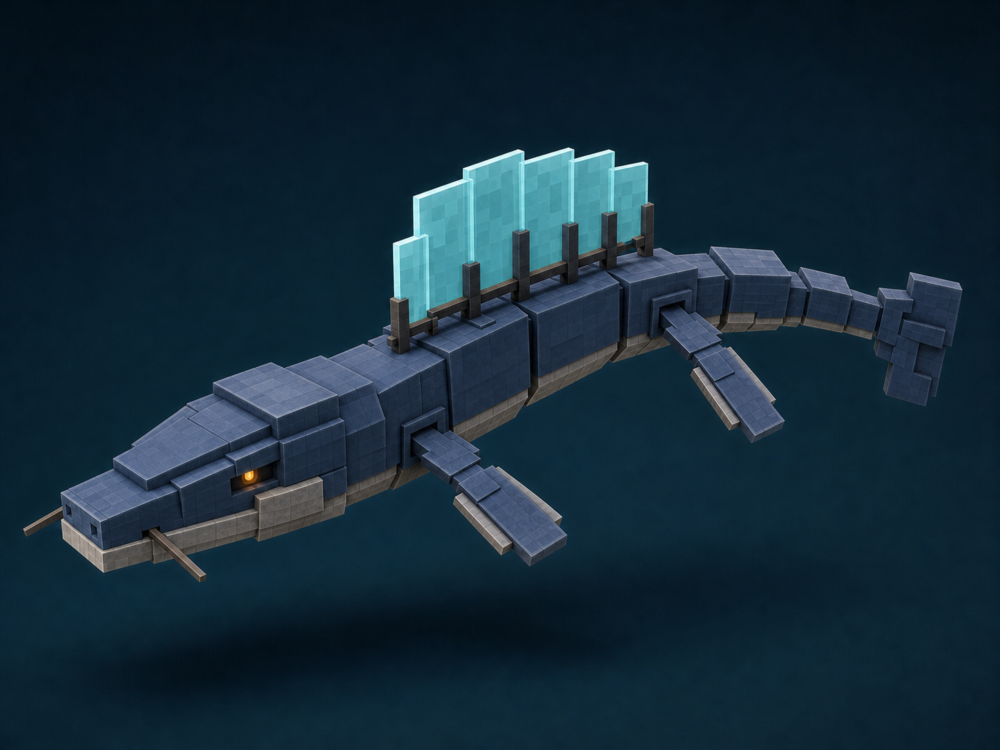
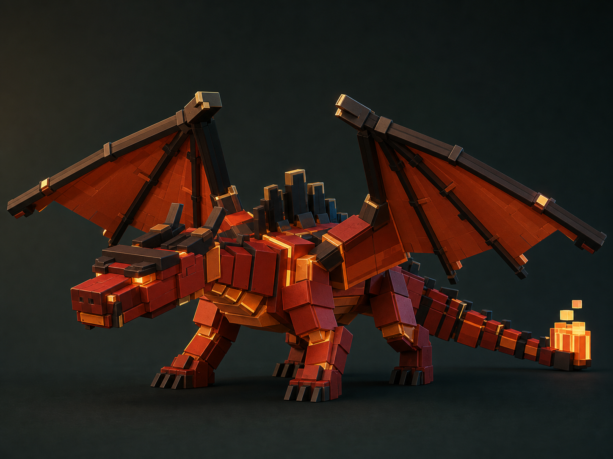

# Blockwild Image-Generated Creature References

These are reviewed examples produced with [`BLOCKWILD_CREATURE_IMAGEGEN_PROMPT.md`](../../../templates/BLOCKWILD_CREATURE_IMAGEGEN_PROMPT.md). They demonstrate the intended reduced-density form of Blockwild's cubic storybook anatomy for future Tripo work, TCG art, and modeling blockouts.

Generated art is a design reference, not executable game geometry. Existing runtime models and creature definitions remain authoritative until an approved redesign is implemented and audited.

## Tideglass Ribbonsnout

- **Status:** exploratory sea-serpent reference; not currently a registered mob kind.
- **Tier:** restrained signature/rare.
- **Body plan:** elongated aquatic swimmer, four paddle fins, segmented tail, two whiskers.
- **Visual thesis:** broad slate-blue planes, river-stone jaw, and one supported translucent cyan pressure sail.
- **Review note:** the three-quarter image prioritizes body construction and fin-root clarity; far-side paddles partially overlap in silhouette.

## Adult Fire Dragon

- **Status:** image-generated interpretation of the existing `fire-dragon` runtime creature.
- **Identity source:** the current stage-five adult portrait and `MOB_DEFS["fire-dragon"]`.
- **Tier:** restrained legendary.
- **Body plan:** low volcanic quadruped, two broad wings, long segmented tail, contained molten plume.
- **Visual thesis:** broad vermilion armor, soot-black supports and age ridge, localized pale-gold heat seams.
- **Review note:** preserves the runtime model's volcanic-runner identity while making the leg, wing, face, and tail construction easier to read for downstream modeling.

## Generation settings

- OpenAI GPT Image generation/edit workflow.
- Landscape 4:3 production portrait.
- Dark desaturated studio background.
- The Fire Dragon used the current runtime portrait as a reference lock.
- Both images were manually inspected for silhouette, connected anatomy, material restraint, and excess surface subdivision.
